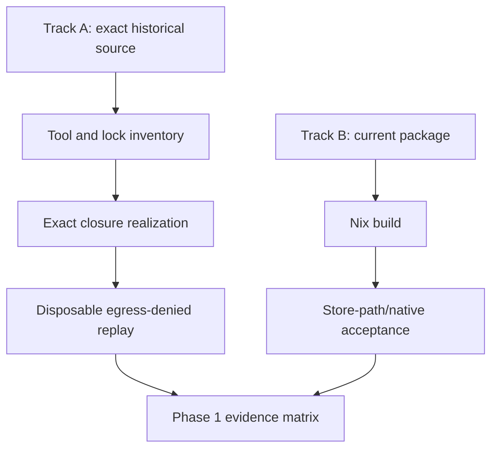
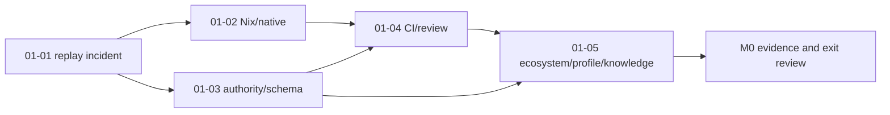

# GSD ingest — reorient the existing Uzel project in place

**Authority:** this file supersedes the earlier package-first and revision-1 through revision-3 execution
instructions.
**Applies to:** the existing brownfield `jodobear/uzel` GSD project, currently blocked
while pre-flighting Phase 1 plan `01-01`.
**Planning action:** amend Phase 1 in place; preserve phase numbering, codebase mapping,
project history, state and prior evidence.

## Locked programme decisions

1. Uzel is the only active implementation repository through M5.
2. Build visible vertical product slices; pull internal mechanisms from their needs.
3. Preserve the separate runtime daemon and exact-build guest boundary.
4. Use one canonical Nostr engine through a narrow private adapter. The current provider
   must be exact-pinned and verified against current source before its API or ownership
   is assumed.
5. Keep product-service, runtime and engine state instance-scoped from the first new
   schema; local-profile-scope every identity-dependent record and all object bytes/
   derivatives before A5. A read-only social
   profile may still have a daemon-bound actor public key; `read_only` removes signing
   authority, not identity context. Host product semantics in a daemon-hosted product
   service; the shell never opens its database directly.
6. Build no general filesystem or media platform before A5. Trusted file selection,
   opaque handles, bounded reads, explicit import/export and atomic export/overwrite are
   enough. Any untrusted raster parsing/normalization required by product journeys runs
   in a private no-network, resource-limited media worker outside the authority-bearing
   daemon process.
7. M5 produces a frozen audit candidate, not an automatic release or milestone
   completion.
8. After M0, each bounded integer or decimal GSD phase is one issue/branch/worktree and one primary
   PR; product milestones span several such delivery increments.
9. A5 is a mandatory twelve-lane whole-system audit after 7.9. No new feature programme
   begins until its blocking findings are resolved and the owner decides what happens next.
10. Every packaged build is bound to one immutable Uzel Runtime Compatibility Profile.
    Fast-moving specs, proposal branches, conformance tools and libraries remain exact-
    pinned; read-only radar and evidence-led compatibility campaigns keep Uzel current.
11. Phase 2 cannot begin until the napplet manifest/exact-build identity seam has an
    accepted profile. Current NIP-5A, open NIP-5D work, NAP docs and packages must not be
    treated as one stable contract when they disagree.
12. Every enabled production-relevant capability has a maturity ledger. M5 requires L4
    production-candidate evidence; only A5/remediation/human approval can reach L5.
13. Material decisions, spec interpretations, upstream interactions and reusable
    learnings are durable repository records. Canonical terminology is governed through
    stable term IDs rather than redefined in agent prompts or phase prose. Phase closeout
    records decision, profile, terminology, upstream, learning and education deltas.
14. Every guest-influenced execution path has global and per-principal admission,
    fairness, anti-starvation, cancellation and cleanup policy. A successful soak is not
    evidence that an unbounded or monopolizable queue is safe.

## Current Phase 1 incident

The current plan is internally impossible:

```text
historical source replay needs Vite and a conformance tool
clean replay checkout has no installed dependency closure
plan prohibits dependency materialization
```

Partial work is isolated at:

```text
b185ad1
```

Do not merge, delete, amend, cherry-pick or reset that commit during planning. Create or
retain a durable safety ref. Inspect its parent, diff, generated files, tests and
assumptions. Planning may record a provisional disposition; execution assigns the final
one after evidence exists.

## Required Phase 1 correction

Choose a two-track evidence model.

### Track A — hermetic exact-source replay

1. Identify the exact historical source revision and source-replay claims.
2. Inventory the actual package manager, lockfile, runtime/toolchain, workspace scripts
   and the origin of every required command, especially Vite and the conformance tool.
3. Classify each tool as one of:

   ```text
   workspace package or binary
   repository script
   Nix app or derivation
   exact lockfile dependency
   external historical dependency with integrity evidence
   unavailable historical tool
   ```

4. Realize only exact lock/integrity/hash-bound dependencies. A networked fetch stage is
   allowed only for bytes already fixed by the lock or derivation and only when the
   local content-addressed store lacks them.
5. Materialize the closure in a disposable exact-source worktree with disposable
   `HOME`, XDG and cache paths.
6. Disable dependency lifecycle scripts by default. Permit an exact reviewed allowlist
   only when the historical baseline demonstrably requires them; run them with external
   egress denied and log their inputs/outputs.
7. Deny public DNS and external network egress during materialization scripts and replay.
   Permit only explicitly enumerated loopback or Unix-socket test services.
8. Keep source and lockfiles unchanged. Use no global binaries, dynamic `npx` downloads,
   copied dependency trees, package substitutions or compatibility edits.
9. Bound the archaeology: perform one source/tool inventory, choose one exact-closure
   realization path, run one isolated replay attempt, and permit at most one correction
   only when evidence proves the replay harness/isolation—not source or closure—was wrong.
   Otherwise stop and classify honestly.
10. Run the source, conformance and hostile-boundary checks supported by the exact
   baseline.
11. Record one exact verdict:

    ```text
    reproduced
    reproduced_with_variance
    unavailable_exact_closure
    unavailable_platform
    failed_behavior
    superseded_test
    ```

An unavailable historical replay may support Phase 1 completion only when a current-
source replacement independently proves every affected critical security/correctness
invariant and the old claim is explicitly retired or downgraded. Otherwise it is a
blocker.

### Track B — current Nix package/native acceptance

Independently prove that the current locked source:

- builds through the canonical Nix path;
- runs binaries/resources from Nix store paths;
- does not depend on the source checkout or ambient developer `PATH`;
- uses clean `HOME`, an explicit instance ID and instance-scoped XDG paths;
- proves deterministic disjoint paths with two fixture instances and records whether
  simultaneous packaged operation already exists; absence is a planned 7.1 delta, not
  invented M0 feature work;
- starts, restarts and stops through the intended user-service path;
- fails clearly on incompatible local-control versions;
- passes the relevant native WebKit/Weston and Fedora SELinux checks;
- records closure, build and runtime evidence separately.

Track B does not repair or substitute for Track A. The final Phase 1 report carries two
separate verdicts.



## Revised Phase 1 plan structure

The planner may choose different plan numbers if the current directory already contains
conflicting artifacts, but must preserve these responsibilities and dependencies.

### `01-01` — reconcile the incident and produce replay evidence

Owns:

- GSD/Git/worktree state inventory;
- `b185ad1` safety ref and provisional classification;
- historical source and claim inventory;
- package manager/tool/lock classification;
- exact closure realization;
- external-egress-denied source/conformance replay;
- hostile probe proving egress denial;
- final `b185ad1` disposition after tests;
- exact replay verdict and claim downgrade/blocker table.

Must not change product behavior, update dependencies or rewrite historical source.

### `01-02` — current Nix package and native baseline

Owns:

- canonical package outputs and user-service wiring;
- store-path resource/binary discovery;
- clean `HOME`/XDG launch;
- explicit instance path layout;
- daemon/client mismatch behavior;
- package smoke and native WebKit/Weston acceptance;
- Fedora Server 43/SELinux evidence or an explicit environment blocker;
- measured closure/build/startup baseline.

Depends on `01-01` only for the current-source/claim map, not for a green historical
result.

### `01-03` — authority, schema and threat baseline

Owns:

- one-page authority matrix;
- exact-build/session/local-profile/actor/subject/instance request identity;
- trusted grant and signer flows;
- canonical Nostr engine/private adapter boundary;
- durable-format registry and current schema owners;
- instance/local-profile XDG and data scoping;
- guest/browser/daemon/OS threat model;
- parked capability boundary;
- product visual/interaction grammar baseline.

Must describe actual current source and explicitly mark planned deltas.

### `01-04` — measured CI, test and review baseline

Owns:

- current command/tool inventory;
- PR-fast, package preflight, merge-full and scheduled/native lanes;
- current timings/cache hit rates and top bottlenecks;
- focused test map to Phase 1 claims;
- local/remote serial review sequence;
- naming, unsafe, dependency and artifact-integrity gates;
- no speculative affected-crate classifier before measurements justify it.


### `01-05` — ecosystem, compatibility, maturity and knowledge baseline

Owns:

- re-verification of the dated ecosystem source scan at the actual Uzel pins;
- canonical machine-readable upstream registry and contribution/security routes;
- initial canonical machine-readable Uzel Runtime Compatibility Profile, immutable source
  identities, generated human rendering and package/profile-hash binding plan;
- required/optional capability-negotiation schema, fail-before-guest rule and canonical
  transcript binding/test-vector plan;
- a Spec Interpretation Record for the NIP-5A/NIP-5D/NAP/tooling manifest and
  exact-build identity seam;
- capability-domain status map: active, draft, open-PR, private-profile or unsupported;
- initial interop/version-skew matrix, external-source clean-room fixture plan and true
  independent-peer acquisition/blocking rule;
- capability-maturity ledger index and L0/L1 baselines;
- local-patch/upstream-interaction ledger that separates merge, release, Uzel adoption
  and patch removal;
- dedicated upstream fork/worktree/contribution-policy process;
- decision, learning, milestone-digest, visibility/embargo and educational-record
  directories/templates;
- canonical terminology registry with stable term IDs, aliases, owners, applicability,
  sources and supersession;
- admission/fairness baseline covering per-build/profile/session/capability principals,
  global limits, anti-starvation tests and privacy-safe diagnostics;
- read-only upstream radar and compatibility-campaign triggers.

Must not float dependency pins, contact upstream automatically, or claim universal
conformance. Any external issue/comment/PR remains a separately reviewed action.

## Dependencies and execution order



On Codex, execute sequentially. Do not rely on GSD's Claude-specific automatic worktree
isolation. The human-created Phase 1 Git worktree is the execution boundary. `01-01`
may create a separate disposable replay checkout outside it.

## Required `.planning` updates

The planning-only reorientation must update the existing project before Phase 1
execution rather than leaving stale future phases to be repaired after M0:

- preserve `PROJECT.md`, `REQUIREMENTS.md`, `STATE.md`, codebase maps and accepted history;
- preserve Phase 1 and reconcile the blocked `01-01` with explicit provenance;
- preserve the pause report, blocked worktree and `b185ad1` evidence;
- verify the installed Codex/GSD command surface, configure `runtime=codex` and
  `workflow.use_worktrees=false`, and require plan/execute state validation when supported
  by the installed current command help;
- replace package-first strategy and any dependency on another repository;
- keep integer phases 2–7 as the first bounded increment of M1–M5;
- insert only the decimal phases required by this pack, including 2.7, without deleting or renumbering
  integer phases;
- make every listed integer or decimal phase one contextual issue/worktree/primary PR;
- add the hard A5 stop after 7.9, with no A5 implementation phase and no automatic
  milestone completion;
- keep implemented facts distinct from planned deltas.

Expected sequence after reconciliation:

```text
1,
2, 2.1, 2.2, 2.3, 2.4, 2.5, 2.6, 2.7,
3, 3.1, 3.2, 3.3,
4, 4.1, 4.2, 4.3,
5, 5.1, 5.2, 5.3,
6, 6.1, 6.2,
7, 7.1, 7.2, 7.3, 7.4, 7.5, 7.6, 7.7, 7.8, 7.9
```

Use current supported GSD phase-management commands and verify the resulting roadmap,
phase directories and state with `$gsd-progress --forensic`. Do not hand-edit a roadmap
that leaves phase directories/state inconsistent. Do not run new-project, new-milestone,
onboarding or another full codebase map unless `$gsd-health` proves corruption and a
separate bounded repair is approved.

The future roadmap must encode these product milestones:

- M1 `2–2.7`: packaged shell, exact-build guest boundary, Social Home, trusted
  destination-mediated fetch, sandboxed raster normalization, people/profile,
  cross-surface intents and an independently authored compatibility/composition capstone;
- M2 `3–3.3`: daemon product service, first-party exact-build composer, offline drafts,
  conflict/recovery and migration;
- M3 `4–4.3`: signer/profile binding, anti-spoof canonical event-template review,
  validation of signer output before any relay write and deliberate text publication;
- M4 `5–5.3`: bounded profile-scoped static-image import, pre-upload authorization
  validation, Blossom transfer, verified cache, attachment, export and offline reopen;
- M4.5 `6–6.2`: exact-revision future-action authorization, scheduling and bounded
  recovery/composition;
- M5 `7–7.9`: profile/instance isolation, split build lifecycle, diagnostics, migration,
  backup/restore, Linux/surface closure, performance/fuzz/version-skew/supply-chain
  closure, L4 capability evidence and exact candidate freeze.

## Phase 1 exit gate

Phase 1 passes only when all of the following are true:

- `b185ad1` is preserved and has an evidence-based final disposition;
- the exact-source replay has one allowed verdict and an invariant-by-invariant impact
  table;
- every critical historical security/correctness claim is either reproduced or replaced
  by current-source proof;
- current Nix package/native acceptance has a separate verdict;
- the canonical compatibility-profile bytes/hash and upstream registry exist at immutable
  actual source identities, with generated human rendering and package-binding plan;
- the manifest/exact-build identity and required/optional launch-negotiation seam has an
  accepted temporary or upstream-aligned interpretation, vectors and a Phase 2 go/no-go
  result;
- capability ledgers, decision/spec/upstream/learning/visibility records, milestone-digest
  process and phase-closeout fields exist and have clear owners;
- package execution is checkout- and ambient-tool-independent;
- authority, durable-state, instance/local-profile scope and threat boundaries match current
  source or have explicit follow-up deltas;
- CI/review commands and timings are measured rather than assumed;
- no product feature, broad file platform or public API programme leaked into M0;
- current GSD planning state is coherent, no Critical/High review finding remains, and
  no unresolved Medium finding threatens the phase outcome, authority, correctness, data
  or operability; non-blocking Medium/Low findings have explicit dispositions;
- a human reads the Phase 1 evidence matrix before delivery phase 2 begins.

## Mandatory stop after delivery phase 7.9

Delivery phase 7.9 completion means only that the exact packaged M5 candidate can be frozen for
A5. The programme then stops feature work, roadmap advancement, dependency churn and
milestone completion. Execute `05-POST-M5-AUDIT.md`, remediate blocking findings and
repeat affected lanes. A5 includes ecosystem/upstream and knowledge/education lanes. Only the owner can approve the next programme after A5 passes.
