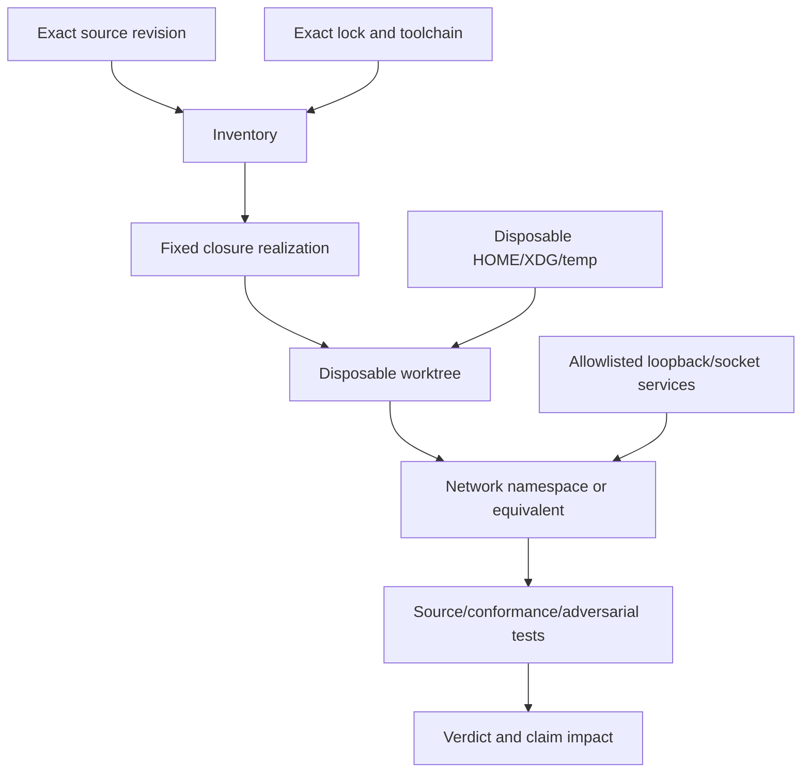

# M0 / GSD Phase 1 — truthful baseline and replay contract

## Purpose

Phase 1 exists to establish what the existing Uzel source, historical POC claims,
packaging and security boundaries actually prove. It is not a feature phase and it is
not a foundation rewrite.

The result must be useful even when a historical replay cannot be reconstructed. An
honest unavailable result plus current replacement evidence is better than a fabricated
green run obtained by changing dependencies, using ambient tools or reinterpreting the
old baseline.

## Three distinct evidence classes

Do not collapse these:

| Evidence | Question answered | What it cannot prove |
|---|---|---|
| Historical exact-source replay | Can the old source and fixed dependency graph execute the claims made for it? | That the current package is distributable or secure |
| Current source tests | Does the current implementation satisfy the relevant invariants? | That the old POC was reproducible |
| Current Nix/native acceptance | Does the current distributable closure build and run independently of the checkout? | Historical source sufficiency |

All Phase 1 summaries and dashboards must label the evidence class.

## Incident preservation

### Preserve Git evidence

Before changing planning or source:

1. Verify `b185ad1` is an existing commit.
2. Record its parent, branch/worktree, author time, changed files and diffstat.
3. Create a durable local safety branch if one does not exist.
4. Create a portable evidence bundle or binary patch archive outside the repository,
   verify it, and record its SHA-256. Do not rely on one local ref as the only copy.
5. Record all current worktrees and the active GSD branch.
6. Generate a GSD pause report from the blocked session.
7. Do not clean, delete or repurpose the blocked worktree.

The final Phase 1 report must state whether `b185ad1` was:

```text
retained
amended
superseded_with_provenance
discarded_with_reason
```

Planning may only say “provisionally retain/amend/supersede/discard.” The final state
requires executed tests and source evidence.

### Preserve claim provenance

Create a claim ledger with at least:

| Claim ID | Historical claim | Source revision | Original test/evidence | Current replacement | Final status |
|---|---|---|---|---|---|
| POC-* | Exact-build verification | commit/ref | command/fixture | current test | reproduced/replaced/etc. |

Include, where present:

- source-bound napplet identity;
- separate daemon and AF_UNIX control boundary;
- trusted versus guest surface separation;
- denial of direct guest network egress;
- denial of native bridge access;
- canonical Nostr data path;
- session/lifecycle and restart behavior;
- exact-build update or verification behavior;
- deterministic browser/conformance behavior;
- Nix/native package claims.

No claim survives because a plan says it once worked.

## Tool and dependency inventory

Before choosing an install command, inspect the exact historical revision. Also record
the installed Codex and GSD versions and verify current command help for planning, review,
execution, phase editing, health and forensic progress; do not inherit CLI assumptions
from an older plan.

Record:

- package manager and version source;
- every lockfile and workspace root;
- Node/toolchain version source;
- Nix inputs relevant to the replay;
- package scripts called by original tests;
- whether Vite is a direct, transitive or workspace dependency;
- what “napplet-conformance” actually is in that revision;
- lifecycle scripts and native build dependencies;
- package-manager cache/store format;
- local test services and required ports/sockets;
- environment variables used by tests;
- generated files expected by the baseline;
- platform-specific assumptions.

Do not infer the conformance tool from its name. It may be a workspace binary,
repository script, Nix app, locked package or an unavailable historical external tool.

### Replay attempt budget

Historical replay is bounded evidence work, not an archaeology programme:

1. perform one complete source/tool/claim inventory;
2. select one exact-closure realization path from the evidence;
3. run one isolated replay attempt;
4. allow at most one correction only when logs prove the failure is in the replay
   harness, sandbox or isolation configuration rather than historical source, platform
   or closure;
5. then stop and emit the conservative verdict plus current-source replacement tests.

Do not patch old source, try a sequence of substitute package managers or spend an
unbounded milestone reconstructing a dead environment.

## Exact closure policy

### Revised rule

> Materializing an exact fixed closure is allowed. Resolving a different closure is not.

Allowed closure sources, in order:

1. a complete local content-addressed store whose package identities match the lock;
2. a Nix derivation whose sources and hashes are fixed;
3. a package-manager frozen/offline install using exact cached content;
4. a controlled prefetch stage fetching only integrity/hash-locked bytes absent from the
   local store.

Forbidden:

- lockfile updates or regeneration;
- semver re-resolution beyond the lock;
- package substitution or “closest available” tools;
- global Vite/conformance binaries;
- `npx` or equivalent dynamic downloads during replay;
- arbitrary dependency directories copied from another checkout;
- source patches that merely make the historical test run;
- committing dependencies, caches or generated output;
- public registry/DNS access during replay;
- silent fallback between package managers.

### Lifecycle scripts

Dependency lifecycle scripts are disabled by default because they are executable supply-
chain input, not passive package bytes.

An allowlist is permitted only when all are true:

- the exact historical baseline demonstrably requires the script;
- package identity and script content are fixed;
- the script is reviewed before execution;
- external egress is denied;
- `HOME`, XDG, temp and cache directories are disposable;
- filesystem writes are logged or bounded to the replay sandbox;
- output hashes and generated locations are recorded;
- failure does not trigger a substitute package or script.

## Replay isolation



The replay environment must:

- be outside the ordinary development checkout;
- not read dependency trees or build output from another checkout;
- use disposable `HOME`, `XDG_CONFIG_HOME`, `XDG_STATE_HOME`, `XDG_DATA_HOME`,
  `XDG_CACHE_HOME` and temp directories;
- deny external network egress and public DNS;
- allow only declared loopback or Unix-socket test services;
- contain a hostile probe that demonstrates external egress denial;
- record kernel, distribution, architecture, tool versions and environment variables;
- avoid user profile, signer, relay, application database or desktop state;
- clean up through an idempotent explicit command after evidence is archived.

“Offline” in this plan means **no external egress**, not “no socket can exist.” A local
relay fixture, WebSocket server, browser driver or Unix daemon may be required for the
baseline, but each is named and bound to the sandbox.

## Replay verdicts

Use exactly one top-level verdict:

### `reproduced`

The exact historical source, closure and declared environment execute the claim set
without material variance.

### `reproduced_with_variance`

Execution succeeds, but a documented non-semantic environmental variance exists, such
as a newer kernel or browser engine. The report proves why the variance does not alter
the claimed invariant.

### `unavailable_exact_closure`

Required exact bytes/tooling cannot be reconstructed without changing the closure.
List the missing identities and why substitution was rejected.

### `unavailable_platform`

The exact required historical platform cannot be reproduced on the supported host and
no faithful environment exists. Record the platform dependency and replacement proof.

### `failed_behavior`

The exact replay executes but a claimed behavior fails. This is a product/security
finding, not a replay-tool failure.

### `superseded_test`

The historical test is no longer a valid proof of the stated invariant. Explain the
semantic mismatch and identify the current replacement test.

A mixed claim set may have per-claim statuses, but the top-level verdict follows the
most conservative material result.

## Replacement-evidence rule

Phase 1 may continue after `unavailable_exact_closure`, `unavailable_platform` or
`superseded_test` only when:

1. every affected claim is enumerated;
2. critical security/correctness invariants have current-source tests at the actual
   package/native boundary;
3. those tests run from the current locked/Nix closure where applicable;
4. the historical claim is explicitly marked retired, replaced or unproven;
5. no plan or documentation continues citing the old replay as green.

A missing replacement for any critical invariant blocks delivery phase 2.

## Current Nix package/native acceptance

### Package outputs

Inventory and verify only outputs that actually exist or are justified by current
operations. At minimum the packaged product should identify:

- Uzel GUI/application result;
- separate runtime daemon result; absence is an explicit package-acceptance blocker;
- user-service definition where used;
- exact resources and test fixtures needed for acceptance;
- bounded diagnostics/control entrypoint only if current source already has one or M5
  operations require it.

Do not create generic SDKs or extra binaries merely to satisfy a diagram.

### Acceptance environment

Run with:

- clean temporary `HOME`;
- explicit instance ID;
- instance-scoped XDG directories;
- no source checkout in current directory or resource search path;
- minimal `PATH` containing only declared runtime dependencies;
- SELinux enforcing when running the Fedora acceptance lane;
- store-path binaries and resources;
- explicit daemon endpoint and version negotiation;
- deterministic fixture services where network behavior is needed.

### Required checks

- package builds from locked inputs;
- product and daemon locate each other without arbitrary `PATH` search;
- resources load from package/store locations;
- incompatible control generations fail clearly;
- stale socket/lock recovery is deterministic;
- an explicit instance ID yields deterministic disjoint paths for two fixture instances;
- the report records whether simultaneous packaged instances already work; if not, this
  remains an explicit 7.1 product delta rather than M0 feature work;
- GUI/daemon restart does not revive stale guest sessions;
- native WebKit/Weston smoke executes from the package;
- package output, closure size, build time, launch time and peak memory are recorded;
- clean uninstall/test teardown leaves no undeclared state outside the chosen XDG roots.

## Authority and schema baseline

Phase 1 must produce a current-source authority map, not just an intended architecture.
For each semantic owner, mark:

```text
implemented
partially implemented
planned delta
contradiction
unknown requiring evidence
```

Minimum owners:

- trusted shell/product UX;
- runtime daemon/session/grant authority;
- canonical Nostr engine;
- external signer protocol execution;
- durable product intent;
- Nostr write/delivery evidence;
- object bytes and access metadata;
- package/exact-build records;
- migrations/backups;
- local diagnostics/control.

Create the durable-format registry and include every current signed, wire or on-disk
format. Do not postpone schema ownership because internal modules are unstable.

## Ecosystem, compatibility and maturity baseline

M0 must re-run the dated source scan in
[reports/ecosystem-baseline-2026-08-10.md](reports/ecosystem-baseline-2026-08-10.md)
against the exact dependency/spec/tool revisions actually present in Uzel.

Produce:

- `docs/ecosystem/upstreams.toml` or the repository-equivalent single registry;
- the initial canonical machine-readable Uzel Runtime Compatibility Profile with immutable
  source identities, profile hash, generated human rendering and package-binding plan;
- a Spec Interpretation Record for napplet manifest kinds, aggregate/build identity,
  source verification, required/optional capability declarations and web bootstrap;
- canonical capability-negotiation/transcript schema and vectors proving missing required
  capabilities reject before guest code, with no implicit downgrade or mid-session profile
  mutation;
- a status map for every used NIP/NAP/proposal: merged, active, draft, open-PR,
  temporary-profile, unrecommended or unsupported;
- current conformance-tool and canonical-engine pins plus the exact phase-pinned
  GSD/Codex/CodeRabbit/Rust/Node/Nix toolchain record;
- a local-patch and upstream-interaction index;
- a read-only upstream-radar snapshot and isolated candidate-next shadow-probe policy
  that cannot mutate production locks, profiles or releases;
- an initial interop/version-skew matrix, externally consumable compatibility/
  conformance-kit plan, external-source clean-room fixture plan and true independent-peer
  acquisition/blocking rule;
- capability-maturity ledgers at honest L0/L1 levels;
- separate local-patch, upstream merge/release/Uzel-adoption/patch-removal states and
  contribution/security routes;
- decision/spec/upstream/learning/milestone-digest directories, visibility/embargo rules
  and phase-closeout fields.

The profile must distinguish current NIP-5A nsite semantics from any open NIP-5D
napplet-manifest semantics and from package behavior. A disagreement is not resolved by
choosing the most convenient README. It is resolved through exact source evidence,
contract fixtures and an explicit temporary or upstream-aligned interpretation.

Phase 2 is blocked until Uzel can prove how the exact bytes that execute are bound to
publisher/source/build identity under the chosen profile **and** how required/optional
capabilities are negotiated and bound before guest code executes.

## Phase 1 CI and review baseline

Measure existing commands before changing the workflow:

- wall time, CPU and cache behavior;
- duplicate work across local hooks and CI;
- Nix rebuild triggers;
- Rust and frontend cache hit/miss behavior;
- native test flakiness;
- Codex/GSD and review-tool availability, versions and relevant supported flags;
- critical checks that currently run only on developer machines.

The Phase 1 change should implement only obvious, evidence-backed corrections. It must
not open a bespoke changed-crate dependency engine unless measured full-workspace PR
checks are actually unacceptable.

## Phase 1 evidence matrix

The final report includes a table like:

| Area | Historical replay | Current source | Nix/native | Status/blocker |
|---|---|---|---|---|
| Exact-build identity | verdict + artifact | test | package test | pass/block |
| Guest egress denial | verdict + hostile probe | test | native test | pass/block |
| Daemon lifecycle | verdict | integration | user-service test | pass/block |
| Nostr authority | claim impact | adapter/owner tests | package journey | pass/block |
| Browser boundary | variance | conformance | WebKit/Weston | pass/block |
| State paths | not applicable/claim | schema/path tests | two fixture roots; current simultaneous status | pass/block |
| Compatibility profile/negotiation | immutable sources/profile hash | adapter/contracts/vectors | packaged diagnostics/launch transcript | pass/block |
| Upstream/local patches | not applicable | registry/records | source/provenance map | pass/block |
| Capability maturity | claim only | L0/L1 ledgers | package-evidence links | pass/block |

## Stop conditions

Stop and escalate rather than improvising when:

- the exact historical revision or parent of `b185ad1` is ambiguous;
- the lockfile does not fix the required package identity;
- package integrity cannot be verified;
- a lifecycle script needs undeclared external access;
- replay isolation cannot prove external egress denial;
- a test requires secrets or production accounts;
- the current package depends on the source checkout;
- current source has two competing Nostr/state/signing authorities;
- napplet manifest/exact-build identity depends on an unrecorded or contradictory moving
  spec/package assumption;
- a critical upstream/local patch has no owner, test or provenance;
- Phase 1 would need a product feature or broad platform rewrite to become green;
- a critical old claim is unavailable and has no current replacement proof;
- any Critical/High plan finding or a Medium finding that threatens the Phase 1 outcome,
  authority, correctness, data or operability remains unresolved after the bounded replan
  loop.

## Exit gate

M0 completes only after:

- Git/GSD incident evidence and `b185ad1` are safely reconciled;
- both replay and package verdicts exist independently;
- claim provenance and replacement evidence are explicit;
- current authority, threat, schema and XDG scope are documented against source;
- current package acceptance runs without checkout/ambient-tool dependence;
- CI/review baselines are measured;
- the canonical profile bytes/hash, generated rendering, immutable upstream registry,
  SIR, negotiation vectors and initial capability ledgers exist at exact source identities;
- the Phase 2 manifest/exact-build/launch-negotiation gate has a human-readable go/no-go
  verdict;
- upstream/local-patch lifecycle, visibility rules, decision/learning closeout and
  milestone-digest process are operational rather than aspirational;
- installed command help is recorded, plan/execute state validation has run, and no
  automatic Codex worktree assumption remains;
- Phase 1 verification passes and the owner approves advancement to delivery phase 2.
