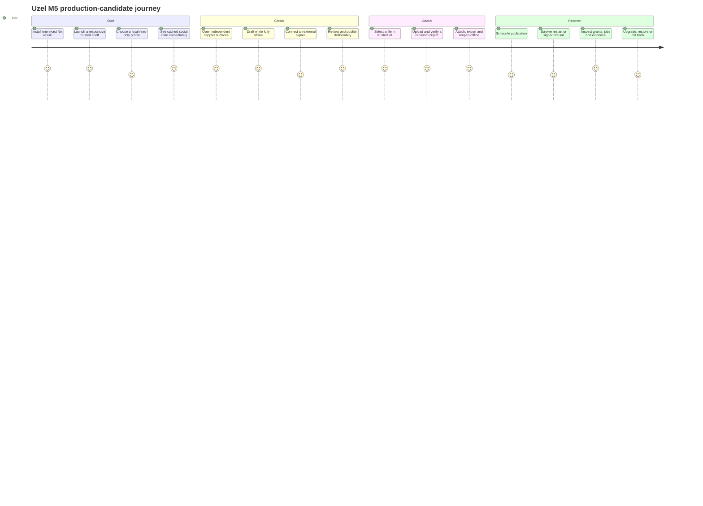
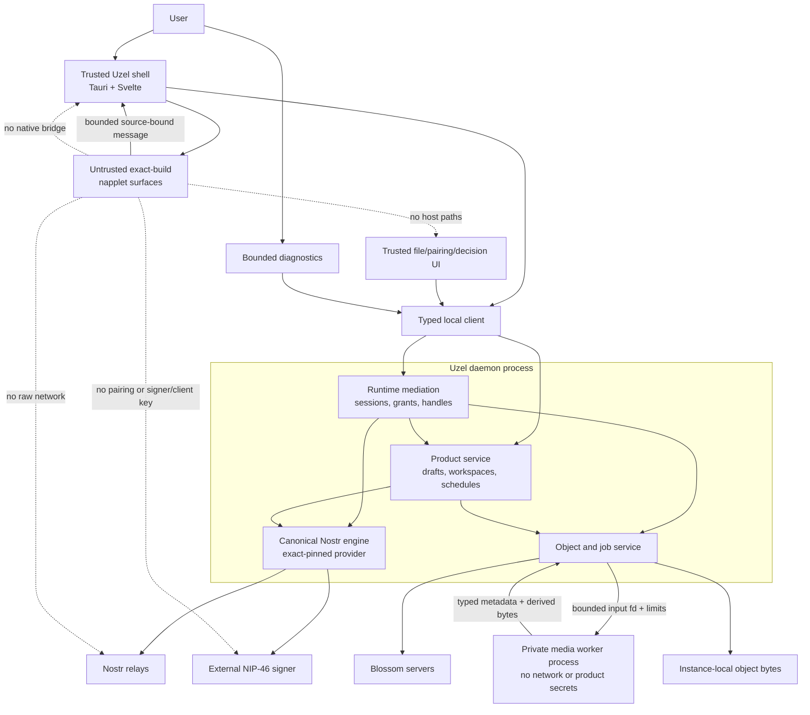
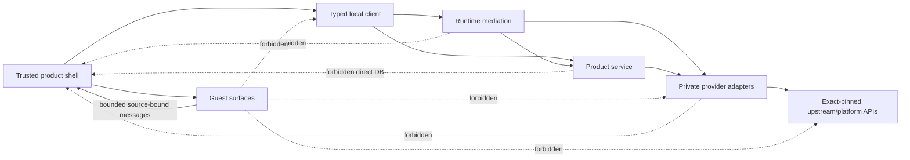
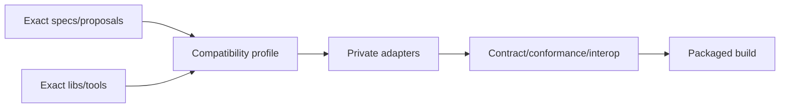
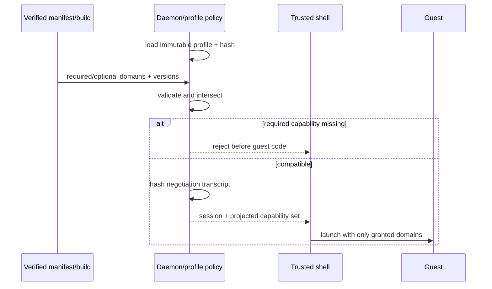
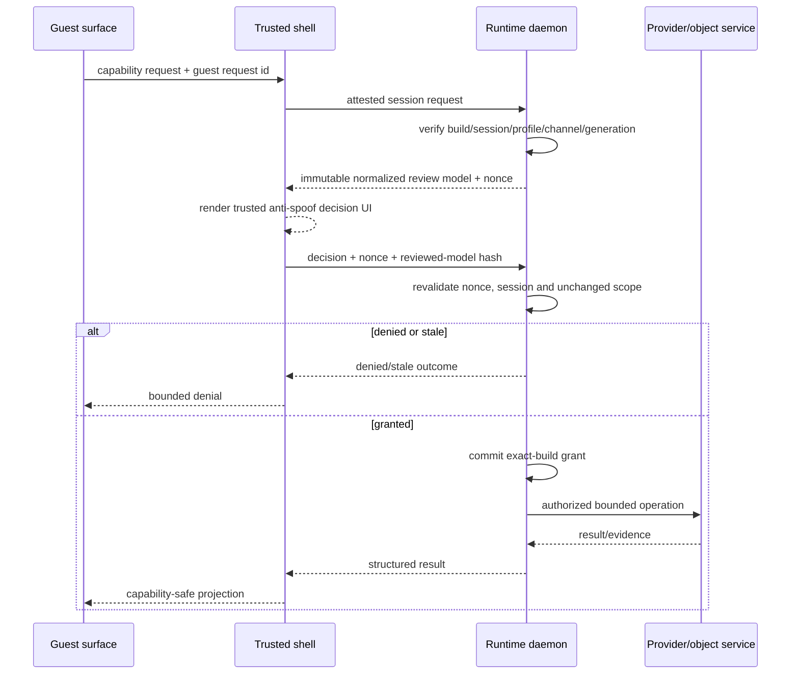
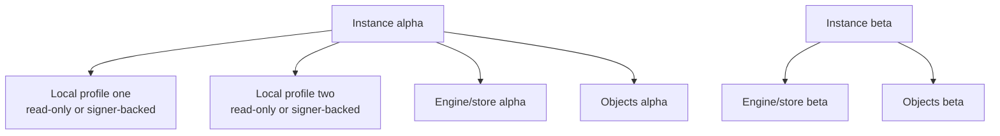
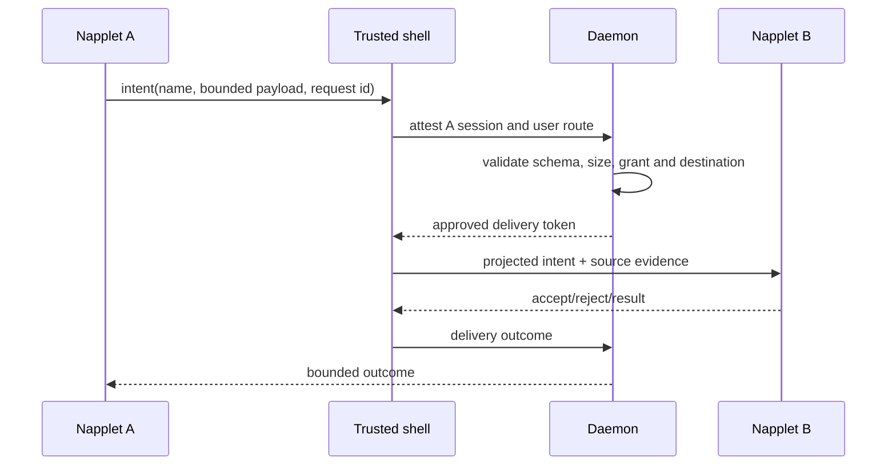
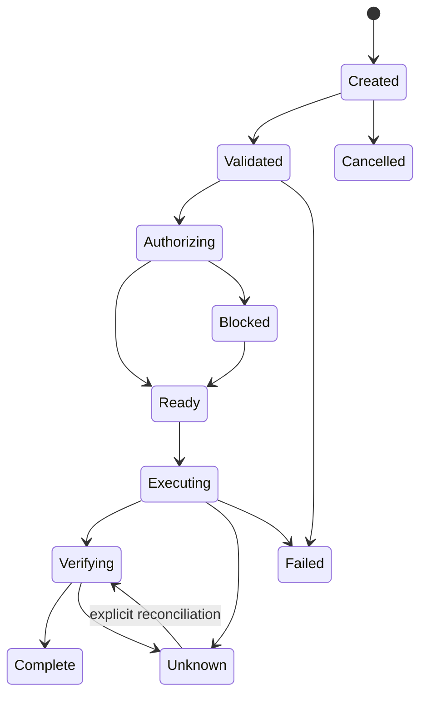
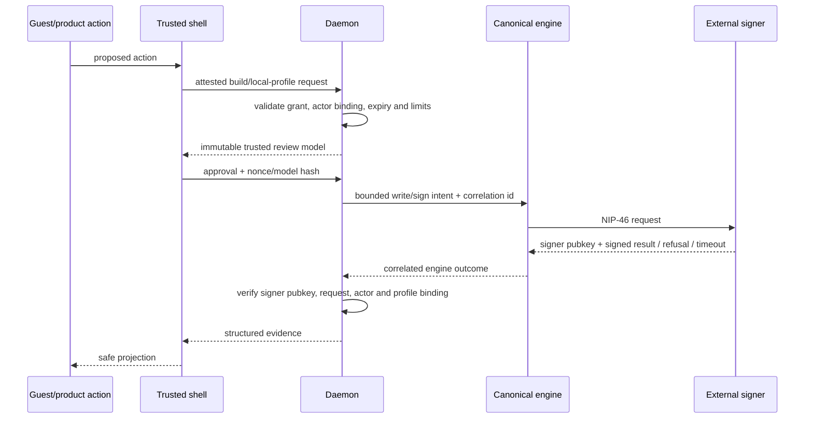

# Uzel product and incubation architecture

## Product charter

Uzel is a Linux-first native environment for small, composable napplets. The M5
production candidate must be a coherent product rather than a runtime demo, SDK showcase or collection of
isolated proof-of-concepts.

It should be:

- fast, local-first and useful when relays or signers are unavailable;
- crisp, sharp, sovereign and distinctive without becoming visually noisy;
- keyboard-first with equivalent mouse, touchpad and assistive-technology paths;
- explicit about identity, authority, source/build identity, stale data, partial
  evidence, uncertain side effects and recovery;
- composed from narrow product surfaces and runtime services rather than a plugin
  monolith;
- open-source, inspectable and operational without silent telemetry or closed accounts;
- small enough that a technically capable user can understand what is running;
- internally modular enough to change aggressively while product semantics are still
  being learned.

The architecture optimizes first for product correctness, isolation and evolvability.
It does not optimize current names or module boundaries for a hypothetical downstream
consumer.

## Product-representative journey



## Product surface map

The trust boundary is about authority, not who authored the UI.

| Surface | Trust class | Responsibilities before A5 |
|---|---|---|
| Trusted shell | Trusted native/product UI | Workspace chrome, focus/layout, permission/file/signer/destructive dialogs, settings, diagnostics and recovery |
| Home | First-party exact-build guest napplet | Cached/live social projection and bounded navigation intents |
| People/Profile | First-party exact-build guest napplet | People/follow/profile projection and bounded intents |
| Composer/Drafts | First-party exact-build guest napplet | Draft editing through a scoped product-service capability; no direct database, signer or network access |

The first-party napplets are bundled as immutable exact builds in the same Nix result for
M1–M4.5. They receive no privileged bridge, origin, database or raw provider shortcut.
A public install/update experience is not introduced until the bounded exact-build
lifecycle work in M5.

M1 workspace layout/projection is transient shell state. The shell must not create a
competing durable layout database. If persistent workspace state proves useful, M2 adds
it through the daemon-hosted product service with an owned schema and migration path.

## System context

Names below describe responsibilities. Preserve current source names unless a bounded
issue proves a rename improves correctness or product clarity.



Through M5, the Uzel-specific product service is hosted in the daemon process so drafts,
schedules and reconciliation survive shell close/restart. Process co-location does not
merge semantic ownership: product-service state, runtime mediation, canonical Nostr
state and object/job state remain separate modules/stores with explicit contracts. The
trusted shell uses the typed local client and never opens those databases directly.

Those module/store boundaries are **not process security boundaries**. Compromise of the
daemon process can reach in-process state and credentials. Untrusted raster parsing is the
one pre-A5 exception that must run outside that authority-bearing process in a restartable,
no-network, low-authority media worker. A5 must test the actual daemon and worker boundaries and decide
whether additional provider/product/runtime separation, systemd hardening or another OS
boundary is required; the plan must not imply isolation that co-location cannot provide.

Blossom ownership follows exact provider evidence. When the canonical Nostr engine owns
authorization or upload semantics, Uzel calls that seam through its private adapter.
When the object service owns a product-specific transfer job, it still must not create a
second Nostr signer, relay pool or publication queue.

## Authority model

### Trusted shell owns presentation and human decisions

The trusted shell owns:

- product navigation, workspace composition and visual hierarchy;
- native windows/surfaces and focus/input behavior;
- trusted permission, signer, file and destructive-action dialogs;
- human-readable source/build identity and authority diffs;
- transient interaction state, layout rendering and animation;
- product defaults and settings presentation;
- accessible recovery, blocked/unknown state and support UX;
- desktop notifications only when a product phase requires them;
- transient ingestion of pairing URIs/QR data in a trusted surface, immediately handed
  to the canonical engine without logs, history or guest projection.

It does **not** own:

- canonical guest/session identity;
- committed grant truth;
- canonical Nostr events, relay routing or delivery evidence;
- signer protocol execution or secrets;
- file authorization or opaque-handle truth;
- durable drafts, schedules or remote side-effect completion;
- direct mutation of product-service, runtime, object or engine databases.

### Runtime mediation owns guest authority and runtime truth

The daemon-hosted runtime mediation layer owns:

- exact installed source/build records and launch principals;
- napplet instance, session and generation lifecycle;
- binding every guest request to build, instance, session, local profile, actor context,
  surface channel and generation;
- capability request validation, grant commit, revocation and authority diff;
- cross-napplet intent routing and delivery evidence;
- opaque object/file handles and access-control checks;
- bounded queues, quotas, cancellation, timeouts and pressure behavior;
- local-control version negotiation and structured diagnostics;
- supervision of runtime-owned tasks/processes and stale endpoint cleanup.

It does **not** become:

- a product draft/schedule database;
- a second Nostr event store or relay pool;
- a second signer or NIP-46 implementation;
- a second Nostr publication queue;
- a general shell-command or D-Bus service;
- a product layout/navigation engine;
- a generic filesystem server.

### Product service owns durable Uzel workflow semantics

The daemon-resident product service owns:

- draft content, revisions, autosave/conflict state and deletion intent;
- workspace state that must survive shell close/restart;
- schedule intent, due-time policy and one finite scheduler owner;
- attachment choices and references to verified object records;
- product-to-engine and product-to-object operation references;
- user-visible workflow history and reconciliation state;
- migrations, backup/export and deletion semantics for product-owned records.

It communicates through typed local requests. Guest napplets may reach only explicitly
mediated, bounded product capabilities; they never receive the product database or an
unrestricted product-service handle. The shell renders and decides, but cannot directly
write product state. Hosting this service in the daemon process is an incubation choice,
not a promise that it will become a separate package or process.

### Canonical Nostr engine owns Nostr semantics

Use exactly one semantic owner for:

- event validation and canonical event state;
- relay discovery, routing, connection and finite fan-out;
- replacement/deletion/expiry semantics;
- live query demand and cancellation;
- source/provenance/freshness evidence;
- signer protocol integration and signed-event production;
- Nostr write intent, retry and per-relay outcome evidence;
- enforcement that signer-produced events satisfy the reviewed template before any relay
  write;
- Nostr-specific durable state.

The current implementation candidate is the exact-pinned NMP family behind a private
adapter. Treat that pin as evolving upstream code, not as a stable Uzel contract:

- inventory its current ownership and API from source;
- project only narrow Uzel-owned request/result types across internal boundaries;
- prevent provider-specific types from crossing the local-control or UI boundary;
- maintain contract fixtures around every used operation;
- update the pin deliberately with an authority/behavior diff;
- replace the whole semantic owner if the provider changes; never run two canonical
  Nostr planes side by side.

### Product service owns user intent, not protocol delivery

The product service owns what the user is trying to do. The canonical Nostr engine owns
Nostr event/write state and relay evidence; the object service owns Uzel transfer and
verification jobs where the engine does not.

A queued product action stores a durable reference to the owning engine/object
operation; it does not mirror relay retries or invent a second upload/publication truth.
Reconciliation is explicit after daemon, provider or shell restart.

## Dependency direction



Internal source layout may differ. The invariant is ownership and dependency direction.
Use private modules and `pub(crate)` by default. Create a crate only when process,
build, dependency, ownership or test isolation proves it useful. Do not create empty
“future package” crates. Co-location in the daemon must not permit cross-owner database
access or circular semantic authority.

## Runtime compatibility profile and moving upstream boundary

Every packaged build carries one immutable, daemon-owned `compat_profile_id`,
`profile_hash_scheme` and `compat_profile_hash`. The canonical profile is the exact
validated UTF-8 TOML byte sequence shipped in the package: no BOM, LF line endings and no
runtime normalization before SHA-256 under
`sha256-exact-utf8-bytes-v1`. The package manifest and compiled expected digest bind the
bytes; daemon startup recomputes the digest and fails closed on mismatch. A human
rendering is generated by parsing those exact bytes. The profile binds the exact
Nostr/NAP/projection/conformance/provider revisions and the supported subset, deviations,
trust tier, interop matrix and migration rules. It is not negotiated by a guest and is
not inferred from whichever README is newest at runtime.

Every source entry identifies immutable bytes, not merely a human locator. For Git-backed
material record repository, commit object, tree object, path and content digest; for a
package/release record exact version plus registry integrity or Nix source hash. A branch,
tag name, pull-request number or mutable URL is useful provenance but is never sufficient
as the executable pin. The package exposes the canonical profile digest through trusted
diagnostics and binds it into compatibility evidence.

The private adapter boundary has two jobs:

1. prevent fast-moving upstream types and names from becoming Uzel product/control
   contracts; and
2. make semantic or security drift visible rather than silently translating it.

The adapter must expose Uzel-owned concepts for:

```text
profile/capability availability
canonical demand and freshness evidence
sign-then-validate-then-submit
publication/delivery evidence
endpoint-policy enforcement
provider diagnostics and known shortfalls
```

It must not invent fallback semantics when upstream cannot represent a required
invariant. A missing pre-send validation seam, ambiguous manifest identity or absent
cancellation path blocks the owning capability rather than being hidden behind an option
bag.

The initial profile must explicitly reconcile current NIP-5A nsite semantics, the exact
open NIP-5D revision (if used), the NAP registry/projection, napplet packages and
conformance tooling. See [the ecosystem/upstream process](07-ECOSYSTEM-UPSTREAM.md).



## Capability negotiation and launch transcript

The compatibility profile states what the runtime can offer. A verified napplet manifest
states what that exact build requires or may use. Launch computes an explicit intersection
before guest code executes:

1. verify manifest, exact bytes, source/publisher evidence and profile interpretation;
2. parse versioned required and optional domains/operations under fixed limits;
3. intersect them with the active runtime profile and local policy;
4. reject launch when any required capability/version is unavailable or forbidden;
5. expose optional omissions as explicit `unsupported`/degraded results—never an implicit
   semantic downgrade;
6. mint the surface/session only after the result is fixed;
7. canonicalize and hash a negotiation transcript bound to instance, local profile,
   authority mode, actor, exact build, profile hash, session and generation.

The transcript records requested, granted, omitted and rejected domains/versions plus
limits and deviations. Its canonicalization is independently specified as
`sha256-canonical-cbor-v1` with cross-language positive and negative vectors; it is not the
RCP hashing format. The guest cannot broaden it after launch. A profile or exact-build
change creates a new generation and a new transcript; there is no mid-session profile
upgrade. Runtime presence checks remain useful for optional behavior, but they do not
replace pre-launch required-capability validation.

By Phase 2.7, the exact RCP, schemas, vectors, limits, black-box packaged harness and a
clean-room example form an externally consumable compatibility kit. It may expose wire
and behavior contracts, but it does not expose Uzel private adapters or promise a public
Rust SDK. M1 proves the kit with a Uzel-authored external-source clean-room build; M5 requires a
separately authored/commissioned clean-room peer using only the public kit and packaged
harness. Community-maintained-peer evidence is tracked separately.



## Request identity

Every guest-originated operation carries an immutable daemon-derived and validated
context:

```text
instance_id
local_profile_id
authority_mode = read_only | signer_backed
actor_pubkey?                 # daemon-owned binding, never caller-selected
napplet_id
napplet_source/publisher evidence
exact build hash
compatibility profile id/hash
negotiation transcript hash
surface/session id
session generation
channel capability id         # daemon-minted, host-side only
request id
requested capability
resource scope
expiry/deadline
```

`local_profile_id` always identifies a Uzel-local profile record. `authority_mode` is
explicit. A profile may have an optional bound `actor_pubkey`; an identity-rooted Home
requires one, while a separate public-browse context may omit it. Read-only mode does not
confer signing authority. A viewed author, note, event or profile is a payload
`subject_ref`, never the caller principal.

The guest may propose an operation payload; it may not select or overwrite its own
principal, local profile, actor public key, exact build, channel capability or destination
authority. The daemon mints a per-surface channel capability at launch; the host-side
bridge attaches it, guest JavaScript never receives it, and cross-surface reuse fails. The
shell does not choose the principal: the daemon ignores caller-supplied identity fields and
derives them from the launch/session record. Because the shell is trusted product code,
compromise of the shell is outside the guest-containment claim; do not overstate that the
shell is technically incapable of acting on the user's behalf.

Stale generation, wrong local profile, actor/signature mismatch, revoked build, expired
request and reused request ID fail closed before reaching a provider.

## Permission and grant flow



Rules:

- The decision UI is outside the guest DOM/origin and is visually identifiable as trusted
  Uzel chrome.
- It shows local profile/actor, requesting exact build and provenance, capability,
  normalized resource/destination and expiry. Guest-provided text is escaped,
  length-bounded and clearly attributed; it is never rendered as trusted rich content.
- While a decision is active, prevent guest click-through/focus stealing where the
  platform permits it and verify the current trusted surface/session before accepting.
- The daemon issues the per-surface channel capability, decision nonce and immutable
  review-model digest. Any payload,
  scope, profile, build or generation change invalidates approval.
- The shell presents the decision; the daemon validates and commits it.
- A grant is keyed by exact build, local profile/actor binding, capability, resource scope
  and lifetime.
- New bytes do not silently inherit authority.
- Update UI presents added, removed, narrowed and unchanged capabilities.
- Signer, publish, object write/export and background capabilities always receive
  explicit review.
- Revocation prevents new work immediately and defines cancellation/reconciliation of
  in-flight work.
- Rollback restores only grants valid for the exact previous build.
- Disabled or quarantined builds cannot continue stale sessions or jobs.

## State ownership

| State/data | Canonical owner | Scope | Persistence rule |
|---|---|---|---|
| Nostr events, relay/provenance facts, Nostr writes | Canonical Nostr engine | Instance + local profile where relevant | Durable; no duplicate product/runtime authority |
| Installed source/build/hash/manifest | Runtime metadata | Instance | Exact bytes/content identity; schema versioned |
| Grants and grant history | Runtime metadata | Instance + local profile + exact build | Durable, reviewable and revocable |
| Sessions and generations | Daemon | Instance | Ephemeral plus reconciliation journal; never silently revived |
| Product workspaces/layout/settings | Product service when persistence is introduced | Instance + local profile as needed | M1 shell layout is transient; any M2+ durable form is independently migratable and shell-inaccessible |
| Draft content and schedule intent | Product service | Instance + local profile | Durable and crash-safe; scheduler survives shell exit |
| Nostr delivery/retry evidence | Canonical engine | Instance + local profile | Durable engine-owned state |
| Product-to-engine/object operation refs | Product service | Instance + local profile | Durable correlation, not duplicate provider state |
| Object bytes | Profile-local content store | Instance + local profile | Durable/bounded; no cross-profile deduplication or existence oracle before A5 |
| Object access metadata/handles | Runtime metadata | Instance + local profile + build | Opaque, revocable, expiry/cleanup defined |
| File chooser tokens | Runtime memory/metadata | Instance + local profile | Short-lived unless explicit retained import |
| Raster validation/derived display objects | Object service + isolated media worker | Instance + local profile | Bounded, rebuildable, source hash + worker/version provenance tracked |
| Thumbnails/render cache | Derived cache | Instance + local profile | Bounded, rebuildable, provenance tracked |
| Signer connection/client key | Engine/provider integration | Instance + local profile | Explicit secure-at-rest/session-only policy; never guest-visible; no silent plaintext fallback |
| Diagnostics | Owning component | Instance | Redacted, bounded retention |

A value called a cache that cannot be rebuilt is durable state and requires schema,
migration, backup and deletion ownership.

## Durable-format registry

Internal functions may change freely. Signed, wire and on-disk formats may not.
Register at least:

- exact-build identity and manifest fields;
- source hash and aggregate/hash preimages;
- local-control envelope generation and role negotiation;
- product, runtime and engine schema generations;
- grant keys/scopes and decision nonces;
- session and request correlation identifiers;
- durable job states, idempotency and reconciliation tokens;
- object metadata, expected hashes and access references;
- draft/schedule records and engine operation references;
- backup/export manifests;
- diagnostic redaction classes.

Each entry records:

1. canonical owner;
2. version/generation;
3. parser and maximum sizes;
4. deterministic vectors/fixtures;
5. forward migration and unsupported-future behavior;
6. previous-green rollback compatibility;
7. backup/restore disposition;
8. deletion/retention owner;
9. security/redaction class.

Delay API stability, not data correctness.

## Instance and local-profile scope

Multi-instance and multi-profile support are schema properties from M0, not M5 patches.

Alpha path layout:

```text
$XDG_RUNTIME_DIR/uzel/instances/<instance>/...
$XDG_CONFIG_HOME/uzel/instances/<instance>/...
$XDG_STATE_HOME/uzel/instances/<instance>/runtime/profiles/<local_profile>/...
$XDG_STATE_HOME/uzel/instances/<instance>/product-service/profiles/<local_profile>/...
$XDG_DATA_HOME/uzel/instances/<instance>/objects/profiles/<local_profile>/...
$XDG_CACHE_HOME/uzel/instances/<instance>/profiles/<local_profile>/...
```

A local profile record has at least:

```text
local_profile_id
authority_mode = read_only | signer_backed
actor_pubkey?                 # optional until explicitly bound
signer_connection_ref?       # engine-owned reference, never a guest secret
```

Rules:

- No shared cross-instance or cross-profile content store before A5. Do not expose a
  cross-profile content-existence or deduplication oracle.
- Each instance has its own daemon endpoint, lock and engine/store; each local profile has
  a logically and physically separate object namespace before A5.
- Read-only use is represented by a real local profile with explicit `read_only` mode,
  never an absent/null/magic identity. An identity-rooted Home requires a bound
  `actor_pubkey`; read-only means the profile cannot sign, not that it lacks identity. A
  separate public-browse mode may omit an actor but cannot pretend to be a followed Home.
- A viewed subject public key does not become the active actor.
- Profile switching never mutates the identity of an already validated request.
- Pending signer/publish/object jobs remain bound to their original local profile and
  actor public key.
- A NIP-46 connection may elevate a profile to `signer_backed` only after the signer-
  reported public key is verified. A mismatch requires an explicit new-profile or rebind
  decision; it never silently changes the actor.
- Two fixture instances and two fixture local profiles exist in tests from the first new
  schema; M5 proves simultaneous packaged operation and UX.
- Paths are never derived from unvalidated user labels.



## Local control surface

GUI and bounded diagnostics communicate with the daemon over AF_UNIX in the instance
runtime directory.

Requirements:

- socket directory mode and ownership validation;
- peer credential verification where supported;
- protocol generation and role negotiation;
- message and field size limits;
- request IDs, deadlines and cancellation;
- bounded inbound/outbound queues;
- stale endpoint/lock recovery;
- no shell command, arbitrary path or database query operation;
- redacted diagnostics;
- fail-closed unknown roles, generations and message variants.

### Threat scope

AF_UNIX permissions and peer credentials prevent accidental/public access; they do not
make a compromised same-UID process harmless. Sensitive operations still require
session capability and trusted user interaction where appropriate.

The alpha does not claim protection against a compromised kernel, root, injected same-
UID process or browser-engine remote-code execution. Where stronger OS isolation is
added later, it must be evidenced separately rather than implied by a WebView boundary.

## Guest and browser boundary

Guest napplets are untrusted content even when first-party or published by a known
identity.

- No Tauri invoke bridge or arbitrary native IPC.
- No direct product-service, runtime, object or Nostr engine handle.
- No raw relay, HTTP, WebSocket, file, signer, clipboard, notification, D-Bus or shell
  authority.
- Guest network APIs are disabled at the supported WebKit/product-policy boundary.
- Each exact build uses a unique/build-scoped controlled origin or a proven isolated
  website-data manager partition. Path-only separation on one origin is insufficient.
  Do not use `file://` or a wildcard localhost origin.
- The origin has a default-deny CSP. Remote scripts and ambient remote subresources are
  forbidden unless a separately reviewed product capability mediates them.
- Navigation, popup, download, external protocol and origin changes are denied or routed
  through trusted policy.
- Guest cookies, local storage, IndexedDB, caches and related website data are disabled
  by default. Any exercised persistent guest state is partitioned by instance, local
  profile and exact build, receives migration/deletion ownership and is cleared or
  quarantined on build revocation/update.
- Service workers are disabled before A5 unless a bounded issue proves a product need,
  build-scoped partitioning, update semantics and adversarial tests.
- Every message is schema-validated, bounded and tied to the current exact-build session
  generation plus a daemon-minted host-side channel capability that is never exposed to
  guest JavaScript.
- Surface close/navigation cancels owned work and invalidates stale callbacks.
- First-party Home, People/Profile and Composer napplets use this same boundary; there is
  no trusted first-party shortcut.
- Hostile fixtures test direct egress, bridge probing, oversized messages, replayed IDs, stolen/cross-surface channel attempts, stale generations,
  cross-build/profile website-data leakage, origin confusion,
  service-worker/cache contamination and malformed resource metadata.

This is application containment, not a claim of per-WebView kernel sandboxing.

## Supported guest trust tiers

The runtime distinguishes:

```text
first_party_exact
vetted_external_exact
experimental_external
unsupported_arbitrary
```

An exact hash proves byte identity, not benign behavior. Before A5, required product
journeys may rely on first-party and vetted independent exact builds. Experimental
external builds require explicit trusted-UI policy and may be disabled in the supported
profile. Arbitrary hostile third-party code is not claimed safe merely because WebKit,
CSP, origin separation and message validation are present.

A5 must either accept this limited trust-tier claim or require stronger per-guest
process/OS/network isolation. The package, diagnostics and educational material must use
the same wording.

## Trusted destination policy

Raw remote destinations are authority, not ordinary guest data.

- Guests request a semantic relay/resource/Blossom/signing operation against a
  policy-validated endpoint record; they cannot supply an arbitrary URL, redirect target or
  socket address. “Validated” does not mean every public relay was manually approved.
- Endpoint records retain provenance such as bundled default, trusted user configuration
  or protocol-discovered candidate. Protocol-discovered/public endpoints still pass the
  same service, scheme, host, port, path and address policy before use.
- User-configured endpoints enter only through trusted UI/settings. URL user-info and
  ambiguous host encodings are rejected.
- Default production policy denies loopback, private, link-local, multicast, unspecified
  and cloud-metadata destinations, including IPv4, IPv6, IPv4-mapped IPv6 and encoded
  equivalents.
- A technically capable user may explicitly allow one local/self-hosted endpoint through
  trusted UI. The exception is visible and scoped to exact instance, local profile,
  service type, host/address and port. It does not authorize lateral addresses or
  redirect broadening. Cloud-metadata destinations are never allowed.
- Validation and connection use the same resolved address set, or the provider adapter
  must prove an equivalent pinned-resolution mechanism. Avoid check-then-resolve TOCTOU
  without weakening TLS hostname/SNI/certificate verification.
- Every redirect, reconnect and failover hop is bounded, provenance-recorded and
  revalidated.
- Ambient `HTTP_PROXY`, `HTTPS_PROXY`, `ALL_PROXY`, `NO_PROXY` and equivalent proxy
  settings are scrubbed for mediated operations unless a separately reviewed
  policy-aware proxy path applies the same destination checks to the actual connection.
- Provider-owned networking must expose or prove equivalent enforcement through the
  private adapter; otherwise Uzel rejects that raw routing seam.
- Tests cover DNS rebinding, redirect-to-private, IPv4-mapped IPv6, mixed/encoded forms,
  user-info/host confusion, public-to-private resolution change, proxy bypass, oversized
  URLs, unsupported schemes and endpoint changes during retry.

## Cross-napplet composition

Composition uses mediated typed intents rather than direct guest-to-guest authority.



- No guest discovers another guest's native endpoint.
- Recipient identity, exact build, local profile and supported compatibility profile are
  explicit.
- Payload schemas, convention identity, result types and maximum sizes are versioned.
- Delivery does not transfer or imply the sender's capabilities; the recipient is
  independently authorized for every sensitive follow-on operation.
- Cycles, fan-out, recursive depth, recipients, outstanding requests, retained results
  and execution time are bounded.
- Backpressure and overflow produce typed outcomes rather than an unbounded queue.
- Unsupported handler/profile/version, target crash, denial, timeout, cancellation,
  stale generation and partial result remain distinct.
- Cancellation, update, revocation and surface close invalidate outstanding deliveries
  and stale callbacks.

An **independent napplet** used as interoperability evidence must:

- live in a separate repository and build pipeline;
- use only the public profiled seam/spec/SDK surface, never Uzel internal crates, imports,
  test hooks or privileged bridges;
- have exact source, dependency, manifest and artifact provenance;
- pass black-box launch, negotiation, denial, composition, cancellation and lifecycle
  tests against the packaged runtime;
- for M1, may be a Uzel-authored external-repository clean-room fixture; for L4 runtime
  composability, must also include a separately commissioned/authored clean-room peer whose
  authors receive only the public compatibility kit and packaged black-box harness, not
  Uzel internals or private test hooks. `blocked_no_independent_peer` blocks the M5
  composability target rather than deleting composability from the product thesis;
- distinguish that required independent implementation from a community-maintained peer.
  The latter strengthens ecosystem-adoption claims but is not required to prove the
  runtime's technical seam.

Additional product requirements:

- Trusted UX names the initiating and receiving exact builds for sensitive routes.
- The M1 capstone uses an external-source clean-room fixture built only from the
  compatibility kit and proves no transitive authority or first-party shortcut. A second,
  separately authored/commissioned clean-room peer is mandatory before the seam is
  promoted to L4; community maintenance is stronger but separate evidence.
- Product UX makes cross-surface routing visible and reversible.

## Admission, fairness and abuse resistance

Bounded queues alone do not prevent one guest, profile, session or capability from
monopolizing the runtime. Every guest-influenced work class defines a stable admission
principal, normally:

```text
instance_id + local_profile_id + exact_build_id + session_id + capability
```

A narrower or broader key requires an explicit threat/resource rationale. The active
compatibility profile declares the relevant limits and scheduling semantics, including:

- global and per-principal in-flight work;
- global and per-principal queued items, bytes, retained results and wakeups;
- composition depth, fan-out and outstanding descendants;
- subscription, retry, media-worker, durable-job and diagnostics quotas;
- fair scheduling or another measured bounded policy that prevents starvation;
- typed reject, shed, coalesce, backpressure and retry-after outcomes;
- cancellation, revocation, session-generation invalidation and terminal cleanup;
- privacy-safe pressure diagnostics that do not leak another profile's activity.

Admission happens before expensive parsing, allocation, spawning, network work or durable
state creation whenever possible. A sender cannot amplify work by recursively composing
through recipients or by cycling identities/builds. Profile switch, build revocation,
crash and daemon restart release or reconcile every charged unit without transferring it
to another principal.

Tests include a noisy-guest/quiet-guest pair, many-principal pressure, recursive
composition, cancellation races, reconnect storms and durable-job contention. They must
demonstrate anti-starvation and bounded memory/CPU/wakeups, not merely eventual recovery
after the load stops.

## Lifecycle and side effects

### Session lifecycle

```text
installed → launching → active → suspending → stopped
                    ↘ failed
active → invalidated → stopped
```

A daemon restart reconciles installed builds and durable jobs but never resurrects an
old session generation. GUI reconnect reconstructs product projections from daemon/
engine evidence rather than treating view state as truth.

### Side-effect lifecycle

All remote or durable side effects use explicit state and terminal outcomes:

```text
created
validated
authorizing
ready
executing
verifying
complete
blocked
failed
cancelled
unknown
```

Not every operation needs every state, but `unknown` is mandatory whenever the process
cannot prove whether a non-idempotent remote action completed.



Rules:

- persist intent before irreversible effects;
- include idempotency/correlation evidence where the remote system supports it;
- never automatically retry `unknown` unless duplicate safety is proven;
- distinguish request sent, signer accepted, event signed, final artifact validated,
  provider accepted, bytes verified and user workflow complete;
- validate every signer-produced artifact before any relay write, upload body or other
  irreversible network effect;
- expose every non-terminal durable state to trusted recovery UX;
- bound retries, concurrency, queue length and retained history.

### Reviewed event-template binding

A pre-signing review cannot be byte-identical to the final Nostr event because the
canonical engine/signer may fill derived fields. Review and verification therefore use a
versioned canonical event template:

```text
actor/local profile
requesting exact build
kind
content bytes or digest
material tags in canonical order
write/destination policy
allowed created_at window
allowed engine/signer-filled fields = pubkey, created_at, id, sig
request expiry and correlation id
```

The trusted UI presents the human-relevant template. The daemon hashes the complete
normalized template and allowed-fill policy. After signing, the engine/daemon verifies:

- the returned pubkey equals the bound actor;
- kind, content and all reviewed tags match exactly;
- `created_at` falls within the reviewed bounded window;
- `id` recomputes from the final canonical event;
- the signature verifies for that ID/pubkey;
- no unreviewed tag, routing scope or payload field appeared.

A mismatch is a security failure, not a request to silently re-review or retry. These
checks occur **before** the final event is submitted to any relay. A provider API that
combines signer return and relay publication without a pre-send invariant hook is not an
acceptable seam. The private adapter must stage sign then submit, or enforce the exact
constraint inside the owner before network output. If the exact provider pin cannot do
that, M3 stops for a narrow private/upstream correction rather than publishing first and
checking afterward.

The same ordering applies to signer-produced Blossom authorization: validate the complete
authorization artifact against its reviewed operation, actor, object hash, endpoint and
expiry before any upload body is sent.

### Scheduled future-action authorization

Scheduling creates no signature. Trusted UI commits a narrow revocable future-action
grant bound to the exact draft revision/content digest, canonical event template, actor,
exact requesting build, destination policy, due-time window and expiration. At due time:

- the daemon re-derives and compares the exact template/digest;
- any draft, actor, build, grant, destination or policy change moves the job to
  `awaiting_current_review`/`blocked`;
- only the already reviewed exact action may be sent to the external signer;
- signer-side approval policy remains external and may block the job;
- there is no generic unattended `sign anything` capability;
- revocation prevents new requests and reconciliation handles any already-unknown effect.


## Identity and external signing

The product distinguishes:

- Uzel `local_profile_id`;
- `authority_mode` (`read_only` or `signer_backed`);
- optional bound actor Nostr public key;
- viewed subject references;
- signer connection;
- NIP-46 client identity/key;
- exact-build guest grant;
- active workspace/local-profile selection.

These are not aliases.



- The engine/provider owns the NIP-46 client identity/key, connection state, destination-
  policy-compliant transport and protocol execution. Uzel never receives the external
  signer's `nsec`.
- On pairing, the signer-reported public key is authoritative for the connection. A
  mismatch with the local profile's bound actor requires explicit create-new-profile or
  rebind review and cannot silently elevate or mutate identity.
- Runtime mediation owns guest/local-profile/grant binding and result correlation.
- The shell owns trusted pairing/review and user decision. Pairing URIs/QR data may be
  transiently ingested there, then handed directly to the engine. Uzel does not write
  pairing material to the clipboard, logs or history and minimizes its in-process
  lifetime. It cannot erase clipboard-manager history created outside Uzel when a user
  pastes existing clipboard data; the UI must state that limitation where material.
- Before persistent pairing is supported, M3 chooses and evidences the secret lifecycle
  for every supported Linux environment. Client-key generation uses an approved operating-
  system or cryptographic random source and one narrow engine/provider owner. Key bytes are
  copied as little as the concrete libraries permit and are zeroized where that is
  meaningful and testable; this is not represented as protection from swap, crash dumps,
  debugger access or another hostile same-UID process.
- Persistent client keys use an evidence-backed protected credential backend. When that
  backend is unavailable, Uzel either offers an explicit session-only mode or fails
  closed—never a silent plaintext file, database field, environment variable, CLI
  argument, log or clipboard fallback. Backup/restore behavior is explicit rather than
  accidentally inheriting general product backup policy.
- Rotation, signer-side revocation, local disconnect, local deletion, profile deletion,
  suspected compromise, restore onto another host and unavailable/corrupt credential-
  backend behavior have deterministic tests and trusted recovery UX. Deletion states what
  Uzel erased and the limits of erasure in filesystem snapshots, backups and external
  signer state.
- Guests receive no bunker URI, pairing data, client key, signer secret, raw NIP-46
  transport or unrestricted signing primitive.
- Trusted review follows the anti-spoof/nonce rules in the grant flow.
- Request expiry, replay, refusal, disconnect, timeout, cancellation and restart are
  explicit.
- Scheduled work follows the exact future-action grant above and signs only at due time
  after template/digest, actor, build, grant and destination-policy revalidation.

## File and object architecture

The alpha deliberately avoids a general filesystem capability system and supports one
bounded attachment media class: static raster images. All untrusted raster parsing,
dimension inspection, decode and normalization runs in a separate low-authority media
worker process, not in the authority-bearing daemon or shell. Start with a bounded pool
of at most one active worker per instance/local-profile epoch and a strict per-instance
cap; add concurrency only when measurements justify it. A worker is never reused across
local profiles without termination and clean restart. The worker receives one bounded
read-only input descriptor/stream at a time plus explicit limits, has no network,
signer/provider credentials, product/runtime databases or ambient host paths, and
returns only bounded typed metadata and a sanitized derived raster.
Enforce CPU/time/address-space/output limits, validate the returned object in the daemon,
and terminate/restart the worker on protocol fault, limit violation or after an
evidence-based recycle threshold. This avoids per-image process-spawn cost without making
the parser an authority-bearing in-process library. Choose the exact Linux sandbox
mechanism from tested Fedora/Nix evidence.

The initial allowlist should be kept narrow (for example static PNG/JPEG/WebP), determined
from bytes rather than filename, with encoded size, dimensions, decoded-pixel, metadata
and decompression bounds. Reject animation, SVG, active content, polyglot ambiguity and
arbitrary preview parsers unless separately reviewed.

Other file types may be rejected or treated as opaque import/export-only objects when a
specific product journey requires that behavior; they are not previewed or attached in
the M5 core journey.

### Supported before A5

- trusted native file selection;
- short-lived chooser tokens converted to opaque daemon handles;
- bounded metadata and range reads;
- isolated static-image type/size/dimension validation and normalized display derivative;
- explicit import into the instance-local object store;
- explicit export to a user-selected target;
- atomic create/replace behavior with conflict review;
- streaming/hash verification;
- quotas, cancellation, retention and cleanup;
- attachment references to verified objects.

### Deferred before A5

- arbitrary mounted directory roots;
- recursive directory browsing as a platform capability;
- generic guest filesystem writes;
- directory watchers;
- long-lived raw host path grants;
- shared cross-instance object stores;
- arbitrary FUSE/portal/filesystem abstraction layers;
- SVG/HTML/document/media preview platform;
- arbitrary attachment types.

### Handle rules

An opaque handle is bound to:

```text
instance
local profile
requesting exact build
object or chooser token
permitted operation
byte/range limit
expiry
```

Guest payloads never contain host paths. Original bytes and normalized derivatives have
separate hashes/provenance and handles; displaying a derivative never changes which
original bytes would be uploaded/exported. Metadata strings are untrusted and size-
bounded. Memory use is related to configured chunks/windows, not complete object size.
Exports use temporary targets and atomic replacement where the platform permits it;
uncertain replacement state is surfaced rather than guessed.

## Nostr, freshness and social projections

The product must communicate evidence rather than a fake global “synced” boolean.
Represent at least:

```text
cached
refreshing
current-for-observed-sources
stale
partial
source-degraded
offline
failed
```

- Cached content renders immediately.
- Live demand is bounded, cancellable and shared where semantics match.
- One failed author/source does not poison unrelated results.
- Latest-known/provenance evidence comes from the canonical engine.
- Product projections are rebuildable views, not competing canonical stores.
- Image/resource retrieval follows bounded runtime object/resource policy.
- Relay/source details are available through progressive disclosure, not dumped into the
  primary UI.
- Relay/resource endpoints pass the trusted destination policy; the private provider
  adapter proves enforcement or rejects unsupported raw routing seams.

## Blossom and attachment ownership

The M5 core attachment journey is limited to the supported static-image class above.
Blossom is transport/storage, not permission to introduce arbitrary parsers or previews.

Keep these outcomes separate:

```text
file selected
object imported
upload authorized
upload attempted
server response observed
hash/bytes verified
object cached
attachment referenced
Nostr event signed
per-relay publication evidence observed
export completed
```

An upload job owns product/object intent and references any engine/provider auth/write
operation. Any signer-produced authorization is validated before the object service sends
upload bytes. A one-shot sign-and-upload seam that can transmit before this check is
rejected. The job may not treat a server response as verified bytes or publication
success. Hash mismatch and truncation fail closed. Unknown remote completion requires explicit
reconciliation or user choice. Blossom endpoints and every redirect/DNS resolution pass
the trusted destination policy; a guest-provided URL is never accepted as authority.

## Capability maturity and production evidence

Every enabled production-relevant capability has one maturity ledger. It records owner,
profile, trust boundary, state machine, limits, cancellation, restart, persistence,
security abuse cases, conformance, fuzzing, interoperability, version skew, operations,
known gaps and upstream dependencies.

The runtime maturity levels are L0 explored, L1 bounded, L2 integrated, L3 adversarial,
L4 production candidate and L5 production approved. M5 requires L4 for every capability
used in the required journey; A5/remediation/human approval is required for L5.

A first-party happy path cannot by itself raise a composability, signing, persistence or
network capability to L4. See [the production-maturity programme](09-PRODUCTION-MATURITY.md).

## Package, service and platform layout

The canonical Nix output must package the actual product and required service/runtime
components together at one exact revision. Do not create independently versioned
components during incubation.

Requirements:

- reproducible locked source and dependency inputs;
- store-path resource/binary discovery;
- one selected, documented user-service contract with explicit instance targeting;
- package acceptance must start, restart and stop through that contract; if current
  platform/source evidence cannot support it, record an explicit environment blocker;
- clean `HOME` and instance-scoped XDG support;
- no arbitrary `PATH` search for sibling binaries;
- version negotiation across independently running GUI/daemon processes;
- stale lock/socket recovery;
- previous-green package availability and rollback evidence;
- package-visible compatibility-profile ID, source/pin map, SBOM, license/advisory verdict
  and local-patch provenance;
- exact-build provenance for installed napplets: immutable bytes/hash, source locator,
  publisher/authentication evidence where supported, compatibility profile, trust tier,
  user-visible verified/unverified status and capability diff; a mutable URL alone never
  confers authority;
- SELinux-enforcing Fedora Server 43 acceptance;
- headless Weston for deterministic native CI;
- KDE Plasma 6 Wayland and Hyprland reference-session acceptance by M5, or an explicit
  documented unsupported result rather than an untested claim.

## Product interaction grammar

Design is part of each vertical slice, not a final polish phase.

### Character

- clean, crisp and high-contrast;
- sharp edges and deliberate geometry;
- cypherpunk/sovereign character without decorative hacker clichés;
- dense enough for power users, calm enough for first use;
- reuse a small component vocabulary;
- avoid generic dashboard cards, excessive gradients, rounded-everything and ornamental
  motion.

### Interaction

The alpha uses a small workspace grammar—open, focus, split, stack/tab, close and return
(or a smaller evidence-backed equivalent). It is implemented in ordinary product
windows/surfaces, not a custom compositor or window manager.

- command palette and predictable keyboard navigation;
- visible focus and robust focus restoration;
- one obvious primary action per state;
- progressive disclosure for authority/evidence details;
- no modal cascade for routine low-risk actions;
- irreversible/uncertain actions show exact scope and recovery;
- stale, partial, blocked, failed and unknown states differ visually and semantically;
- reduced-motion behavior and no motion-dependent meaning;
- semantic labels, logical reading order and accessible status announcements;
- layouts remain usable under font scaling and narrow surfaces.

## Diagnostics and privacy

Diagnostics are bounded product support, not a hidden administration API.

They may expose:

- exact application/daemon/control generation;
- instance/profile target;
- build/source identity;
- session/job counts and terminal states;
- queue/pressure summaries;
- provider/relay health evidence;
- redacted recent errors;
- migration/backup status.

They must not expose:

- signer/client keys, retained pairing data or external private keys;
- raw message/event content by default;
- host paths unless explicitly selected for export;
- unbounded logs or databases;
- unrestricted mutation commands.

No silent telemetry. Diagnostic export is explicit, previewable and redacted.

## Internal engineering rules

- Functional core / imperative shell where practical.
- Small single-purpose functions and modules.
- Authored function/variable/type names are descriptive, context-aware, conventional and
  at most 21 characters; generated/upstream/public protocol names are exempt.
- No `unsafe` without a separately reviewed, documented necessity and narrow invariant.
- No custom cryptographic primitives or ad-hoc key derivation.
- Bounded channels, collections, retries, concurrency and retained history.
- Explicit cancellation and one finite owner per task/resource.
- TDD for new behavior and regression-first fixes.
- Reuse current provider/platform behavior before wrapping or rebuilding it.
- No feature flags or configuration knobs without an exercised product need.
- Idempotent scripts with dry-run or safe repeat behavior where applicable.
- Comments explain invariants and decisions, not obvious syntax.
- Material ownership/security/schema/profile choices use durable decision/spec records;
  comments and execution plans are not architecture authority.
- Every phase closes decision, profile, upstream, learning and education deltas and
  updates affected capability ledgers.

### Machine-enforced architecture boundary checks

CI maintains a source/dependency rule set that fails when:

- any module except the private provider adapter imports NMP/provider implementation
  types into Uzel durable product/control contracts;
- runtime mechanisms import Svelte/Tauri presentation or Uzel product-policy modules;
- the shell opens the daemon product database or canonical Nostr store;
- guest code gains a direct NAP/native/network/filesystem/signer bridge outside negotiated
  mediation;
- ownership layers form a forbidden reverse or circular dependency.

The checker may use language-aware dependency analysis plus focused grep/deny rules, but
must include small self-tests proving that representative forbidden edges are detected.
An allowlist entry requires owner, rationale, expiry/review trigger and architecture ADR.

## Parked scope before A5

Do not pull these into active phase context unless a current accepted journey cannot be
completed without one and the roadmap is explicitly amended:

- FIPS remote/mesh transport;
- ContextVM integration;
- Relatr/Open-Ranking or broad search;
- wallet, Bitcoin, Lightning or Cashu capabilities;
- native/WASI napplets;
- Android;
- TUI/general headless product;
- public marketplace or unattended updates;
- arbitrary directory mounting/watchers;
- arbitrary in-process media/document decoders and runtime-wide media focus/session
  management;
- custom compositor/window manager;
- broad desktop APIs, D-Bus or shell execution;
- multi-host remote administration.
