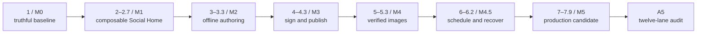

# Uzel product-first roadmap

## Roadmap rule

Each phase must deliver one bounded visible journey and the minimum internal mechanism
needed for it. Do not stabilize a horizontal subsystem for imagined future consumers.
When a product slice exposes a wrong boundary, refactor across the repository while the
cost is still local.

A phase plan must state:

- visible user outcome;
- exact entry evidence;
- semantic owner for every changed state;
- trust/authority changes;
- state machine and terminal outcomes;
- cancellation, restart and pressure behavior;
- tests at the narrowest useful boundary and packaged journey boundary;
- migration/rollback impact;
- explicit exclusions;
- measured performance impact;
- product design/accessibility acceptance;
- compatibility-profile and upstream delta;
- capability-maturity promotion or gap;
- decision, learning and education delta.

## Programme map

Phase 1 is the existing incident-recovery exception. During the planning-only
reorientation, preserve integer phases 2–7 as the first bounded increment of their
milestone and insert the listed decimals. Do not wait until M0 completes: a stale future
roadmap would recreate the same contradiction at the next gate.

Each listed integer or decimal delivery phase is one contextual issue, one manual issue
worktree/branch and one primary PR. `$gsd-execute-phase N` executes the plans in that one
bounded increment; it is never used to execute a complete product milestone as one PR.



Expected sequence:

```text
1,
2, 2.1, 2.2, 2.3, 2.4, 2.5, 2.6, 2.7,
3, 3.1, 3.2, 3.3,
4, 4.1, 4.2, 4.3,
5, 5.1, 5.2, 5.3,
6, 6.1, 6.2,
7, 7.1, 7.2, 7.3, 7.4, 7.5, 7.6, 7.7, 7.8, 7.9
```

Use current GSD phase-management commands and verify `.planning/ROADMAP.md`, phase
artifacts and `STATE.md` with forensic progress. Do not hand-edit an inconsistent phase
tree. A planner may split a phase further when evidence proves it is too large, but may
not combine listed ownership seams merely for convenience.

## Continuous lanes

Every product phase carries these lanes; none are postponed to M5:

1. **Product and visual design:** interaction grammar, component reuse, empty/loading/
   partial/failure/recovery states, keyboard and accessible behavior.
2. **Security:** threat delta, exact-build/session binding, grant impact, malformed input,
   denial/revocation and hostile fixtures.
3. **Correctness:** explicit state transitions, terminal outcomes, duplicate/unknown
   handling and invariant tests.
4. **Resource discipline:** bounded queues, concurrency, memory, object sizes, retries,
   cancellation and cleanup.
5. **Packaging:** current Nix build and checkout-independent smoke for changed seams.
6. **Recovery:** GUI/daemon/provider restart, interrupted work and previous state.
7. **Observability:** structured, redacted evidence sufficient to debug the slice without
   exposing secrets or building a universal admin plane.
8. **Ecosystem compatibility:** exact profile/pin scan, version-skew impact, conformance
   path and interop evidence.
9. **Upstream stewardship:** local-patch state and whether a comment, issue, PR, private
   disclosure or no upstream action is correct.
10. **Knowledge capture:** capability-ledger, decision/spec, learning and education deltas
    moved out of temporary execution context.

## Slice and issue size

Prefer one primary user outcome per contextual issue/PR. Split a slice when it:

- changes more than one semantic owner without a single acceptance journey;
- introduces both a new durable state machine and a broad UI surface;
- requires unrelated migration and capability changes;
- cannot be reviewed with a focused threat/state diagram;
- exceeds the team's measured context/review comfort;
- needs more than one independent rollback unit.

Do not split so finely that one journey requires a chain of unusable merged states. A
vertical slice may include UI, product service, runtime mediation, adapter, tests and
migration when those are one atomic behavior.

For M1–M5, **one listed integer or decimal phase is the delivery/PR unit**. It may contain multiple
GSD plan files or commits, but all must serve the one primary outcome and merge together.
Do not execute all increments of a milestone in one branch/PR. Every increment closes
with its own review, package-sensitive checks and `$gsd-verify-work <phase>` before the
next issue worktree begins.

The final phase of each milestone (`2.7`, `3.3`, `4.3`, `5.3`, `6.2`, `7.9`) also produces
a bounded milestone learning digest and case-study outline from accepted records. This is
not a documentation sprint or a polished course; it is the evidence-backed handoff that
prevents implementation nuance from being lost.

---

# M0 / GSD Phase 1 — truthful baseline and execution reset

## Visible outcome

There is no new end-user feature. The existing product/POC remains runnable, its claims
are truthfully classified, the current Nix package path is proven independently, and the
programme can continue without hidden plan/tool contradictions.

## Required plans

Use `01-BASELINE-REPLAY.md` as the contract:

- incident/replay reconciliation;
- current Nix package/native acceptance;
- authority/schema/threat baseline;
- measured CI/test/review baseline;
- ecosystem/compatibility/maturity/knowledge baseline.

## Required outputs

- historical claim ledger and replay verdict;
- current-source replacement evidence;
- package/native verdict;
- `b185ad1` final disposition;
- current authority matrix and planned deltas;
- durable-format registry;
- instance/profile path and schema contract;
- exact-pinned canonical Nostr provider record and adapter contract;
- supported platform/test matrix;
- measured CI baseline;
- minimal product interaction grammar;
- canonical machine-readable upstream registry and initial exact-UTF-8 compatibility
  profile, including immutable commit/tree/path/content or package-integrity identities,
  separate package-bound digest and generated human rendering;
- isolated no-secret candidate-next shadow-probe policy and initial watched-tool set;
- phase-pinned GSD/Codex/CodeRabbit/Rust/Node/Nix orchestration/toolchain profile;
- Spec Interpretation Record for manifest/exact-build identity;
- capability status and maturity-ledger index;
- capability-negotiation schema/transcript contract plus interop/version-skew backlog,
  externally consumable compatibility-kit plan and clean-room fixture plan;
- local-patch/upstream-interaction index;
- decision, learning, visibility/embargo and educational-record structure plus generated
  internal/public knowledge-index schema;
- canonical terminology registry with stable term IDs and supersession rules;
- global/per-principal admission and fairness model with an initial anti-starvation test
  plan for guest execution, composition and runtime work queues.

## M0 exit gate

M0 completes only when all gates in `01-BASELINE-REPLAY.md` pass, the manifest/exact-build identity profile has a human go/no-go verdict, and a human approves
delivery phase 2. No automated “next” route should cross this incident boundary.

## Exclusions

- product feature work;
- dependency upgrades unrelated to exact closure or package proof;
- broad source layout rewrite;
- public API or package surface;
- general file capability system;
- new signing/publication behavior.

---

# M1 / GSD delivery phases 2, 2.1–2.7 — coherent composable Social Home

## Visible outcome

Uzel launches from its package into a useful social workspace rather than a runtime
harness. A user creates or selects a local read-only profile, sees cached social state
immediately, receives bounded live updates, opens independently identified Home and
People/Profile napplets, and understands cached, refreshing, stale, partial,
source-degraded, offline and failed states.

## Entry conditions

- M0 replay/package/authority evidence has human approval;
- one exact-pinned canonical Nostr owner and private adapter contract exist;
- exact-build/session message path and hostile guest fixtures work;
- instance/local-profile schemas exist;
- package launch is checkout-independent;
- future GSD roadmap already matches the sequence in this document;
- one immutable compatibility profile reconciles the exact manifest/build identity,
  web projection, NAP domains, conformance tool and canonical engine revisions;
- Phase 2 has an explicit trust-tier and unsupported-profile policy.

## Surface and persistence rules

- Home and People/Profile are bundled first-party exact-build **guest** napplets.
- The trusted shell owns only chrome, layout/focus, trusted dialogs, settings and
  recovery. First-party code receives no privileged bridge.
- M1 workspace layout is transient shell projection. It must not create a durable shell
  database. M2 may add product-service-owned persistence when justified.
- `subject_ref` identifies viewed notes/authors; it never becomes the active principal.

## Bounded slices

### Phase 2 — packaged shell and exact-build guest boundary

Deliver one packaged first-use journey:

- small workspace grammar: open, focus, split/stack, close and return, or a smaller
  evidence-backed equivalent;
- crisp reusable visual/component grammar, keyboard path, visible focus, reduced motion
  and honest status vocabulary;
- one bundled hostile/untrusted exact-build fixture launched inside the real package;
- unique/build-scoped controlled origin or isolated website-data manager; no `file://`
  or wildcard localhost origin;
- default-deny CSP, navigation/popup/download/external-protocol controls;
- guest storage disabled by default or partitioned by instance/local profile/exact build;
- service workers disabled;
- active canonical compatibility-profile hash visible through trusted diagnostics;
- pre-launch required/optional capability negotiation, with unsupported required domains
  rejected before guest code and optional omissions projected explicitly;
- canonical negotiation transcript bound to instance, profile, exact build, session and
  generation;
- profile-declared global/per-principal admission limits, fair scheduling or equivalent
  anti-starvation policy, typed overload outcomes and noisy/quiet guest tests;
- session-generation cancellation on close/reload/navigation;
- no durable layout database in shell code.

Acceptance includes native WebKit hostile probes for raw network, native bridge,
origin/storage leakage, replayed messages and stale callbacks.

### Phase 2.1 — local profile and cached/live text Home

Deliver:

- mandatory `local_profile_id` with explicit `read_only` authority mode;
- actor public key bound by daemon-owned state for the identity-rooted Home, not guest
  input; read-only removes signing authority but does not remove identity context;
- an explicitly separate public-browse context may omit an actor but is not called Home;
- profile lookup/selection through canonical engine demand;
- immediate cached text Home;
- bounded initial query and incremental updates;
- cancellation on surface/profile generation changes;
- provenance/freshness summary and partial-source behavior;
- malformed/oversized event handling;
- no second event/feed database.

No signer or publication authority exists. A viewed profile is a `subject_ref`, not a
caller identity.

### Phase 2.2 — trusted destination policy and bounded resource fetch

Deliver one mediated remote-resource path without decoding untrusted media in the daemon
or shell:

- guests request a semantic resource identifier, never a raw URL;
- the daemon resolves the locator from canonical engine/product state and a policy-
  validated endpoint record with bundled/user/protocol-discovered provenance;
- service-specific normalization of scheme, host, port, path and address forms;
- default deny for loopback/private/link-local/multicast/unspecified/cloud metadata;
- explicit exact-scoped trusted-UI exception for one local/self-hosted endpoint; cloud
  metadata remains forbidden;
- validation and connection use the same resolved address set without weakening TLS
  hostname/SNI/certificate checks;
- redirect/reconnect revalidation, provenance and bounded chains;
- ambient proxy variables scrubbed or handled by an equally strict policy-aware path;
- bounded streaming, encoded-byte/type limits, cancellation and raw-object quarantine;
- SSRF/DNS/redirect/proxy adversarial fixtures.

No untrusted raster decoder runs in the authority-bearing daemon or trusted shell.

### Phase 2.3 — isolated raster normalization and resource cache

Deliver profile/avatar display through a separate restartable low-authority media worker:

- no network, signer/provider keys, product/runtime databases or ambient host paths;
- bounded read-only input descriptor/stream and explicit format/resource limits;
- narrow static PNG/JPEG/WebP allowlist with animation/active/polyglot rejection;
- CPU, wall-time, address-space, decoded-pixel and output limits;
- typed metadata plus a sanitized normalized raster derivative;
- source hash, worker/build/version and derivative hash provenance;
- bounded cache, quota, eviction, cancellation, crash/timeout cleanup and offline reuse;
- malformed, oversized, decompression-bomb and worker-compromise-containment fixtures;
- Nix/package/native proof for the selected Fedora sandbox mechanism.

The original remote bytes remain distinct from the display derivative. A worker crash or
rejection yields a safe placeholder and bounded diagnostic, not daemon compromise or raw
fallback.

### Phase 2.4 — People and Profile guest surface

Deliver:

- follows/people projection;
- profile detail and subject navigation;
- profile-image path reusing Phases 2.2–2.3;
- partial author/source failure without whole-surface failure;
- cached/offline behavior;
- bounded list/virtualization behavior;
- keyboard and assistive-technology semantics.

### Phase 2.5 — mediated cross-surface intents

Deliver versioned bounded intents such as:

```text
open_profile
open_note
show_people
return_to_source
```

Every delivery carries source/destination exact-build evidence, transfers no capability,
rejects stale/closed destinations, bounds payload/fan-out/recursion and returns a
structured outcome.

### Phase 2.6 — M1 diagnostics and integrated closure

Expose only the diagnostics needed to understand M1, then run the complete packaged
journey:

- instance/local-profile and exact app/daemon/provider/media-worker versions;
- session/surface health;
- cached/live/offline/source-degraded evidence;
- redacted relay/source/resource detail through progressive disclosure;
- safe restart/reload where supported;
- native, hostile-guest, destination-policy, media-worker, website-data, accessibility and
  resource evidence.

### Phase 2.7 — external clean-room compatibility and composition capstone

Prove that M1 is a runtime seam rather than a first-party demo:

First generate the externally consumable compatibility/conformance kit from the exact
packaged RCP: exact profile bytes/hash, schemas, transcript vectors, supported operations
and limits, negative cases, black-box harness instructions and a minimal example.

The required M1 fixture lives in a separate repository/build, imports no Uzel-internal
source or test hook, carries exact source/dependency/manifest/artifact provenance and runs
black-box against the packaged product using only that kit. It may be Uzel-authored, but
must be labeled `clean_room_fixture` rather than independent evidence.

M0/M1 also open a bounded acquisition/commission track for an **independent clean-room
peer** before M5. Its authors receive only the published kit, packaged runtime and public
issue channel—not Uzel internals, private tests or implementation coaching. A community-
maintained peer is preferable and strengthens ecosystem-adoption claims, but the minimum
L4 runtime-composability gate is independently authored black-box evidence. If it does not
exist, `blocked_no_independent_peer` blocks M5; composability is not silently removed from
the product thesis.

- build one intentionally small clean-room napplet outside the Uzel repository using only
  the exact supported compatibility kit/profile/toolchain;
- verify source/publisher/manifest/aggregate/build identity from the exact executing bytes;
- install and run it under the honest source/trust tier: `first_party_exact` for a
  Uzel-authored clean-room fixture, or `vetted_external_exact` only for an independently
  authored/reviewed exact build; use no first-party bridge or grant path;
- exercise at least one typed intent between it and a first-party napplet;
- prove no transitive grants, principal substitution, raw destination or native access;
- test unsupported profile/domain/version, unknown message, stale generation, target
  crash, denial, cancellation and timeout;
- test required/optional capability negotiation, transcript binding and refusal of
  implicit downgrade;
- test cycle, recursive depth, fan-out, outstanding-request and queue limits;
- run the actual packaged conformance path and show which checks reach real behavior;
- record interop/version-skew results, capability-ledger promotions and any upstream
  issue/comment/PR needed.

This phase blocks generic “composable runtime” claims if it can only pass through
Uzel-private behavior or a package/spec contradiction.

## M1 exit gate

- packaged Social Home is independently useful;
- Home and People/Profile are separate bundled exact-build guests using mediated seams;
- one Uzel-authored external-source clean-room exact-build napplet passes the supported
  profile and composition capstone without Uzel internals; the separate independent
  clean-room peer remains an explicit M5 blocker, not an M1 dependency;
- canonical Nostr ownership remains singular;
- local actor and viewed subject cannot be confused;
- destination/resource and isolated-media-worker hostile tests pass;
- cross-build/profile/instance website-data tests pass;
- restart and local-profile scope remain correct;
- visual/accessibility review passes;
- measured resource behavior has no known unbounded path;
- no drafting, signer, arbitrary file or marketplace scope leaked in;
- all enabled M1 capabilities have honest maturity levels and owned gaps;
- profile, upstream, decision and learning closeout deltas are complete;
- the M1 learning digest binds its claims to the exact profile/hash and package evidence.

## Exclusions

- editing/publishing;
- signer connection;
- arbitrary user files;
- scheduling/background publication;
- broad search/ranking;
- public plugin marketplace;
- custom compositor/window manager.

---

# M2 / GSD delivery phases 3, 3.1–3.3 — local-first offline authoring

## Visible outcome

The user can create, edit, reopen, organize and recover drafts while fully offline. A
single daemon-hosted product service owns durable draft/workspace semantics; the trusted
shell and Composer guest never open its database and no state implies signing or remote
publication.

## Entry conditions

- M1 package, guest boundary, profile scope and accessibility pass;
- generic durable-schema/migration fixture machinery exists;
- trusted shell can host a bundled Composer exact-build guest without network/signer/file
  authority;
- the Phase 3 issue will create the product-service-specific schema and previous-green
  fixture rather than assuming they already exist.

## Draft model

Keep distinct:

```text
new → editing → saved ↔ modified
saved/modified → archived
authorized delete → deleted
conflict and recovery are explicit side states
```

A saved draft is local product data only. It has no event ID or signature.

## Bounded slices

### Phase 3 — product-service foundation and draft schema

Deliver:

- daemon-resident Uzel product service and typed local client;
- one finite lifecycle owner surviving shell close/restart;
- versioned draft record, stable local draft ID, revision and times;
- instance/local-profile ownership;
- scoped Composer capability rather than unrestricted service access;
- crash-safe writes and size/content bounds;
- product-service-specific current/previous/future fixtures and migration harness;
- retention/delete/backup/export disposition;
- optional durable workspace layout only if M1 evidence proves value; shell still has no
  durable competing store.

### Phase 3.1 — minimal Composer create/edit/save/reopen

Deliver one tight text-composition journey:

- bundled exact-build Composer guest using only the scoped product capability;
- create/open/edit/save/reopen;
- explicit saved/modified state;
- deterministic autosave or explicit-save policy chosen and tested;
- bounded undo/redo;
- crash/reload recovery;
- keyboard, screen-reader and reduced-motion behavior;
- safe text rendering with no remote executable content or arbitrary HTML.

### Phase 3.2 — draft library and conflict semantics

Deliver:

- draft list/status and local search;
- duplicate/archive/delete with deliberate destructive review;
- profile context and cross-profile denial;
- optimistic conflict detection for concurrent editors;
- preserve/recover/choose behavior instead of silent last-write-wins;
- bounded history/retention and deterministic cleanup.

### Phase 3.3 — recovery, migration and packaged offline closure

Inject process kill, disk-full/permission failure, corrupted record, unsupported future
schema, profile switch while modified, concurrent revision conflict and interrupted
migration. From a clean packaged instance with external network disabled, create/edit/
save, restart shell and daemon, reopen exact content, exercise recovery, and restore the
previous-green fixture.

## M2 exit gate

- offline authoring is useful and polished;
- Composer remains an exact-build guest with no privileged shortcut;
- product service is the sole durable draft/workspace owner;
- restart, conflict, corruption, migration and recovery pass;
- local-profile/instance isolation passes;
- no draft content reaches network/provider paths;
- no signer, attachment or remote side-effect scope leaked in;
- the M2 learning digest captures recovery/conflict nuances and exact evidence.

## Exclusions

- signing/publication/outbox;
- scheduling;
- file attachments/Blossom;
- collaborative editing;
- full document/markdown/plugin platform.

---

# M3 / GSD delivery phases 4, 4.1–4.3 — external signer and deliberate text publication

## Visible outcome

The user connects an external NIP-46 signer, explicitly binds the signer-reported public key to a local profile, reviews one source/profile-bound text
publication, approves it, and sees honest signing and per-relay delivery evidence.
Uzel never receives the external signer's `nsec`; guest surfaces receive no pairing
material, NIP-46 client key or unrestricted signer primitive.

## Entry conditions

- M2 draft state and recovery pass;
- canonical engine provider's current signer/write ownership is verified at the exact
  pin, including a proven pre-relay validation seam for signer-produced events;
- daemon request identity and grant flow are implemented;
- durable product-to-engine operation reference is designed and versioned;
- hostile guest and local-control fixtures pass.

## Outcome model

Keep distinct:

```text
draft
publication_intent
awaiting_review
awaiting_signer
signed
submitting
observed_per_relay
complete_for_policy
blocked
failed
cancelled
unknown
```

“Complete for policy” is a product decision over explicit per-relay evidence; it is not
a claim of global propagation or human receipt.

## Bounded slices

### Phase 4 — signer pairing and client-secret lifecycle

Deliver:

- trusted pairing/import UI that handles pairing data transiently, never writes it to
  Uzel logs/history/clipboard, minimizes lifetime, and states that Uzel cannot erase
  external clipboard-manager history for pasted data;
- exact local-profile association and signer-reported public-key verification;
- explicit create-new-profile or rebind flow on public-key mismatch; no silent identity
  elevation;
- explicit supported-Linux client-key lifecycle: approved generation/import, narrow
  owner, minimized copies, meaningful zeroization where testable, protected persistence
  or deliberate session-only mode, lock/unlock, rotation, signer-side revocation, local
  disconnect/deletion, profile deletion, backup exclusion, restore, compromise recovery
  and unavailable/corrupt-backend behavior;
- truthful limits for swap, crash dumps, snapshots, backups and hostile same-UID access;
- no silent plaintext persistence fallback in files, databases, environment, arguments,
  logs or clipboard;
- engine/provider-owned NIP-46 transport reusing the trusted destination policy;
- daemon-visible bounded connection status;
- disconnect/revoke/reconnect;
- no guest exposure of bunker URI, client identity secret or transport handle;
- restart and unsupported signer behavior.

### Phase 4.1 — publication grant and trusted payload review

Deliver:

- exact-build/profile/source-bound publish request;
- normalized risk/scope model;
- trusted grant decision and daemon commit;
- grant history/revocation;
- update/rollback authority diff fixture;
- no generic “sign anything” capability.

#### Final text review within phase 4.1

Deliver anti-spoof trusted UI outside the guest DOM/origin showing:

- active profile/public key;
- requesting napplet exact-build identity;
- canonical event template: final text/content digest, event kind and every material tag
  in canonical order;
- allowed engine/signer-populated fields (`pubkey`, bounded `created_at`, `id`, `sig`);
- intended write/destination policy and source scope;
- expiration/request identity;
- escaped/attributed guest text, approve/deny/cancel and a daemon-issued decision nonce.

Prevent click-through/focus stealing where the platform permits it. Approval is valid
only for the current session/generation and immutable reviewed-template hash. The final
signed event must match kind/content/tags and destination policy exactly; its actor must
match the bound signer key, `created_at` must fall inside the reviewed window, its ID must
recompute and its signature must verify. Unreviewed fields fail closed.

### Phase 4.2 — constrained sign, pre-send verification and engine-owned publication

Deliver:

- durable product publication intent before remote effect;
- correlation to one canonical engine write intent;
- external signer request;
- final signed-event verification against the reviewed template **before** any relay
  submission;
- a staged sign-then-submit seam or an equivalent invariant-enforcing provider hook;
- a hard block if the exact provider pin can publish signer output before validation;
- signed event evidence;
- per-relay submission/outcome evidence;
- bounded retry only where engine semantics prove safety;
- no duplicate product-side relay retry queue.

### Phase 4.3 — adverse recovery and publication UX closure

Test:

- signer refusal;
- signer disconnect before/after request;
- expired/replayed request;
- profile switch while pending;
- daemon/engine/shell restart at each transition;
- relay partial success;
- loss of response after a possible remote acceptance;
- duplicate user action;
- revoked grant during pending work.

`unknown` cannot silently retry. Recovery uses exact event/operation evidence or explicit
user choice.

#### Publication history and recovery within phase 4.3

Show bounded product history with:

- draft/source link;
- signed event ID when known;
- per-relay evidence summary;
- blocked/failed/unknown state;
- safe retry/reconcile/cancel actions;
- no false global “published everywhere” language.

## M3 exit gate

- one packaged text publication works end to end;
- no pairing material or signer/client key crosses to a guest, and the chosen client-key
  storage/session policy has no silent plaintext fallback;
- reviewed template and signed event match, and no relay sees the event before that
  check passes;
- canonical engine remains sole signer/write/delivery owner;
- refusal, timeout, restart, partial relay and unknown outcomes pass;
- grant/revocation/update behavior is exact-build scoped;
- publication history is honest and recoverable;
- security and accessibility review pass;
- the M3 learning digest captures signer/provider nuances without exposing pairing or
  security-sensitive material.

## Exclusions

- scheduled publication;
- automatic background signing;
- file attachments;
- arbitrary Nostr event builders exposed to guests;
- local `nsec` custody;
- multi-signer/multisig;
- automatic unattended authority inheritance.

---

# M4 / GSD delivery phases 5, 5.1–5.3 — verified static-image attachment round trip

## Visible outcome

The user selects one supported static raster image in trusted UI, imports and verifies it
without exposing a host path to a guest, uploads it to an approved Blossom endpoint,
fetches/verifies/caches it, attaches it to a draft, exports it and reopens it offline.
Upload, verification, attachment, event publication and export remain separate outcomes.

## Scope

The core alpha allowlist is deliberately narrow—such as PNG/JPEG/WebP—based on bytes,
not extensions, with encoded/decoded size, dimension, pixel, metadata and decompression
limits. SVG, HTML, animated formats, arbitrary media/document preview and generic file
platform behavior are excluded. Other files are rejected or opaque import/export-only
only when an explicit bounded issue requires it.

## Entry conditions

- M3 text publication and signer/profile binding pass;
- trusted destination policy from 2.2 is operational;
- object/handle ownership and bounded streaming contract exist on paper and in fixtures;
- the Phase 2.3 isolated media worker and its Fedora/Nix sandbox evidence are operational;
- supported original-byte upload/export policy and limits are chosen from actual product
  evidence.

## Outcome separation

```text
file selected
chooser token issued
bytes imported
media validated
hash/object verified
upload authorized
upload attempted
server response observed
remote bytes/hash verified
cache complete
attachment referenced
Nostr event reviewed/signed/published
export completed
```

## Bounded slices

### Phase 5 — trusted selection, bounded image import and local object

Deliver:

- native trusted chooser and short-lived token;
- no host path in guest payloads;
- opaque handle bound to instance/local profile/exact build/operation/expiry/limits;
- streaming import and hash verification;
- isolated worker validation/normalization with size/dimension/decompression limits;
- separate source and derived hashes/handles so preview never substitutes upload bytes;
- local-profile-scoped object store, quota, cancellation, retention and cleanup, with
  no cross-profile deduplication/existence oracle before A5;
- malicious metadata, oversized/truncated/polyglot input, worker crash/timeout/escape,
  forbidden cross-profile worker reuse and revoked/stale handle tests.

### Phase 5.1 — Blossom authorization and verified upload

Extend—not replace—the Phase 2.2 destination policy:

- trusted endpoint selection/configuration;
- explicit exact-scoped local/self-hosted exception where approved;
- engine/provider authorization through its private adapter without a second signer;
- complete signer-produced authorization verification before the first upload byte;
- rejection of any one-shot auth/upload seam that can transmit before validation;
- object-service transfer job and bounded stream;
- validation/connection on the same resolved address set;
- redirect/reconnect/proxy policy on every hop;
- upload progress, cancellation, timeout, quota and `unknown` outcome;
- server response is not success until expected hash/bytes are verified;
- no unsafe retry after ambiguous remote completion.

### Phase 5.2 — verified fetch, cache and offline reopen

Deliver:

- bounded fetch through the same endpoint policy;
- expected-hash and length verification;
- atomic cache commit only after verification;
- cache ACL/provenance, quota, eviction and corruption recovery;
- offline reopen from verified bytes;
- hostile server tests for truncation, oversized body, hash mismatch, redirects, slow
  stream and disconnect.

### Phase 5.3 — Composer attachment, export and integrated round trip

Deliver:

- Composer reference to a verified object, not raw bytes/path/URL authority;
- trusted final review that distinguishes local object, remote upload and Nostr publish;
- attachment publication evidence linked to, but not conflated with, upload evidence;
- trusted export target, temporary file and atomic create/replace with conflict review;
- no cross-profile/build/instance handle reuse;
- complete packaged select → import → upload → verify → attach → publish → fetch →
  offline reopen → export journey.

## M4 exit gate

- the static-image journey passes from the exact package;
- raw paths/destinations never cross to guests;
- handle ACL/revocation, object quotas and media-worker isolation/resource limits pass;
- SSRF/DNS/redirect/proxy defenses pass for upload and fetch;
- hash mismatch/truncation/corruption fail closed;
- unknown remote effects do not silently retry;
- upload, publish and export outcomes remain distinct;
- no generic filesystem or arbitrary media platform leaked in;
- the M4 learning digest captures object/media/Blossom interop and negative results.

---

# M4.5 / GSD delivery phases 6, 6.1–6.2 — scheduling, recovery and cross-domain composition

## Visible outcome

The user can schedule a draft for later publication, understand exactly what version
will be used, survive signer unavailability, sleep/time changes and restarts, and resolve
blocked or uncertain work. Social, authoring, publication and attachment surfaces form a
coherent workflow rather than isolated demos.

## Entry conditions

- M1–M4 integrated journeys pass;
- durable product intent and engine operation references are stable enough to schedule;
- signer and object jobs expose complete terminal/unknown states;
- bounded background task ownership exists;
- platform sleep/resume and clock-change test strategy is defined.

## Scheduling model

Keep distinct:

```text
draft_revision
schedule_intent
waiting_due
awaiting_current_review
awaiting_signer
publishing
complete
blocked
failed
cancelled
unknown
```

The schedule references an exact draft revision and a trusted-review digest of its
canonical event template. Creation commits a narrow revocable future-action grant bound
to actor, requesting build, destination policy, due-time window and expiry. Edits or any
scope/policy change require explicit keep-old/review-update/cancel; signing occurs when
due, never at schedule creation. The grant authorizes only that exact future request and
is not a generic unattended signing capability.

## Bounded slices

### Phase 6 — durable schedule intent and daemon-hosted scheduler

Deliver:

- exact profile/draft revision/time zone/time basis;
- explicit due-time semantics;
- create/update/cancel;
- migration/backup fixture;
- unsupported future generation handling;
- trusted scheduling review and immutable template/grant digest;
- clear UI for current scheduled version, actor, build, destination policy and grant
  expiry.

#### Scheduler/wake work within phase 6

Deliver:

- one finite scheduler owner hosted by the product service so schedules survive shell
  exit/restart;
- bounded wakeups and timer set;
- sleep/resume and clock/time-zone changes;
- missed-due reconciliation;
- no busy polling;
- no silent always-on enrollment;
- clear package/service lifecycle.

### Phase 6.1 — due-time signer behavior and restart reconciliation

Deliver:

- exact draft revision/template/grant/actor/build/destination-policy revalidation;
- any drift becomes `awaiting_current_review` or `blocked`;
- submit only the already reviewed exact action and sign only at due time;
- signer unavailable/refusal becomes visible `blocked`;
- bounded retry/backoff with user control;
- no generic unattended signing grant.

#### Restart/unknown reconciliation within phase 6.1

Inject kill/restart at each state boundary across:

- schedule persistence;
- due-time transition;
- signer request;
- signed event receipt;
- relay submission;
- object upload where linked;
- final product-service state update.

Every durable non-terminal state must reconcile to a truthful state or remain visibly
blocked/unknown.

### Phase 6.2 — integrated composition, notification and resource closure

Deliver one coherent path:

```text
Social Home → open profile/note context → create draft → attach verified object
→ schedule or publish → inspect evidence → return to source
```

Requirements:

- typed mediated intents;
- exact source/destination build evidence;
- profile preserved explicitly;
- no capability transfer;
- cancellation and closed-surface behavior;
- minimal shared component vocabulary;
- browser back/focus/keyboard coherence.

#### Bounded notification within phase 6.2

Only if required to make scheduled/recovery work usable:

- opt-in desktop notification;
- no content leak by default;
- clear instance/profile attribution;
- click routes to trusted recovery UI;
- deduplication and bounded history;
- no notification authority exposed to guests.

## Resource acceptance

Measure:

- idle wakeups and CPU with no schedules;
- timer/schedule count limits;
- reconnect retry behavior;
- queue depth under many blocked jobs;
- cleanup/retention of completed jobs;
- restart reconciliation time;
- two-instance simultaneous scheduling.

## M4.5 exit gate

- exact-revision, exact-template future-action authorization and due-time signing work;
- signer refusal/offline/timeout are visible and bounded;
- sleep, restart and clock-change cases pass;
- no unsafe retry of unknown remote effects;
- integrated cross-domain workflow is coherent and accessible;
- background work is bounded, inspectable and not silently enrolled;
- two fixture instances/profiles remain isolated;
- M5 can focus on breadth/hardening rather than introducing a missing core journey;
- the M4.5 learning digest captures scheduling/reconciliation and composition nuances.

## Exclusions

- recurring/complex automation rules;
- server-side scheduler;
- remote administration;
- broad desktop notification APIs;
- arbitrary background napplet execution;
- autonomous content generation/publication.

---

# M5 / GSD delivery phases 7, 7.1–7.9 — production-candidate hardening and audit freeze

## Visible outcome

A technically capable Linux user can install, use, recover, inspect and upgrade one exact
Uzel package across multiple sessions, local profiles and instances without the source
tree. M5 adds little new capability; it closes the breadth, isolation, data, platform,
performance and operational gaps exposed by earlier journeys.

M5 completion means **candidate ready for A5**, not release approval.

## Entry conditions

- every prior phase has current verification and no required-journey blocker;
- the integrated packaged flow passes once before hardening;
- authority/schema/job meanings are no longer changing conceptually every PR;
- debt and unsupported claims are explicit;
- the active compatibility profile, upstream registry, interop matrix and local-patch
  ledger are current;
- every enabled core capability has an owner and maturity ledger;
- supported Linux matrix is agreed.

## Bounded slices

### Phase 7 — multi-profile UX and authority isolation

Complete at least two local profiles across read-only and signer-backed modes. Prove
explicit active profile/actor per action, signer-key binding, wrong-profile prevention,
pending-work binding, cross-profile denial, and grants/drafts/schedules/objects/engine
state scope. Profile backup/restore/delete belongs to Phase 7.6 rather than this phase.

### Phase 7.1 — two simultaneous packaged instances

Prove explicit instance IDs; disjoint sockets, locks, config, product/runtime/engine
state, objects and caches; simultaneous GUI/daemon operation; correct diagnostics
routing; no cross-instance handle/session/grant/job leakage; independent restart and
stale-endpoint recovery.

### Phase 7.2 — exact-build registry, launch, revoke and removal

Deliver immutable bytes/hash/manifest under the active compatibility profile, source locator and publisher/authentication
evidence where supported, explicit verified/unverified/trust-tier state, install/register,
launch/stop/disable/remove, grant inspection/revocation, website-data partition cleanup,
and stale session/job behavior. No marketplace or unattended update channel.

### Phase 7.3 — exact-build update, quarantine and previous-build rollback

Deliver explicit capability/provenance/profile-transition diff, no grant inheritance
across new bytes, incompatible/quarantined state, update failure recovery, stale
callback/job handling and rollback to the exact previous build with only grants valid for
those bytes. Runtime and napplet updates are explicit, reviewable and channel/profile
bound; no silent substitution or unattended authority increase is permitted. Test
publisher/source mismatch, tampered manifest, interrupted update, channel downgrade,
profile mismatch and rollback failure.

### Phase 7.4 — bounded operations and diagnostics

Provide only support operations justified by the product: health/version, instance/local-
profile targeting, build/session/job inspection, safe cancel/shutdown, migration/backup
status and redacted diagnostic export. No database mutation, arbitrary paths, grant
minting, shell execution or universal admin API.

### Phase 7.5 — schema migration, integrity and corruption recovery

Complete the durable-format registry; current/previous/future fixtures; forward and
interrupted migration; unsupported-future-generation failure; record/object integrity
checks; quarantine and bounded corruption recovery. Never claim in-place rollback when
the previous package cannot read the migrated state.

### Phase 7.6 — backup, restore, profile deletion and package rollback truth

Deliver verified pre-migration backup, clean-instance and selected-profile restore,
backup manifest/redaction/secret-exclusion behavior, object reference/cleanup semantics,
profile deletion with pending-work review, previous-green package availability and the
exact restore-or-downgrade procedure. Rehearse data loss, partial backup and interrupted
restore.

### Phase 7.7 — surface and supported-Linux closure

Close native WebKit crash/reload/navigation/focus/input-method behavior, cancellation on
close, stale callback rejection, keyboard/assistive behavior under dynamic layout,
per-surface resource cost and malicious guest fixtures. Close Fedora Server 43 with
SELinux enforcing, headless Weston native CI, KDE Plasma 6 Wayland and Hyprland reference
sessions, package/user-service lifecycle, media-worker sandbox, portals/file
chooser/export, suspend/resume and notifications where used. Unsupported results are
explicit; do not overclaim browser/kernel isolation.

### Phase 7.8 — production-evidence, performance and resource closure

Close the cross-cutting L4 evidence before candidate freeze:

- targeted fuzz/property corpora for IPC, guest messages, manifests/build identity,
  destination policy, signer validation, object/media/Blossom boundaries, jobs/migrations
  and composition;
- feasible sanitizer/dynamic-analysis results with honest unavailable-tool notes;
- current/previous/unsupported profile and GUI/daemon/provider version-skew fixtures;
- independent relay, signer and Blossom interoperability where peers exist, plus the
  required independent clean-room napplet implementation for L4 runtime composability;
  `blocked_no_independent_peer` is an M5 blocker. Record community-maintained-peer evidence
  separately for stronger ecosystem-adoption claims;
- SBOM, source/license inventory, advisory dispositions and local-patch provenance;
- at least two clean rebuilds of the exact candidate inputs with artifact/NAR/closure
  comparison; classify every variance, own its cause and block L4 when release-relevant
  output is not reproducible;
- supported-version, vulnerability-reporting, incident, unsafe-build quarantine and
  emergency rollback drafts;
- an independently scoped critical-boundary security-review brief, reviewer independence
  criteria, evidence bundle and finding/remediation protocol for A5;
- signed immutable candidate/canary/stable channel metadata, no-silent-update policy,
  opt-in canary scope, privacy-bounded health criteria, rollback thresholds and
  previous-green recovery rehearsal for the post-A5 release decision;
- every enabled required-journey capability promoted to L4 or removed/disabled from the
  supported profile.

Then measure distributions on recorded hardware: launch/first content, Social Home update,
draft load/save, sign/publish transitions excluding external delay, media-worker and image
object throughput/peak memory, component/per-surface RSS, idle CPU/wakeups, queue overflow
and cancellation, blocked jobs, two instances, cleanup and a four-hour soak. Budgets
derive from M0/M1 evidence and may change only with documented evidence.

### Phase 7.9 — freeze exact audit candidate

Freeze one Git SHA/tree and Nix result, canonical compatibility-profile bytes/hash,
capability-negotiation schema/transcript vectors, capability ledgers,
upstream/local-patch state, decision/spec/learning indexes, SBOM/source/license/advisory
results, fuzz/version-skew corpora, interop matrix, evidence/checksum manifest,
clean-install integrated journey, previous-green upgrade/restore/rollback, current
security/code/UI/validation artifacts, independent-security-review brief, signed-channel/
canary/rollback policy draft, unresolved finding/debt/risk register and candidate notes
marked “not yet release-approved,” plus the M5 learning digest and case-study outline. Protect against accidental milestone completion and produce the A5
input bundle.

## Full M5 acceptance journey

From a clean supported machine/profile fixture:

1. install the exact package and start two instances;
2. create/select read-only and signer-backed local profiles;
3. use Home and People/Profile plus the clean-room compatibility-kit fixture—and the
   independent peer required by any retained L4 ecosystem-composability claim—from
   cache/live sources and compose them through the runtime;
4. create/recover an offline draft in the Composer guest;
5. pair signer, verify reported public key and deliberately publish text;
6. import/worker-validate/upload/verify/attach/export/reopen a supported static image;
7. schedule another exact draft revision;
8. suspend/restart/refuse signer and recover honestly;
9. inspect and revoke grants/builds/jobs;
10. update an exact build and review capability/provenance diff;
11. back up, migrate, restore and roll back previous-green;
12. run native/security/accessibility/resource acceptance;
13. inspect the compatibility profile, upstream/local-patch and capability-maturity evidence;
14. freeze exact evidence for A5.

## M5 exit gate

- all required journeys pass from one exact packaged revision;
- multi-profile and two-instance isolation pass;
- exact-build register/update/revoke/quarantine/rollback is usable;
- data migration/backup/restore/recovery evidence is complete;
- supported Linux matrix has explicit outcomes;
- no known unbounded externally influenced resource path remains;
- every enabled required-journey capability is L4, or is removed from the supported
  profile;
- the Uzel-authored clean-room fixture and required independent clean-room peer pass the
  frozen packaged profile; interop and version-skew matrices pass, while community-peer
  evidence is labeled separately;
- required/optional capability negotiation and transcript binding pass across package,
  independent napplet and version-skew tests;
- two clean exact-input rebuilds match for release-relevant outputs, or any variance is a
  documented A5 blocker rather than a waived inconvenience;
- no critical upstream delta is untriaged and no local patch lacks owner/test/removal
  trigger;
- SBOM, license/advisory, provenance, security-response and incident artifacts exist;
- an independent critical-boundary security-review brief and a signed, explicit,
  no-silent-update candidate/canary/stable release-and-rollback policy are frozen for A5;
- decision/spec/upstream/learning records and the exact-candidate M5 digest are current
  enough to support A5 and later educational synthesis;
- delivery phases 7 through 7.9 have current evidence;
- exact candidate and manifest are frozen;
- no milestone completion, release tag or next feature phase runs;
- the project enters A5.

---

# A5 — mandatory post-M5 stop

After delivery phase 7.9:

```text
STOP feature work
STOP dependency churn
STOP roadmap advancement
STOP release completion and tagging
FREEZE exact candidate and evidence
RUN the twelve-lane whole-system audit
```

Follow `05-POST-M5-AUDIT.md`. Blocking findings create bounded remediation work against
the same candidate line and require rerunning affected lanes plus integration evidence.
Only a complete A5 pass and explicit human decision authorize another programme.
