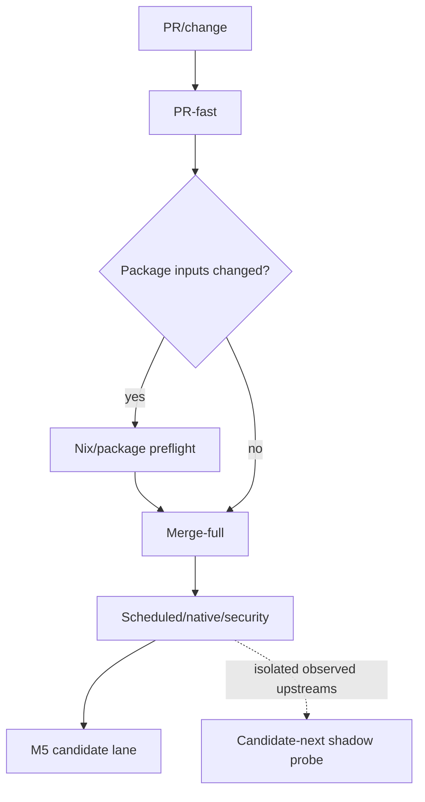

# Delivery, quality, review and packaging discipline

## Purpose

This document defines how Uzel phases are planned, implemented, reviewed, packaged and
accepted. It is deliberately simpler than a multi-repository release programme. The
active unit is one contextual issue/branch/worktree/primary PR in the Uzel repository,
driven by one bounded GSD delivery phase and verified through the exact Nix/package path
where relevant. Phase 1 is the existing incident-recovery exception; M1–M5 use the listed integer
phases 2–7 plus inserted decimal phases through 7.9, including the 2.7 independent compatibility capstone.

## One planning authority

- The existing `.planning/` project remains authoritative for active phase state.
- `docs/plans/uzel-product-incubation-v4-2026-08-10/` is durable programme input and
  audit evidence, not a second live roadmap.
- GSD-generated phase context/plans must reconcile with this pack and actual source.
- `AGENTS.md` contains concise repository-wide rules and links to detailed architecture,
  testing and product documents; it should not duplicate the entire plan.
- An active executor receives only the current plan, nearest instructions, relevant
  contract/architecture section and exact source/tests.

## Codex and worktree model

GSD's automatic parallel worktree isolation is not used under Codex. Project
configuration must resolve to:

```text
runtime = codex
workflow.use_worktrees = false
```

Use one human-created Git worktree and branch for the active delivery phase/PR. GSD
executes all plans for that one bounded phase sequentially in that worktree. A plan may create disposable test/replay checkouts outside
the active worktree when its contract requires isolation.

Rules:

- one writer at a time for shared source/planning files;
- no nested GSD parallel worktree assumptions;
- no automatic merge of plan worktrees;
- no execution from the ordinary main checkout;
- preserve blocked/forensic worktrees until evidence is reconciled;
- use explicit branches and `git worktree list` before cleanup;
- cleanup scripts are idempotent and refuse unknown/uncommitted worktrees;
- after M0, never place multiple listed integer or decimal delivery phases in one issue worktree or
  primary PR; each phase starts from the integrated branch after the previous phase is
  verified and merged.

## Delivery-increment lifecycle

```mermaid
flowchart LR
    C[Delivery-phase context / accepted decisions]
    P[GSD plan]
    R[Local CodeRabbit plan review]
    X[Sequential execution]
    L[Local tests + CodeRabbit]
    PR[Draft PR]
    CX[GitHub Codex exact-SHA review]
    CI[Required CI/package checks]
    V[GSD verification + human evidence]
    M[Merge]

    C --> P --> R --> X --> L --> PR --> CX --> CI --> V --> M
```



Not every documentation-only PR needs native package tests, but every omitted gate must
be justified by the change boundary. Security, schema, packaging, dependency and product
journey changes receive the full relevant sequence.

## Phase planning and approved review

### Phase-pinned orchestration toolchain

GSD, Codex, CodeRabbit and their relevant runtime dependencies are themselves moving
inputs. At the start of each phase, record their exact installed versions/source or
package integrity and the supported command surface. Freeze that toolchain for the phase;
do not update it mid-plan, mid-execution or mid-review. Tool updates use the same radar,
candidate-next probe and bounded compatibility-campaign discipline as runtime libraries.

The GSD contract is semantic and phase-pinned. Active documentation, a development
branch and an installed release can expose different optional flags, so the exact
installed version and `$gsd-help --full` output are recorded before planning:

- `plan-phase` must support ingest/review and keep plan-checker verification enabled;
- `--skip-verify` is forbidden unless a separately approved incident record provides
  equivalent independent evidence;
- when installed help exposes a state/plan `--validate` option, use it consistently for
  that phase; when it does not, do not invent it or infer that validation was skipped;
- `execute-phase` executes the accepted plan and may use an installed validation option
  only when its recorded semantics match the intended gate;
- `verify-work` remains the explicit post-execution evidence gate in every case;
- `review --phase N --coderabbit` writes local review evidence consumable through
  `plan-phase N --reviews`;
- `extract-learnings N` may produce raw phase learnings after execution.

If the pinned toolchain cannot provide equivalent plan checking, local-CodeRabbit/GitHub-Codex review,
execution, state coherence and post-execution verification, stop and open a bounded
compatibility/toolchain issue rather than weakening or improvising the gate.

### Plan generation

For the current Phase 1 correction:

```text
$gsd-plan-phase 1 --ingest docs/plans/uzel-product-incubation-v4-2026-08-10/00-GSD-INGEST-ADR.md --ingest-format narrative
```

During the planning-only Phase 1 reorientation, reconcile the entire future roadmap to
`03-ROADMAP.md`, preserving integer phases 2–7 and inserting the listed decimals. Verify
roadmap/state coherence before Phase 1 execution. After the M0 human gate, plan exactly
one already-listed delivery phase, for example:

```text
$gsd-discuss-phase 2.1
$gsd-plan-phase 2.1
```

Because `$gsd-execute-phase N` executes every plan in phase `N`, one phase corresponds to
one contextual issue and primary PR—not a whole product milestone.

### Review loop

Attempt local CodeRabbit followed by GitHub Codex on the exact pushed PR SHA. A recorded
CodeRabbit `rate_limit` error before findings permits green GitHub Codex to satisfy the
gate. `N` may be an integer or decimal delivery phase:

```text
$gsd-review --phase N --coderabbit
```

When a Critical/High or blocking Medium finding exists, or an accepted finding changes the plan:

```text
$gsd-plan-phase N --reviews
$gsd-review --phase N --coderabbit
```

Repeat for at most three review cycles. A rejected finding needs exact source/runtime
evidence and rationale; do not spend cycles polishing non-blocking style preferences.
After three cycles, unresolved blocking findings require explicit manual resolution rather
than another automatic loop. Execution requires:

- plan-checker verification was not skipped;
- zero unresolved Critical or High findings;
- zero unresolved Medium findings that threaten the phase outcome, authority,
  correctness, data integrity, security or operability;
- every remaining non-blocking Medium or Low finding has an explicit accept, defer or
  reject disposition, owner/rationale and bounded impact;
- any rejected finding has file/source evidence and rationale in the review artifact;
- no reviewer/tool failure silently degrades to self-review;
- the final reviewed plans match the plans about to execute.

Execute and then verify the accepted bounded phase:

```text
$gsd-execute-phase N
$gsd-verify-work N
```

If CodeRabbit returns `rate_limit` before findings, record it and continue to GitHub
Codex. Stop on any other CodeRabbit failure or any non-green GitHub Codex result. Do not
substitute Claude, OpenCode, remote CodeRabbit, local Codex self-review or another AI
reviewer.

## Contextual issue and plan contract

Each listed integer or decimal delivery phase has one contextual issue and primary PR. Its issue/plan
records:

1. **Visible outcome** — what a user/operator can observe after merge.
2. **Owned seam** — exact modules/state owners allowed to change.
3. **Accepted facts** — exact pins, current source behavior and references.
4. **Exclusions** — adjacent features/platforms not in scope.
5. **Trust delta** — principals, capabilities, inputs and authority changes.
6. **State model** — states, transitions, terminal/unknown outcomes.
7. **Resource bounds** — sizes, queues, concurrency, retries, timeouts, retention.
8. **Failure/recovery** — cancellation, restart, partial completion and rollback.
9. **Data impact** — schema, migration, backup and deletion.
10. **Tests** — failing-first behavior and package/native evidence.
11. **Product acceptance** — design, keyboard, accessibility and honest statuses.
12. **Review sensitivity** — security, supply-chain or platform areas needing special
    attention.
13. **Compatibility impact** — exact profile/pins, spec/tool/library delta and version-
    skew/conformance effect.
14. **Upstream impact** — none, monitor, existing thread, comment, issue, PR or private
    disclosure; include local-patch state.
15. **Knowledge impact** — decision/spec, capability-ledger, learning and education
    records to create/update, or `none — reason`.

The PR description links the contextual issue and maps each acceptance item to evidence.

## Implementation discipline

### General

- Reproduce a defect or write a failing behavior test before the fix when practical.
- Implement the smallest complete vertical behavior.
- Prefer a functional core and narrow effect-owning shell.
- Keep one finite owner for tasks, queues, sockets, files, stores and timers.
- Make cancellation and shutdown explicit.
- Bound every externally influenced collection, message, object, retry and concurrency
  path globally and per admission principal; prove fairness or another explicit
  anti-starvation policy under noisy/quiet and many-principal pressure.
- Use typed states/results rather than boolean success for multi-stage work.
- No silent fallback, package substitution, authority inheritance or implicit retry.
- No speculative abstraction or configuration switch.
- Reuse exact current provider/platform behavior before wrapping or rebuilding it.
- No custom cryptography.
- No `unsafe` unless a separate issue proves necessity, invariant and test boundary.
- Do not float to branch heads or silently reinterpret a draft spec. Every executable
  profile is exact and diagnostics-visible.
- Durable knowledge belongs in ADR/spec/upstream/learning/capability records, not only
  issue comments or agent chat. Use canonical term IDs for shared concepts and update the
  terminology registry rather than redefining nouns in one phase.

### Naming

Authored code names must be:

- descriptive and context-aware;
- consistent with language/repository convention;
- at most 21 characters for functions, variables, local types and modules;
- split when a longer name indicates multiple responsibilities.

Exemptions:

- upstream/public protocol names;
- generated code;
- required external ABI/schema names;
- test descriptions and human-facing prose.

An automated identifier report should flag violations but allow reviewed exemptions
rather than destructive renaming of protocol/API terms.

### Scripts

Scripts must:

- be idempotent;
- use `set -euo pipefail` or equivalent;
- validate repository/worktree/branch assumptions;
- quote paths;
- avoid global mutation where a local/Nix path exists;
- refuse destructive cleanup when state is unknown;
- support clean rerun after partial failure;
- emit enough structured evidence for CI/review;
- avoid hidden network access.

## Dependency policy

### Normal development

- Pin through committed lockfiles and Nix inputs.
- Update dependencies only in explicit dependency PRs or when required by a bounded
  product slice.
- Inspect package identity, source, license, maintainer and integrity before adding it.
- Prefer existing workspace/upstream functionality.
- Record capability/authority changes caused by provider updates.
- Do not run arbitrary install scripts without review.
- No package-name substitution when install fails.

### Historical replay

Follow `01-BASELINE-REPLAY.md`: exact closure realization is allowed; closure drift is
forbidden. External egress is denied during replay, with only declared loopback/socket
test services. Enforce the one-inventory, one-realization-path, one-attempt budget, with
at most one correction proven to be a replay-harness/isolation defect.

### Fast-moving specs, tools and provider pins

Follow [the ecosystem/upstream stewardship process](07-ECOSYSTEM-UPSTREAM.md).
Execution remains exact-pinned. A scheduled read-only radar may update one internal
tracking issue, but may not change locks, open public threads or merge code.

Every relevant adoption is a separate compatibility campaign with:

- old/new immutable source identities, profile hashes and upstream delta range;
- API, wire/schema, ownership/authority, security, migration and performance diff;
- active compatibility-profile update;
- used-source and known-gap inventory;
- contract/conformance, differential, interop and version-skew tests;
- local-patch removal/rebase result;
- full affected packaged journeys;
- previous-green/rollback truth;
- decision/spec/upstream/learning/capability-ledger updates;
- no provider-specific type leakage into product/control contracts.

An urgent security update may be expedited, but not made unpinned or untested.

### Candidate-next shadow lane

A credentials-free scheduled job may resolve the latest observed immutable upstream/tool
sources and build an ephemeral candidate-next overlay. It must not edit production locks
or the active RCP, publish/promote artifacts, access release/signing keys, open public
threads or merge updates. It records exact inputs, selected tests and delta classification.
High-risk or unknown results block the next affected phase until a compatibility campaign
owns them; green results remain advisory and do not constitute adoption.

### Upstream contributions

Uzel uses two related but separate tracks:

1. a bounded local adapter patch may unblock Uzel when it has an owner, regression test,
   risk statement and expiry/removal trigger; and
2. an upstream interaction may seek clarification or a general correction.

Upstream merge is not Uzel adoption. Adoption is a later compatibility-campaign PR at an
exact released/committed pin; local-patch removal is another verified state transition.
Never delete a patch merely because a PR merged.

For external code work, use a dedicated upstream fork/worktree/branch. Read and record the
target repository's `CONTRIBUTING`, `SECURITY`, license, DCO/CLA, authorship/signoff,
AI-assisted-contribution, style and test rules. Preserve truthful authorship, keep commits
minimal, run the upstream's own gates and avoid unrelated cleanup. A named human submitter
must understand, approve and take responsibility for the report or patch; record AI
assistance when policy requires it. Never fabricate maintainer consensus, testing,
provenance, authorship or signoff. Search for the existing canonical thread first. Public
issue/comment/PR text is human-reviewed before submission and stays on one thread unless
maintainers direct otherwise.

Before a public issue, comment or PR:

1. reproduce at Uzel's pin and current upstream revision;
2. search existing issues/PRs/discussions and read contributor guidance;
3. reduce to a synthetic minimal reproducer;
4. separate Uzel product policy from a general upstream defect/contract;
5. choose comment, issue, PR, private disclosure or no upstream action;
6. obtain human review for non-trivial external submissions;
7. create/update an Upstream Interaction Record.

For NMP and every other upstream, resolve the current repository-specific contribution
route at the exact observed revision; use issue-first only when current guidance or
maintainer practice calls for it. NAP/NIP changes require implementation, security and
interop evidence rather than Uzel preference. Security defects use private routes.
Upstream merge and Uzel adoption are separate events and separate Uzel PRs.

A local patch must have an owner, exact base, focused test, upstream/no-upstream rationale
and expiry/removal trigger. An unowned patch blocks M5.

## Test architecture

### 1. Unit/model tests

Use for:

- parsers and size limits;
- exact-build/grant keys;
- state transitions and terminal outcomes;
- path/instance/profile validation;
- product-service draft revisions, future-action grants and schedule logic;
- raster input/output limits and worker protocol states;
- authority diffs;
- redaction;
- bounded retry/backoff and time calculations.

These tests are deterministic and run in PR-fast.

### 2. Contract and vector tests

Use for:

- local-control envelopes;
- canonical RCP parsing/hash/package binding;
- required/optional capability negotiation and launch-transcript canonicalization;
- signed/hash preimages;
- provider adapter request/result projections;
- canonical event-template normalization, allowed-fill policy, final-event verification
  and pre-relay enforcement;
- Nostr write/sign correlation;
- Blossom authorization verification before upload bytes;
- media-worker request/result/provenance envelopes;
- future-action grant/revocation vectors;
- cross-napplet intent schemas;
- object metadata/expected hashes;
- durable format generations;
- backup/export manifests;
- previous/current/future schema fixtures.

Contracts test observable semantics, not current internal struct layout.

### 3. Component/integration tests

Use real owning components with deterministic fixtures for:

- daemon/client session lifecycle;
- canonical engine query/write integration;
- grant request/commit/revoke;
- signer refusal/timeout/restart;
- daemon-hosted product-service persistence, shell close/restart and draft conflict;
- object import/fetch/export;
- low-authority media-worker lifecycle, crash/restart and returned-object validation;
- scheduler/reconciliation;
- systemd-user lifecycle where practical.

Avoid mocks that bypass the boundary under test.

### 4. Adversarial/security tests

Maintain hostile fixtures for:

- guest direct network and bridge probing;
- cross-build/profile/instance cookies, local storage, IndexedDB, cache and service-worker
  contamination;
- stale/replayed session/request IDs and negotiation transcripts;
- wrong exact build/profile/instance/profile hash;
- required-capability mismatch, malformed declarations, implicit downgrade and attempted
  mid-session profile mutation;
- oversized/malformed control messages and metadata;
- path/handle misuse and export races;
- signer event-template mismatch, unreviewed fields, replay, expiry and attempted relay
  submission before final-event validation;
- attempted Blossom upload before signer-produced authorization validation;
- future-action grant scope drift, expiry and revocation;
- media-worker protocol escape, cross-profile reuse, network/ambient-path denial,
  malicious raster, decompression
  bomb, CPU/memory/output exhaustion and stale result reuse;
- malicious relay/server responses;
- raw destination injection, DNS rebinding, redirect-to-private/metadata, unsupported
  scheme and IPv4/IPv6 address-form bypass;
- cross-instance/profile/build access;
- dependency/install egress;
- pairing/client-key/secret/log leakage and unavailable secure-storage backend behavior;
- denial/revocation during in-flight work.

Security tests fail closed and never require production secrets.

### 5. Fault injection and recovery

Inject kills/failures:

- before and after durable commit;
- before and after signer request/response;
- before and after possible remote acceptance;
- during migration/backup/restore;
- during media-worker parse/result handoff, profile-change termination and object
  import/upload/export;
- during schedule wake/reconciliation;
- while profile/instance changes;
- on disk full, permission denial and corrupt records.

Each durable non-terminal state must reconcile or remain explicitly blocked/unknown.

### 6. Browser/native tests

Use deterministic browser tests for product/guest behavior and native WebKit/Weston for
actual host integration:

- source/build/profile/negotiation/session message binding;
- rejection before guest code when a required capability/profile is unsupported;
- controlled origin/CSP, remote-script refusal and navigation/popup/download/network
  policy;
- website-data partition/disable, update/revocation cleanup and service-worker policy;
- focus/input/resize/close/reload;
- multi-surface lifecycle;
- file chooser/export portals;
- packaged media-worker launch, sandbox, crash/restart and cleanup;
- package resource paths;
- native accessibility smoke;
- malicious guest fixtures.

Browser simulation does not replace native package evidence.

### 7. Accessibility and design tests

Each visible slice checks:

- full keyboard path;
- visible focus and restoration;
- semantic names/roles/status announcements;
- logical reading order;
- font scaling/narrow surfaces;
- reduced motion;
- non-color-only state distinctions;
- empty/loading/stale/partial/blocked/failed/unknown screens;
- destructive/uncertain action comprehension.

Use automated checks plus human review; neither substitutes for the other.

### 8. Performance/resource tests

Measure distributions, not one best run:

- launch and first useful frame;
- demand-to-visible update;
- local control latency;
- draft load/save;
- memory/CPU/wakeups per component/surface;
- queue depth/overflow/cancellation;
- object streaming throughput and peak memory;
- schedule idle/pressure behavior;
- restart/reconciliation time;
- soak and cleanup.

Budgets are set from M0/M1 evidence and tracked as regressions.

### 9. Fuzz/property and dynamic-analysis tests

Maintain focused targets for externally influenced and authority-bearing boundaries:

- local IPC/control envelopes;
- napplet bootstrap/NAP messages and manifest/build identity;
- URL/address/redirect destination policy;
- canonical event-template and signer-result validation;
- object handles/ranges and media-worker protocol;
- Blossom authorization/response metadata;
- durable jobs/migrations;
- composition depth, cycles, fan-out, backpressure and cancellation.

Fast corpora run in ordinary CI where practical; longer fuzz, sanitizer, leak/FD/process
and minimized-regression work runs in scheduled/candidate lanes. Tool unavailability is
reported, not silently passed.

### 10. Interoperability and version-skew tests

Test the current profile, declared predecessor, unsupported future/unknown behavior,
GUI/daemon skew, old/new exact builds and relevant provider transitions. Every adopted
profile change has an executable machine transition record and generated human diff that
classify breaking/deprecated behavior, migration, support window and rollback. Use independent
relay, signer and Blossom implementations where available.

M1 requires a Uzel-authored or external clean-room fixture outside the Uzel repository,
with a separate source/build boundary, exact provenance, no Uzel internal imports or test
hooks, and the real packaged black-box path. Before M5, a second implementation must be
independently authored/commissioned using only the public compatibility kit and packaged
harness. That evidence is required for L4 runtime composability; record
`blocked_no_independent_peer` as an M5 blocker when absent. A community-maintained peer is
tracked separately and is required only for stronger ecosystem-adoption claims.

### 11. Supply-chain and release-evidence tests

Candidate evidence includes two clean builds from the same exact Git/tree/lock/toolchain
inputs using independent build directories and sanitized state. Compare package outputs,
NAR/closure metadata and signed checksums as applicable. A difference is classified to an
owned input or nondeterminism source; release-relevant unexplained variance blocks L4.
Where a second machine/builder is available, repeat there for stronger evidence rather
than weakening the local two-build requirement.


Generate and verify:

- source/lock/toolchain mapping;
- Nix closure and SBOM;
- license inventory and policy result;
- vulnerability/advisory dispositions;
- local patch/fork ledger;
- package/source checksums and provenance;
- two-clean-build reproducibility report and classified variance ledger;
- previous-green package availability and rollback evidence;
- signed immutable candidate metadata, unsigned canary/stable transition schemas,
  no-silent-update checks and predeclared canary rollback thresholds. Canary/stable
  metadata remains unsigned until its respective human authorization.

No first-launch dependency fetch is allowed outside explicit verified user-content
operations.

## Security gate by delivery phase

| Delivery phase(s) | New attack surface | Minimum gate |
|---|---|---|
| 1 / M0 | dependency replay, package path, current control boundary | exact closure proof, bounded replay, egress probe, package/native threat baseline |
| 2, 2.1–2.7 / M1 | guest WebKit, website data, canonical social demand, mediated resources, low-authority raster worker, composition | hostile guest, build-scoped origin/CSP/storage isolation, destination/SSRF/DNS/proxy tests, worker sandbox/resource/protocol tests, stale generation, bounded demand/native tests, clean-room compatibility-kit fixture, no-transitive-authority, cycle/fan-out/backpressure and profile/version-skew tests |
| 3, 3.1–3.3 / M2 | daemon-hosted product service, Composer guest and durable drafts | shell/guest DB bypass, first-party privilege parity, cross-profile access, injection, conflict, corruption, migration and crash tests |
| 4, 4.1–4.3 / M3 | NIP-46 client key and remote Nostr writes | pairing/key lifecycle, canonical event-template/final-event binding, replay/expiry/refusal/unknown, partial relay evidence |
| 5, 5.1–5.3 / M4 | chooser, static-image validation, object store, Blossom, cache, attachment/export | handle ACL, media bounds, SSRF/DNS/redirect/proxy policy, hash/truncation, export race, quota, hostile server/file tests |
| 6, 6.1–6.2 / M4.5 | scheduler/background/recovery | exact future-action grant, one daemon-hosted owner, bounded retry, sleep/clock/restart and ambiguous side effects |
| 7, 7.1–7.9 / M5 | profile/instance isolation, surfaces, builds, operations, data recovery, Linux/performance/compatibility closure | complete threat model, platform hardening, fuzz/dynamic analysis, interop/version skew, SBOM/advisories/provenance, L4 capability ledgers and exact candidate audit preparation |

Each increment runs only its relevant gate plus regression contracts. Milestone closure
runs the integrated journey before advancing to the next milestone.

## CI design

Measure first. Keep PR feedback fast and avoid duplicate full gates.



### Lane 1 — PR-fast

Target changed-code feedback:

- Rust format;
- Clippy with repository policy;
- focused/full workspace tests according to measured cost;
- frontend type/lint/unit tests;
- Fallow for changed JS/TS;
- naming/unsafe/forbidden-boundary checks;
- the machine-enforced architecture boundary checker and its self-tests;
- contract/vector tests;
- doc links/fences where plans/docs changed;
- no ordinary full Nix package build unless package-sensitive.

Use Rust/frontend caches keyed by relevant locks/toolchains. Do not cache mutable build
state across incompatible inputs.

### Lane 2 — package/toolchain preflight

Trigger when changing:

- flake/locks/toolchain;
- package/service/desktop files;
- resource discovery;
- build scripts/native dependencies;
- WebKit/Tauri integration;
- schema migration executable paths.

Run evaluation/build checks sufficient to fail early without duplicating merge-full.

### Lane 3 — merge-full

- complete correctness suites;
- one canonical Nix package build;
- checkout-independent package smoke;
- migration/current fixtures;
- integrated deterministic browser journey;
- required provenance/checksum output.

### Lane 4 — scheduled/native/security

- native WebKit/Weston;
- Fedora SELinux lane;
- hostile/adversarial suite;
- provider/relay fault fixtures;
- performance trend and selected soak;
- dependency/supply-chain audit;
- read-only upstream radar and critical-delta triage;
- longer fuzz/sanitizer/version-skew/interop jobs;
- restore/rollback rehearsal;
- independent critical-boundary security-review scope/evidence preparation and reviewer
  conflict/ownership declaration;
- opt-in canary and emergency-quarantine tabletop using signed exact package/profile
  identities.

### Lane 5 — M5/7.9 candidate

- complete supported Linux matrix;
- clean install/full integrated journey;
- two profiles and two instances;
- previous-green upgrade/backup/restore/rollback;
- full security/accessibility/resource evidence;
- exact candidate manifest, including media-worker executable/sandbox policy and provenance;
- exact-byte immutable compatibility profile and all L4 capability ledgers;
- compatibility/conformance kit, Uzel-authored clean-room fixture and separately authored/
  commissioned clean-room peer evidence for the core L4 runtime-composability claim;
- SBOM, license/advisory, local-patch, source/provenance and incident/security-response
  evidence;
- decision/spec/upstream/learning indexes and traceability checks.

### Lane 6 — candidate-next shadow probe

- no secrets, release/signing keys, production write tokens or artifact-promotion rights;
- resolve watched locators to immutable source identities;
- generate an ephemeral next-pin/profile overlay without modifying the shipped lock/RCP;
- run selected adapter, contract, conformance, version-skew, schema and packaged probes;
- retain a machine-readable result/delta classification, then destroy the overlay;
- create a blocker for high-risk/unknown deltas, otherwise feed a future compatibility
  campaign;
- never adopt, merge, publish or open public upstream interactions automatically.

## CI optimization rules

- Measure job and critical-path time before redesign.
- Cancel superseded runs.
- Use path filters only when dependency semantics are clear.
- Avoid building the same package in multiple lanes without reusing an immutable result.
- Separate Nix evaluation, derivation build and runtime smoke metrics.
- Cache cargo registry/git/build artifacts with lock/toolchain keys.
- Use frontend package-store caching; never cache arbitrary copied dependency trees as
  replay evidence.
- Keep native/security/soak off every commit unless a high-risk path changes.
- Do not add a custom affected-crate graph until full workspace checks are demonstrably
  the bottleneck.
- Record flaky tests as defects; do not blanket retry correctness tests.
- Keep upstream radar read-only and separate from adoption CI; no bot may auto-open public
  issues/PRs or auto-merge moving-spec/library updates.
- Preserve fuzz seeds, minimized failures and version-skew fixtures as source-controlled
  evidence where licensing/privacy permits.

## Phase learning extraction and curation

After `$gsd-verify-work N`, run `$gsd-extract-learnings N` when the pinned GSD version
provides it. The generated `.planning/learnings/<phase>-LEARNINGS.md` is candidate evidence,
not durable authority: it may omit context, merge fact with inference or be overwritten on
rerun. Curate it through `prompts/05-phase-closeout.md` into accepted ADRs, SIRs, Upstream
Records, Learning Notes, capability ledgers and phase closeout deltas. Preserve source
artifact attribution and negative results; discard duplication explicitly.

M0 defines a deterministic visibility-aware knowledge index, for example:

```text
docs/knowledge/index.internal.json
docs/knowledge/index.public.json
```

The internal index links all records allowed to its audience. The public index excludes
`internal` and `embargoed` material by construction. Educational sites, agent skills and
other derivatives consume accepted indexed records—not raw chat, raw GSD extraction or
unreviewed issue prose. Index generation and visibility-leak fixtures run in CI.

## External-review data boundary

Local CodeRabbit and Codex/GitHub review may receive source, plan and
test context. Treat that as an explicit outbound data flow:

- use only owner-approved reviewer tools, accounts and endpoints;
- record tool/runtime/version and whether analysis is local or remote;
- never include private keys, signer/client secrets, pairing URIs, production user
  content, private relay data, credentials or unredacted diagnostics;
- fixtures and prompts use synthetic/redacted data;
- review configuration and exclusions are committed or captured as evidence;
- CodeRabbit `rate_limit` before findings activates the GitHub Codex fallback; every
  other CodeRabbit failure and every non-green GitHub Codex result fails closed;
- reviewer output is advisory evidence, not authority to weaken source-grounded gates.

## Code/PR review sequence

For implementation PRs:

1. implement in the issue-owned branch/worktree;
2. run focused local tests, lint and relevant package smoke;
3. run local CodeRabbit CLI and batch-fix valid findings, or record its `rate_limit`
   result before findings;
4. perform phase closeout: update affected ledgers/ADRs/spec/upstream/learning records,
   visibility/embargo and contradiction checks, then rerun affected gates;
5. for a milestone-ending phase, prepare the bounded milestone learning digest;
6. push/open the draft contextual PR;
7. request GitHub Codex review on the exact candidate SHA;
8. batch-fix valid findings and rerun local gates plus a local CodeRabbit attempt;
9. request GitHub Codex again on the new exact SHA when any commit followed its review;
10. run/confirm required CI and package evidence;
11. verify the exact GSD delivery-phase/contextual-issue acceptance;
12. merge.

GitHub Codex and local CodeRabbit do not review a moving SHA. Any commit invalidates
review evidence and starts a new normal or CodeRabbit-rate-limit fallback path. This
includes mechanical, formatting, link and documentation-only commits: exact-SHA evidence
has no lighter path.

## Public upstream submission review

External submissions are not pushed directly from a product implementation session.
For a non-trivial issue/comment/PR:

1. create the local Upstream Interaction Record and public-safe reproducer;
2. run focused tests against Uzel pin and current upstream;
3. run local CodeRabbit/relevant lint where code exists;
4. have a named human verify scope, technical claims, tone, privacy, repository policy,
   AI-assistance disclosure, authorship/signoff/DCO/CLA obligations and whether an
   existing thread should be used;
5. submit one focused interaction;
6. record maintainer response without arguing through automated comment churn;
7. keep any Uzel workaround independently reviewable;
8. adopt a merged/released fix through a later exact-pin Uzel compatibility PR.

Do not mass-file issues, post speculative agent conclusions, or open a code PR before the
maintainer's expected issue/discussion route.

## Nix and packaged operation

The Nix result is the distributable truth, not an optional CI decoration.

- locked sources and toolchains;
- no source-checkout resource discovery;
- no arbitrary sibling binary search through ambient `PATH`;
- explicit runtime dependencies;
- two clean exact-input builds compared for release-relevant artifact/NAR/closure
  equality, with every variance classified;
- instance-targeted user-service lifecycle;
- clean `HOME`/XDG acceptance;
- previous-green package retention;
- package checksum/provenance manifest;
- immutable canonical compatibility-profile bytes/hash and exact
  commit/tree/path/content or package-integrity source map;
- packaged capability-negotiation schema/transcript vectors;
- machine-readable SBOM, source/license inventory, advisory verdict and local-patch
  ledger;
- installed exact-build source/publisher/authentication evidence and explicit
  verified/unverified status; mutable URLs alone confer no authority;
- build/closure metrics distinct from runtime metrics;
- no Flatpak requirement.

## Durable data and rollback

Every schema-changing PR includes:

- owner and generation change;
- deterministic current/previous/future fixtures;
- migration command/path;
- interruption behavior;
- backup requirement before irreversible change;
- rollback compatibility truth;
- restore test where data is user-owned/critical;
- cleanup/deletion impact;
- package downgrade behavior.

Never claim rollback when the previous binary cannot read the migrated state. In that
case restore from verified backup or keep forward-only state with explicit UX.

## Diagnostics and privacy

- structured errors with correlation IDs and owning component;
- bounded retention/rotation;
- secrets and content redacted by default;
- no silent telemetry;
- explicit diagnostic export with preview;
- logs never become canonical state;
- test fixtures prove signer material and private content do not appear in reports;
- support controls remain narrow and authenticated by local instance/session policy.

## Delivery-phase/PR merge gate

A delivery-phase PR may merge only when:

- contextual issue acceptance is satisfied;
- source and docs agree on semantic ownership;
- tests fail before/fix after for new behavior where practical;
- resource bounds and cancellation exist;
- schema/migration/rollback evidence exists if affected;
- security/product/accessibility checks for the slice pass;
- local review findings are resolved;
- serial remote reviews are current for the final material SHA;
- required CI/Nix/package gates pass;
- no unrelated parked capability or speculative public API entered the change;
- planning/state artifacts are coherent and concise;
- compatibility/upstream scan is current for touched surfaces;
- all local patches and external interactions have records and correct states;
- affected capability ledgers, canonical terminology and decision/spec records are
  updated;
- PR closeout contains decision, profile/negotiation, terminology, upstream, learning and
  education deltas, with executable witnesses for promoted teaching claims;
- visibility/embargo and contradiction checks are complete;
- when this is a milestone-ending phase, the milestone learning digest is current.
