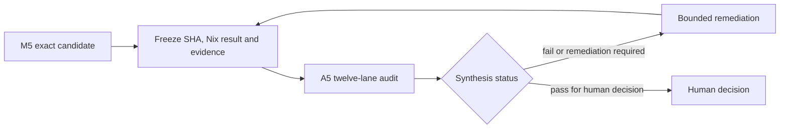

# A5 — mandatory post-M5 whole-system audit

## Status and purpose

A5 is a twelve-lane whole-system audit and hard programme stop after M5/delivery phase 7.9. It
is not an implementation phase, a release checklist, a package-boundary exercise or a
ceremonial confirmation of the roadmap.

Its purpose is to answer:

1. Is the exact M5 candidate a coherent and useful Uzel product?
2. Are its authority, state, security and failure semantics correct?
3. Is it sufficiently hardened for the declared Linux production-candidate profile and trust tier?
4. Can user data and operations survive migration, failure and rollback honestly?
5. Are resource, supply-chain, UX, operations and maintainability risks acceptable?
6. Has Uzel followed moving specs/libraries without hidden drift or an unowned fork?
7. Is durable knowledge traceable enough to teach humans and agents without inventing
   or contradicting the implementation?
8. What must be remediated before any next programme is approved?

A5 evaluates the complete system as built. It does not preselect future module names,
repositories, public APIs or release boundaries.

## Mandatory stop

Immediately after M5 candidate freeze:

```text
no feature work
no dependency churn
no architecture cleanup unrelated to a finding
no roadmap advancement
no release completion or tag
no new public API commitment
no speculative refactor for future reuse
```

Only evidence collection and bounded remediation of audit findings are allowed.



## Audit independence

A5 should include independent perspectives rather than one implementation agent
validating its own assumptions.

Minimum roles:

- architecture/product-fit reviewer;
- correctness/state-machine reviewer;
- application/protocol security reviewer;
- Linux/platform hardening reviewer;
- data/migration/recovery reviewer;
- performance/concurrency reviewer;
- Nix/supply-chain/CI reviewer;
- UX/accessibility reviewer;
- operations/support reviewer;
- maintainability/documentation reviewer;
- ecosystem/spec/interoperability/upstream reviewer;
- knowledge integrity/education reviewer.

One person/tool may cover multiple lanes, but every lane identifies reviewer, method,
source revision and evidence. The implementer may explain design but may not unilaterally
dismiss findings. Lane 3's critical-boundary review must include at least one named human
reviewer or review team without implementation ownership. Automated review is supporting
evidence, not the independent security verdict.

Use local CodeRabbit and external reviewers where useful, but no automated reviewer
substitutes for native package execution, threat testing, data recovery rehearsal or
human accessibility/product review. Record each reviewer/tool/runtime/version and its
local/remote data boundary. Send only synthetic or redacted context—never keys, pairing
URIs, credentials, production content or private diagnostics.

## Candidate evidence freeze

Before auditing, record:

- exact Git SHA and branch;
- exact Nix flake/input locks and output paths;
- package checksums/provenance;
- supported host/session matrix;
- compiler/runtime/package-manager versions;
- schema/durable-format generations;
- current and previous-green fixtures/packages;
- test command inventory and results;
- known issues/debt/unsupported claims;
- threat model and authority matrix;
- performance reference hardware and environment;
- dependency/license/source inventory;
- immutable compatibility profile and exact spec/proposal/tool/provider revisions;
- interop and version-skew matrix, including the Uzel-authored compatibility-kit fixture,
  the mandatory independent clean-room peer and separately labeled community-peer evidence;
- capability maturity ledgers and L4 evidence;
- upstream interaction/local-patch registry and current radar result;
- SBOM, advisory dispositions, fuzz/sanitizer corpora and release/security-response drafts;
- ADR, Spec Interpretation, Learning Note and educational-source indexes;
- redacted configuration required to reproduce tests.

No lane may silently audit a different SHA/output. Remediation creates a new candidate
revision and invalidates every lane whose evidence or assumptions changed.

## Finding model

Each finding records:

```text
id
lane
severity
confidence
exact SHA/output
affected journey/invariant
source or runtime evidence
reproduction command
exploit/failure mechanism
impact
recommended correction
blocking status
owner
retest scope
status
```

### Severity

**Critical**

- private-key/signer-secret exposure;
- arbitrary native code/command execution from guest input;
- reliable cross-profile/instance/build authority bypass;
- silent destructive data corruption without recoverable evidence;
- supply-chain compromise in the exact candidate;
- remotely triggerable compromise within supported use.

**High**

- grant/session/source binding bypass;
- unsafe retry or false success around irreversible effects;
- material sandbox/egress escape within declared boundary;
- migration/backup/restore defect risking user data;
- unbounded remotely influenced resource exhaustion or reliable starvation/monopoly of
  a required journey by another guest, build, profile, session or capability;
- wrong-profile signing/publication;
- package path/service behavior that defeats declared trust assumptions;
- required journey inaccessible to keyboard/assistive technology.

**Medium**

- significant partial failure, recovery, UX, performance or maintainability defect that
  does not immediately create a High impact;
- unsupported claim presented as supported;
- draft/open-PR/profile behavior presented as universal stable conformance;
- unowned upstream drift or local patch that can invalidate a supported journey;
- bounded but operationally damaging resource/diagnostic issue;
- migration/rollback ambiguity with a safe workaround.

**Low**

- localized quality/documentation/polish issue with no material current risk.

Severity follows impact and reachability, not fix size.

## Lane 1 — architecture, authority and product fit

### Questions

- Does Uzel solve a coherent user problem rather than expose runtime internals?
- Are trusted shell, runtime mediation, daemon-hosted product service, canonical Nostr
  engine, signer, object service and low-authority media-worker owners singular and explicit?
- Can any trusted shell, first-party guest, third-party guest or provider bypass the intended owner?
- Are product intent and protocol delivery evidence separate but reconciled?
- Did horizontal platform work displace product value?
- Are `local_profile_id`, read-only/signer-backed authority, actor public key, viewed
  subject, exact build and session represented without conflation?
- Is complexity proportional to the M5 journeys?
- Are parked capabilities actually absent?

### Evidence

- dependency/import graph;
- authority and state-owner tables checked against code;
- process/IPC diagram checked against runtime traces, including the fact that daemon modules are not process security boundaries and the media worker is a real separate low-authority process;
- complete M5 journey observation;
- source search for duplicate stores, signer paths, relay pools, file/network bridges;
- product interview/usability review;
- list of concepts whose meanings changed during M1–M5.

### Blocking findings

- duplicate semantic authority;
- product shell or guest can bypass daemon/provider policy;
- M5 journeys require undocumented hidden state;
- architecture exists mainly to serve a future package shape;
- product is still a developer harness rather than a usable alpha;
- shell/guest code directly opens product-service/runtime/provider state or durable
  scheduler ownership disappears when the shell closes.

## Lane 2 — correctness, state machines and semantic invariants

Audit every durable or side-effecting workflow:

- session/build/grant lifecycle;
- social demand and stale/partial evidence;
- product-service draft revisions/conflicts and shell-close survival;
- signer connection/request/result correlation;
- canonical event-template normalization, allowed engine/signer-filled fields and final signed-event verification;
- future-action grant creation, exact-revision binding, revocation, due-time revalidation and blocked drift;
- Nostr write and per-relay outcome;
- object import/upload/fetch/export, including original-versus-derived provenance and media-worker result validation;
- schedule/wake/recovery;
- update/quarantine/rollback;
- migration/backup/restore;
- profile/instance switch and shutdown.

Methods:

- model/state transition review;
- property and invariant tests;
- duplicate/reordering/replay injection;
- kill at every transition boundary;
- unsupported future variant/generation tests;
- clock/time-zone/suspend changes;
- deterministic reconciliation from durable records;
- compare UI status to authoritative state.

Block when:

- a non-terminal durable state has no recovery path;
- `unknown` is collapsed to success/failure or retried unsafely;
- boolean success hides partial/per-relay outcomes;
- stale generation/profile/build results can commit;
- user-visible state contradicts authoritative state;
- duplicate action can cause an unbounded or irreversible duplicate effect.

## Lane 3 — application and protocol security

### Surfaces

- guest WebKit content, controlled origin/CSP, persistent website data and messaging;
- Tauri/native shell;
- AF_UNIX local control;
- exact-build install/update/grants;
- canonical Nostr provider/relay input;
- NIP-46 pairing, client-key persistence/session mode and signer responses;
- file chooser, object store, Blossom and export;
- diagnostics/logs;
- Nix/dependency/build inputs;
- systemd-user/service environment.

### Required attacks

- direct guest HTTP/WebSocket/native bridge/D-Bus/shell attempts;
- navigation, popup, download, external-protocol and remote-script abuse;
- cross-build/profile/instance cookie, local-storage, IndexedDB, cache and service-worker
  contamination, path-only origin confusion and revoked-build data reuse;
- malformed/oversized/replayed/stale local-control messages;
- caller-selected principal/profile/instance/build attempts;
- exact-build hash/manifest mismatch and update authority inheritance;
- grant nonce replay, revocation race and stale session continuation;
- signer payload substitution, response replay, expiry, refusal and wrong-profile result;
- unreviewed event field/tag injection, created-at window abuse, final-event/template
  mismatch and any relay write before final-event validation;
- signer-produced Blossom authorization mismatch and any upload body sent before
  authorization validation;
- future-action grant widening, stale draft/build/actor/destination reuse and revocation bypass;
- malicious relay/event/server/file metadata;
- raw endpoint injection, DNS rebinding, redirect-to-private/link-local/metadata,
  unsupported schemes, encoded hosts and IPv4/IPv6 address-form bypass;
- cross-profile/instance/build object handle reuse;
- media-worker sandbox escape, ambient path/network access, protocol confusion, stale result reuse, decompression bombs and CPU/memory/output exhaustion;
- path traversal, symlink/target race and export replacement;
- pairing URI, NIP-46 client-key, signer response, log/diagnostic secret and content
  leakage;
- weak/random client-key generation, excessive copies, plaintext fallback, unavailable
  secure-storage backend, locked/corrupt key store, rotation, signer-side revocation,
  local deletion, profile deletion, backup/restore and compromise behavior;
- dependency lifecycle-script egress and source substitution;
- denial-of-service through queues, objects, reconnects, timers and malformed input;
- trusted decision spoofing, guest focus/click-through, stale nonce/model approval and
  guest-controlled rich content in trusted review;
- ambient proxy-variable bypass and local/self-hosted endpoint exception broadening;
- first-party Composer/Home/Profile attempts to use privileged shortcuts.

Review cryptographic use against protocol libraries; no custom construction is accepted
without independent cryptographic review. The independent critical-boundary reviewer must
receive the frozen threat model, authority/state diagrams, exact package/RCP identity,
attack corpus and prior findings, and must declare conflicts, scope, methods and evidence.

Block on any Critical/High finding, a Medium that breaks a core invariant, an unresolved
threat-model contradiction, or the absence of the required independent human security
review for the declared production profile.

## Lane 4 — Linux and platform hardening

Audit the declared support matrix:

- Fedora Server 43 with SELinux enforcing;
- headless Weston/native CI;
- KDE Plasma 6 Wayland reference session;
- Hyprland reference session;
- systemd-user lifecycle;
- media-worker executable lookup, UID/process boundary, namespace/seccomp/landlock or equivalent tested sandbox, resource limits and restart/cleanup behavior;
- XDG directories, sockets and locks;
- portals/file chooser/export;
- WebKit website-data partition/disable and service-worker policy;
- suspend/resume/time change;
- desktop notifications where used;
- package/resource discovery from store paths.

Methods:

- permissions/ownership/umask review;
- AF_UNIX peer and message-boundary tests;
- stale socket/lock and daemon-crash recovery;
- process environment and inherited descriptor review;
- SELinux denial inspection;
- service hardening options compatible with required behavior;
- clean user/home and two-instance operation;
- no checkout/ambient `PATH` dependency;
- explicit limits of same-UID and browser-engine containment.

Block when a claimed supported session cannot complete a required journey, when service
configuration weakens the declared boundary, or when state/sockets are exposed outside
validated instance scope.

## Lane 5 — data integrity, migration, backup and recovery

Audit every durable owner independently and together:

- product-service drafts/schedules/workspaces/settings and operation references;
- runtime builds/grants/jobs/object metadata;
- canonical Nostr engine state;
- object bytes/cache;
- original and normalized raster hashes, decoder/version provenance and rebuildability;
- future-action grant persistence, expiry, revocation and migration;
- backups/exports and evidence manifests.

Required rehearsals:

1. clean install;
2. previous-green data creation;
3. verified backup;
4. upgrade and migration;
5. process kill during migration;
6. restart/recovery;
7. restore into clean instance;
8. package rollback or explicit refusal when backward compatibility is impossible;
9. corrupted/truncated record/object;
10. unsupported future generation;
11. profile and instance deletion/retention;
12. disk-full and permission failure.

Block on silent data loss/corruption, unverified destructive migration, false rollback
claim, backup that cannot restore, or ambiguous ownership between product/runtime/engine.

## Lane 6 — concurrency, resource bounds and performance

Review ownership and bounds across Rust, WebView and provider work:

- task/process/socket lifecycle;
- channels and queues;
- relay/source fan-out;
- surface/resource demand;
- draft/autosave work;
- signer/write jobs;
- object streams/cache;
- scheduler/timers;
- diagnostics/log retention;
- shutdown/restart.

Required measurements:

- p50/p95 and variance for product budgets;
- cold/warm launch and first useful content;
- idle CPU/wakeups and RSS;
- per-surface incremental memory;
- global and per-build/profile/session/capability admission, queue depth, fair scheduling,
  overload outcomes and anti-starvation under noisy/quiet and many-principal workloads;
- cancellation latency;
- object streaming peak memory;
- media-worker queue, process recycle, parser CPU/address-space/output limits and crash recovery;
- reconnect/signer/schedule pressure;
- two-instance resource behavior;
- four-hour soak and cleanup;
- induced slow consumer/provider/backpressure.

Block on unbounded remotely influenced growth, orphan tasks/resources, busy polling,
non-terminating shutdown, pressure that destroys core usability, or performance claims
without reproducible environment/evidence.

## Lane 7 — Nix, supply chain and CI integrity

Audit:

- source/input/lock integrity;
- installed napplet immutable bytes/hash, source locator, publisher/authentication
  evidence and verified/unverified presentation;
- exact provider and JS/Rust dependency pins;
- lifecycle/build scripts;
- package identity and license inventory;
- binary/resource lookup, including the exact media-worker binary and sandbox policy;
- reproducibility/provenance/checksums;
- CI secret exposure and permissions;
- cache key isolation and poisoning risk;
- required checks and branch protection;
- artifact retention/previous-green availability;
- signed immutable candidate metadata and RCP/package binding; canary/stable schemas and
  policies remain unsigned until their separate human approvals;
- no silent runtime or napplet byte substitution under an active profile;
- review SHA consistency;
- historical replay evidence separation.

Required tests:

- clean locked build;
- store-path package smoke;
- two separate clean realizations of the exact candidate inputs and an artifact/NAR/
  closure comparison; inability to run this test blocks the production-candidate claim
  or requires an explicit claim reduction, and two links to one cached output do not count;
- no undeclared network at build/replay stages where forbidden;
- dependency substitution failure;
- tampered lock/hash failure;
- cache miss/full rebuild path;
- artifact/checksum manifest verification;
- mutable source URL, publisher mismatch and exact-build provenance tampering failure;
- checkout-independent launch;
- required CI cannot be bypassed by path-filter error.

Audit reviewer/tool privacy and provenance as part of supply-chain evidence: approved
endpoints, local/remote behavior, versions, configuration and proof that secrets/private
content were excluded from outbound review context.

Block on unresolved source identity, mutable/unpinned critical input, undeclared install
execution, package substitution, artifact/CI integrity gap or a distributable closure
that differs materially from reviewed/tested source.

## Lane 8 — UX, visual system and accessibility

Audit complete required journeys, not screenshots alone:

- first launch/profile choice;
- Social Home cached/live/degraded states;
- cross-surface navigation;
- offline drafting and conflict recovery;
- signer pairing, client-key storage/session policy, canonical event-template review, final-event evidence and refusal;
- publication partial/unknown evidence;
- static-image selection/upload/attachment/export;
- exact-revision future-action review, scheduling, revocation and blocked recovery;
- grants/update/rollback;
- backup/restore and diagnostics.

Evaluate:

- information hierarchy and product character;
- component consistency and unnecessary UI complexity;
- keyboard-only completion;
- visible focus and restoration;
- semantic roles/names/status announcements;
- reading order and font scaling;
- reduced motion;
- non-color-only statuses;
- understandable authority and irreversible-action scope, with trusted review visibly outside guest content;
- distinction among stale, partial, offline, blocked, failed and unknown;
- error/recovery language that does not overclaim.

Block when any required journey is inaccessible, the user cannot understand which
identity/build/action is being authorized, false success is presented, or recovery is
not discoverable.

## Lane 9 — operations, observability and supportability

Audit whether a user/operator can diagnose and recover without unsafe internals.

Required evidence:

- version/instance/profile/build/session/job status;
- structured correlation across shell/daemon/provider/media worker;
- bounded redacted logs;
- safe cancel/shutdown/restart;
- migration/backup status;
- diagnostic bundle preview/export;
- stale lock/socket recovery;
- clear unsupported/incompatible state;
- no production secrets/content in default diagnostics;
- documented restore/rollback and incident steps;
- a post-A5 opt-in canary plan with privacy-bounded health criteria, predeclared rollback
  thresholds, no-silent-update behavior, no remote telemetry by default, previous-green
  availability and a second explicit stable-release decision.

Inject incidents:

- daemon absent/crashing;
- provider/relay/signature service unavailable;
- stuck/unknown job;
- full disk/quota;
- bad migration;
- incompatible GUI/daemon generation;
- corrupted object/cache or crashed/stuck media worker;
- wrong instance targeted;
- notification failure.

Block when recovery requires direct database mutation, unrestricted shell/root access for
normal incidents, secrets leak, or diagnostics cannot distinguish authoritative state
from UI guesses.

## Lane 10 — maintainability, code quality and documentation fit

Audit:

- responsibility and dependency graph;
- semantic owner duplication;
- public/internal surface size;
- unsafe and cryptographic use;
- function/module size and naming policy;
- cancellation/task ownership;
- error/result exhaustiveness;
- dead compatibility paths and speculative abstractions;
- test quality and false-positive mocks;
- provider adapter containment and media-worker protocol/process containment;
- comments/ADRs/durable-format registry;
- package/run/recovery docs against actual commands;
- unresolved unfinished-marker, allow, skip and ignore inventory;
- code generated or copied without clear ownership/license.

Use deep code review, source graph inspection and targeted refactoring proposals. Do not
perform broad cleanup during the audit; findings first, bounded remediation second.

Block when maintainability defects hide security/correctness ownership, core behavior is
prose-only, required tests cannot isolate failures, or documentation materially
contradicts the package/source.

## Lane 11 — ecosystem compatibility and upstream stewardship

This lane treats the compatibility profile as executable release evidence, not prose. It
audits whether Uzel deliberately follows a changing ecosystem without either stale
assumptions or floating execution.

### Required evidence

- canonical machine-readable RCP schema, exact UTF-8 bytes, no-BOM/LF validation,
  `sha256-exact-utf8-bytes-v1` digest and separate package/compiled binding;
- startup mismatch rejection and trusted diagnostics exposing the verified profile;
- separately specified canonical-CBOR launch-transcript vectors;
- generated human rendering demonstrably parsed from the exact packaged profile bytes;
- immutable source identities for every used specification, proposal, library, tool,
  provider and conformance suite;
- canonical machine-readable upstream registry, phase-pinned toolchain record, dated
  pre-freeze radar and candidate-next shadow-probe results;
- Spec Interpretation Records for every material contradiction or temporary profile;
- package/spec/conformance/provider behavior comparison through the actual packaged path;
- negotiation schema, vectors and launch-transcript evidence proving required-capability
  mismatch rejects before guest code;
- current, previous-window and unsupported profile/version-skew fixtures plus machine-
  readable/generated-human profile-transition records with breaking/deprecation,
  migration, support-window and rollback truth;
- interop matrix across qualifying independent napplet, relay, signer and Blossom peers
  where available;
- externally consumable compatibility/conformance kit and clean-room external-source
  fixture using no Uzel internals;
- evidence that L4 runtime composability has a separately authored/commissioned clean-
  room napplet meeting separate-source/build/no-private-hook and black-box package-path
  criteria; `blocked_no_independent_peer` is an M5/A5 blocker, while community-maintained-
  peer evidence is labeled separately for ecosystem-adoption claims;
- all local patches with owner, immutable base, tests, upstream/no-upstream rationale and
  removal trigger;
- Upstream Interaction Records that distinguish local patch, public thread, accepted,
  merged, released, adopted and patch-removed states;
- dedicated upstream fork/worktree/branch and contributor/security/license/DCO/CLA/style/
  test-policy evidence for material public contributions;
- private-disclosure and visibility/embargo handling.

### Attack the assumptions

- Do current immutable NIP-5A/NIP-5D/NAP/tooling sources and packaged behavior agree on
  manifest kind, source/build identity, bootstrap and capability declarations?
- Can a mutable branch, tag, PR number or documentation page change the meaning of a
  shipped build?
- Can required-capability mismatch, malformed declarations or an unknown profile reach
  guest execution?
- Is the negotiation transcript canonical, bound to all required principals and immutable
  for the session?
- Can an optional capability disappear while silently widening or changing authority?
- Does “conformance passed” exercise the exact packaged source-verification, profile,
  negotiation and runtime route?
- Is a Uzel-authored fixture being mislabeled as the required independent clean-room
  peer, or is a commissioned peer being mislabeled as community-maintained?
- Is an upstream merge incorrectly treated as released, adopted or sufficient to remove a
  local patch?
- Can a local patch survive without an owner, test or expiry/review trigger?
- Could candidate-next CI mutate the production lock/profile, access secrets, promote an
  artifact or create a public interaction?
- Did GSD/Codex/CodeRabbit or other orchestration-tool drift change execution semantics
  during a phase?
- Does Uzel expose fast-moving provider/spec spelling as a durable public/control API?
- Can unsupported profile/version input corrupt state rather than fail non-destructively?
- Were current contributor and private-security routes followed without duplicate public
  noise or disclosure leakage?

### Blocking findings

- unresolved manifest/exact-build/launch-negotiation contradiction;
- profile byte rules/hash scheme/bound digest or immutable-source map disagreeing with
  the exact package;
- candidate-next probe with secrets/promotion rights, production-lock mutation or an
  unresolved high-risk/unknown delta;
- phase toolchain drift that invalidates plan/review/execution evidence;
- required capability mismatch that does not reject before guest execution;
- silent downgrade, caller-selected profile or mid-session profile mutation;
- unsupported draft/open-proposal semantics presented as generic stable conformance;
- critical upstream delta not assessed;
- enabled capability depending on an unowned or unverified local patch;
- conformance evidence that bypasses the real packaged path;
- missing qualifying independent clean-room peer evidence for the core composable-runtime
  claim, including any unresolved `blocked_no_independent_peer`;
- unexplained branch-head/floating dependency behavior;
- upstream merge/release/adoption/patch-removal states conflated;
- public contribution or external review that leaked private/embargoed information or
  created unreviewed automated issue/PR noise.

This lane may observe reuse-relevant facts as ordinary architecture evidence. It is **not**
an extraction-readiness lane and may not propose package/repository boundaries.

## Lane 12 — knowledge integrity and educational readiness

Audit whether Uzel's durable explanation is truthful, current, disclosure-safe and usable
by humans and agents.

### Required evidence

- active/superseded ADR index;
- canonical terminology registry with stable term IDs, aliases, owners, source links,
  applicability and supersession checks;
- canonical RCP/profile hash, generated rendering and SIR index;
- capability maturity ledgers;
- upstream records, local-patch states and disclosure visibility;
- Learning Note index, including negative results and failed approaches;
- raw GSD extraction artifacts with explicit curated/rejected/duplicate/embargoed
  dispositions;
- regenerated internal/public knowledge indexes, stable IDs and visibility-leak tests;
- phase closeout decision/profile/negotiation/upstream/learning/education deltas;
- milestone learning digests for `2.7`, `3.3`, `4.3`, `5.3`, `6.2` and `7.9`, each bound
  to exact source/profile identities;
- human and agent documentation maps, each promoted non-elementary claim linked to an
  exact fixture, vector, test, trace or measured report under the declared profile;
- draft exact-candidate case study linked only to current evidence;
- `verified_against`, `last_reviewed`, status and visibility metadata for educational
  outputs;
- documentation/source/test/schema/profile contradiction scan;
- visibility/embargo audit proving public education excludes secrets, private user data and
  undisclosed vulnerability detail.

### Questions

- Can a reviewer trace every core authority/security/schema/profile choice to current
  evidence and a durable record?
- Does each claim use the correct authority bundle rather than a simplistic global
  hierarchy?
- Are contradictions blocked and resolved rather than hidden by whichever artifact was
  edited last?
- Are fact, inference, product policy, temporary interpretation and open question clearly
  separated?
- Were superseded decisions preserved rather than rewritten?
- Are important lessons trapped only in chat, issue comments, raw GSD extraction or
  temporal plans?
- Do agents and humans use the same canonical term IDs, and are changed meanings recorded
  as supersession rather than silent redefinition?
- Can each promoted teaching claim be executed or inspected through its exact witness and
  active source/profile identity?
- Can the public knowledge index include an internal/embargoed record or stale superseded
  claim?
- Do agent references state active profile/hash rules, invariants, forbidden shortcuts,
  preflight, tests and stop conditions?
- Do human materials explain trade-offs, failure modes and recovery rather than repeat
  APIs?
- Do milestone digests capture negative results and upstream movement without becoming a
  second speculative documentation programme?
- Does any polished explanation contradict executable tests, schemas, package behavior or
  the active profile?
- Did AI-generated prose receive source-grounded human review?
- Will a source/profile change mark affected education `needs_review` instead of silently
  rewriting it?

### Blocking findings

- missing provenance for a core invariant or trust boundary;
- current docs teaching behavior contradicted by source, tests, schema, profile or package;
- a security mitigation described without its threat limit;
- a temporary workaround presented as a universal principle;
- missing negative-result/known-gap evidence likely to make future agents repeat a
  dangerous path;
- missing milestone digest or digest not bound to exact evidence;
- uncurated raw agent/GSD output treated as durable authority;
- public/internal index generation that can leak internal or embargoed material;
- educational material claiming production, universal conformance or arbitrary-code
  isolation beyond the frozen candidate;
- public educational output containing secrets, private data or embargoed vulnerability
  details;
- duplicated hand-maintained compatibility descriptions that disagree;
- unresolved contradiction accepted by applying an undocumented “source-of-truth” order.

A5 does not require a finished public course or site. It requires a trustworthy,
traceable and disclosure-safe evidence base from which human learning material and agent
skills can be produced.

## Cross-lane interaction review

Many serious failures sit between lanes. The synthesis must explicitly test these
intersections:

| Intersection | Required question |
|---|---|
| Authority × UX | Does trusted UI accurately present the principal/scope the daemon will commit? |
| Correctness × recovery | Can every durable non-terminal state reconcile after kill/restart? |
| Security × platform | Do actual WebKit/systemd/XDG/SELinux behaviors support the threat model? |
| Data × rollback | Can the previous package safely read state, or is restore required and proven? |
| Performance × security | Do bounds hold under malicious input, parser compromise attempts and slow consumers? |
| Review × signing | Does the final signed event satisfy the reviewed template **before** any relay write, and can the provider bypass that order? |
| Signing × object transfer | Can upload bytes leave before a signer-produced Blossom authorization is fully validated? |
| Scheduling × authority | Can a due-time action exceed or outlive its exact future-action grant? |
| Supply chain × review | Is the exact tested package built from the reviewed source/pins? |
| Operations × privacy | Can support evidence diagnose without leaking keys/content? |
| Product fit × maintainability | Are abstractions serving real journeys rather than internal ceremony? |
| Spec profile × security | Can a moving manifest/capability interpretation change authority or exact-build identity? |
| Upstream × supply chain | Is every adopted fix actually present in the exact package and every local patch owned? |
| Interop × correctness | Do independent peers expose an assumption hidden by first-party mocks? |
| Knowledge × evidence | Do human/agent explanations match tests, schemas, profiles and the exact candidate? |

## GSD-assisted evidence sequence

Run the current supported commands against the final delivery phase 7.9 and the whole
milestone before the custom synthesis:

```text
$gsd-verify-work 7.9
$gsd-code-review 7.9 --depth=deep
$gsd-secure-phase 7.9
$gsd-ui-review 7.9
$gsd-validate-phase 7.9
$gsd-audit-uat
$gsd-progress --forensic
$gsd-milestone-summary
$gsd-audit-milestone
```

These are inputs, not substitutes:

- Delivery-phase 7.9 code review does not inspect every older owner by itself.
- Phase security review does not replace cross-phase threat and platform review.
- UI review does not replace human accessibility/product journey testing.
- Milestone audit does not replace native hardening, data recovery or supply-chain
  rehearsal.

Do **not** run `$gsd-complete-milestone` before A5 pass and explicit owner approval; that
operation archives the milestone and creates release history/tagging state.

## Audit synthesis

Produce one report containing:

1. exact candidate identity/evidence manifest;
2. executive product/system verdict;
3. lane reports and reviewer independence;
4. authority/state/threat diagrams verified against source/runtime;
5. complete findings ledger;
6. cross-lane interaction findings;
7. unsupported/retired claims;
8. remediation plan grouped by root cause, not reviewer;
9. retest matrix;
10. residual risk and accepted limitations;
11. ecosystem/profile/upstream verdict;
12. knowledge/education integrity verdict;
13. capability maturity summary;
14. one final status.

Allowed final statuses:

```text
fail
remediation_required
pass_for_human_decision
```

## Pass criteria

A5 cannot pass with:

- any open Critical or High finding;
- any Medium that invalidates a required product journey or core invariant;
- unresolved authority/identity/isolation ambiguity, including actor/subject or signer-key
  binding;
- data corruption, migration, backup, restore or rollback defect;
- false success or unsafe retry around irreversible side effects;
- required keyboard/accessibility failure;
- unbounded externally influenced resource path;
- unresolved package, supply-chain, exact-build, RCP, release-signing or provenance defect;
- signer/client-key lifecycle with silent plaintext fallback or unproven deletion/backup
  behavior;
- canonical-template/final-event mismatch, relay write before final-event validation,
  upload body before authorization validation, or a future-action grant that can widen,
  outlive revocation or sign a changed draft without current review;
- media-worker network/authority/store/ambient-path access or unbounded parser/process
  behavior;
- cross-build/profile/instance guest-state contamination, cross-profile object/worker
  leakage, trusted-review spoofing or destination/proxy-policy bypass;
- claimed supported platform/session without complete native evidence;
- evidence from mixed source SHAs, package outputs or profile hashes;
- unresolved spec/profile/tool/package contradiction for a supported core seam;
- required-capability mismatch reaching guest execution, implicit downgrade, caller-chosen
  profile or mid-session profile mutation;
- critical upstream delta or unowned local patch;
- enabled required capability below L4 without removal from the supported RCP;
- missing qualifying independent composition/interoperability evidence for a claimed seam;
- missing durable decision provenance for a core authority/security/schema choice;
- missing milestone learning digest or educational/agent guidance that contradicts the
  exact candidate;
- public material that violates visibility/disclosure constraints;
- unexplained release-relevant difference between two clean exact-input candidate builds;
- missing independent human critical-boundary security review, unresolved blocking review
  finding, mutable/unsigned release-channel identity, silent update substitution, or no
  credible opt-in canary/rollback/stable-promotion plan.

Remaining Medium/Low findings require explicit owner, rationale, bounded impact and planned
disposition. A pass means the declared candidate is coherent and truthful enough for a named human
to decide whether to begin a bounded opt-in canary. It is not automatic L5 or stable
release approval.

## Remediation loop

For every blocking root-cause group:

1. create bounded contextual issue(s);
2. keep the candidate line frozen except approved fixes;
3. implement with normal tests, reviews and package gates;
4. produce a new exact source/package/profile identity;
5. rerun every affected lane;
6. rerun cross-lane intersections and complete journeys when authority, schema, dependency,
   package or shared behavior changed;
7. update the synthesis without erasing prior findings or evidence;
8. regenerate profile/knowledge/release artifacts and recheck visibility.

Do not lower severity because remediation is difficult.

## Decision after a pass

`pass_for_human_decision` stops automation. It does **not** itself declare production or
permit milestone completion. The owner chooses one of:

- approve production only for the exact audited package/RCP/platform/trust-tier matrix,
  after release/security/support policy is complete;
- remediate additional non-blocking findings before approval;
- continue Uzel product development under a new roadmap;
- keep the architecture entirely internal;
- contribute selected general fixes upstream;
- commission a fresh, separate reuse/extraction assessment from the exact audited source.

Any approved production claim must name the exact candidate and limitations. A later
reuse/extraction assessment is outside A5 and inherits no package names, boundaries or
assumptions from pre-audit planning.
