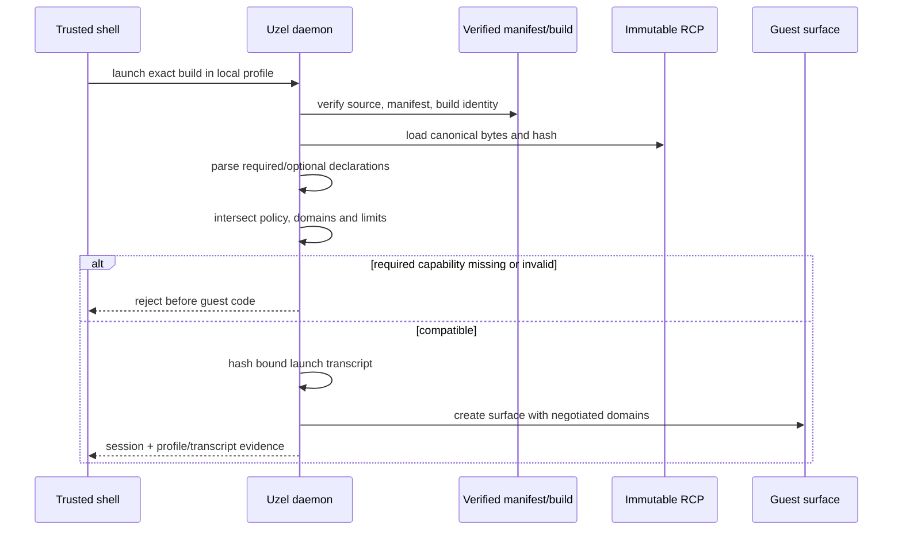

# Fast-moving ecosystem, compatibility and upstream stewardship

## Purpose

Uzel depends on specifications, proposals, libraries, conformance tools and platform
behavior that are changing quickly. A production-grade runtime cannot solve that by
freezing forever, and it cannot remain reproducible by following branch heads.

The operating rule is:

> **Pin execution; observe movement; adopt through evidence; contribute at the smallest
> correct upstream seam.**

“Chasing the spec and libraries” means that Uzel remains close enough to discover,
exercise, influence and deliberately adopt useful changes. It does **not** mean:

- building a release from a mutable branch, tag or pull-request label;
- auto-merging dependency updates;
- allowing a documentation page to redefine shipped behavior;
- treating conformance-tool success as proof that the packaged path is correct;
- changing durable state or authority semantics merely because a draft changed;
- opening upstream issues or PRs automatically.

This document owns the standing ecosystem and contribution process. It complements, but
does not replace, the exact source, lock, Nix and package evidence in
[the baseline replay contract](01-BASELINE-REPLAY.md).

## Current ecosystem posture

The dated scan in
[the ecosystem baseline report](reports/ecosystem-baseline-2026-08-10.md) is planning
evidence, not a permanent statement. M0 must resolve every used source to immutable bytes
at the actual Uzel pins.

The important conditions at planning time are:

- the intended Nostr engine is pre-1.0 and distinguishes relatively stable ownership and
  behavioral invariants from provisional app-facing names and shapes;
- NIPs are selectively adopted implementation possibilities rather than a universal
  checklist, and relevant deployed work may live in open proposals or external projects;
- current NIP-5A describes nsites, while napplet documentation and tooling describe a
  separate NIP-5D napplet manifest model;
- napplet specifications, packages and conformance tooling are moving together but not
  necessarily atomically;
- several NAP domains remain draft or implementation-led;
- Linux WebKit, Tauri, Nix, systemd-user and SELinux behavior can invalidate browser-only
  assumptions even when a JavaScript conformance test passes.

Therefore Uzel must not store a durable claim such as “supports NIP-5A/NIP-5D” without
naming the exact interpretation, source bytes, supported subset, trust assumptions and
executable evidence.

## Claim-specific authority

There is no single linear “source of truth” that can safely settle every disagreement.
Authority depends on the claim:

| Claim | Required authority bundle |
|---|---|
| External protocol meaning | Immutable spec/proposal source + accepted Spec Interpretation Record + contract/interop evidence |
| Library behavior | Immutable library source/package integrity + executable adapter/behavior tests |
| Runtime behavior | Exact Uzel source/package + native execution evidence + capability ledger |
| Durable data meaning | Schema/migration code + fixtures + accepted decision/profile records |
| Product/trust policy | Accepted ADR/profile + packaged trusted UX/diagnostics + policy tests |
| Release content | Exact artifact/provenance/SBOM + source and compatibility-profile hashes |
| Educational claim | Current authority bundle above + reviewed synthesis and review date |

A contradiction between members of a bundle is a blocker. Tests do not silently override
a specification claim; prose does not override observed package behavior; and an upstream
README does not override the exact source Uzel actually ships. Record and resolve the
contradiction.

## Immutable source identity

A mutable locator is useful for discovery but insufficient for execution evidence.
Every used external source must resolve to immutable content.

For Git-hosted text or code, record as applicable:

```text
canonical repository
40-hex commit
root or relevant tree identity
path
content digest
retrieval timestamp
status at that commit
human locator such as tag/PR/branch, for context only
```

For registry packages or archives, record:

```text
exact version
registry/source
package integrity or archive digest
lockfile/Nix source that selected it
unpacked source digest when needed
```

A branch, tag, pull-request number, documentation URL or package name alone is not an
exact source identity.

## Uzel Runtime Compatibility Profile

### Canonical representation

Every packaged Uzel build embeds one canonical machine-readable **Uzel Runtime
Compatibility Profile** (RCP), normally generated from a validated TOML source using
[the machine profile template](templates/COMPAT-PROFILE.toml).

The canonical profile is the exact validated UTF-8 TOML byte sequence shipped in the
package. M0 defines and enforces these byte rules:

```text
encoding = UTF-8
byte_order_mark = forbidden
line_endings = LF
hash_scheme = sha256-exact-utf8-bytes-v1
runtime_normalization_before_hash = forbidden
```

TOML does not have a universal canonical serialization, so Uzel does not hash a reparsed
or reserialized document. The profile does not contain its own digest. The package
manifest and a compiled expected digest bind the exact packaged bytes; daemon startup
recomputes SHA-256 over those bytes, fails closed on mismatch and exposes the verified
identity through trusted diagnostics:

```text
compat_profile_id
profile_hash_scheme
compat_profile_hash
exact_packaged_profile_bytes
```

The human-readable profile is generated by parsing those exact bytes and rendering the
validated model with [the profile rendering template](templates/COMPAT-PROFILE.md). It is
not maintained as a second authority. Launch-transcript canonicalization is a separate
contract (`sha256-canonical-cbor-v1`) with cross-language test vectors; it must never be
confused with the exact-byte RCP hash.

A profile records at least:

- exact Uzel source/tree and Nix derivation identity;
- exact spec/proposal/library/tool/provider sources;
- napplet manifest and exact-build identity interpretation;
- enabled, optional, experimental and unsupported capability domains;
- selected operations and limits for each domain;
- unknown-field/message behavior;
- trust tier and platform matrix;
- known deviations and accepted Spec Interpretation Records;
- conformance, interop and version-skew fixture identities;
- migration/rollback relationships to other profiles;
- security and release constraints.

A used or released profile is immutable. A changed interpretation creates a new profile.

### Required/optional capability negotiation

The verified napplet manifest/build declares required and optional capabilities using the
exact grammar selected by the active profile. Before any guest code executes, the daemon:

1. verifies source, manifest and exact-build identity;
2. loads the immutable active profile by ID and hash;
3. parses required and optional capability declarations under that profile only;
4. intersects declarations with enabled runtime capabilities and policy limits;
5. rejects the launch when a required capability is unsupported, malformed or outside
   policy;
6. records optional omissions as explicit unsupported/degraded outcomes;
7. creates a canonical launch transcript;
8. binds its hash to instance, local profile, actor, exact build, session and generation;
9. only then creates the guest surface and exposes the negotiated domains.

Rules:

- no implicit downgrade of a required capability;
- no branch-head interpretation at launch;
- no mid-session profile replacement;
- no domain exposed merely because a JavaScript object happens to exist;
- no caller-selected compatibility profile;
- stale transcripts/sessions fail closed;
- unsupported future fields are handled according to the active profile, not guessed.



The transcript schema, canonicalization and test vectors are durable contracts and belong
in the profile/schema registry.

## Externally consumable compatibility and conformance kit

By M1 capstone, Uzel publishes from the repository/package a versioned compatibility kit
for the active RCP. It allows a clean-room napplet author or agent to target the runtime
without importing Uzel internals. The kit contains:

- the exact RCP bytes, ID, hash scheme and verified digest;
- manifest/exact-build and launch-negotiation schemas;
- canonical launch-transcript vectors, including negative cases;
- supported domain operations, limits, state/error meanings and unknown-field behavior;
- exact source/proposal/library identities and accepted SIRs needed to interpret the
  profile;
- black-box harness instructions that exercise the packaged runtime path;
- a minimal clean-room example/fixture with its own source, locks and provenance;
- expected denial, downgrade-refusal, stale-session, cancellation and resource-bound
  cases.

This kit is an executable compatibility surface, not a promise of a stable Rust API or an
extracted SDK. Generic fixes to napplet conformance belong upstream when accepted through
the contribution workflow; Uzel-specific policy remains local.

M1 requires a clean-room external-source fixture built only from the kit. M0/M1 also
create an acquisition/commission plan for an independent clean-room implementation whose
authors work from this public kit and packaged black-box harness rather than Uzel private
internals, tests or implementation coaching. Because Uzel source is public, this is a
recorded procedural-independence claim—not proof that public code was unknowable. The peer
must disclose inputs and may not import/copy Uzel internals. That implementation is
required for L4 runtime composability; `blocked_no_independent_peer` blocks M5 rather than
allowing composability to be silently removed. A genuinely community-maintained peer
is tracked separately and strengthens ecosystem-adoption claims, but it is not conflated
with the minimum independent-implementation gate.

## Machine-readable upstream registry

M0 creates one canonical machine-readable registry, normally:

```text
docs/ecosystem/upstreams.toml
```

Use [the registry template](templates/UPSTREAM-REGISTRY.toml). Each entry records:

- stable local ID and role;
- canonical repository/package/path;
- immutable current pin and integrity evidence;
- mutable watched locator, separately;
- contribution and private-security routes;
- license and DCO/CLA requirements where applicable;
- Uzel surfaces that depend on it;
- risk/update class;
- local patches and Upstream Records;
- scan owner, date, latest observed revision, delta class and next trigger.

Generated summaries may exist, but the machine registry remains canonical. It indexes
external sources; it does not mirror their living contents.

## Read-only upstream radar

Run a read-only scan:

- at M0;
- before planning a phase that touches an upstream-owned surface;
- at each milestone learning closeout;
- on a bounded scheduled cadence during active development;
- immediately after relevant security notices;
- before the M5 candidate freeze;
- before a production release decision.

Compare the current immutable pin with upstream changes in:

- public API and wire/schema behavior;
- ownership and authority semantics;
- defaults and capability declarations;
- durable storage/migration behavior;
- security advisories and known gaps;
- conformance vectors and tooling;
- supported platform behavior;
- open issues, discussions and PRs relevant to Uzel;
- local patches that may now be obsolete.

Every observed delta is classified:

```text
none
editorial
compatible_behavior
api_only
wire_or_schema
ownership_or_authority
security
migration_or_storage
interop
unknown
```

`security`, `ownership_or_authority`, `wire_or_schema`, `migration_or_storage` and
`unknown` are high-risk until proven otherwise.

A radar job may create or update one internal tracking issue. It may not modify locks,
open public threads, push an upstream branch or merge an update automatically.

## Candidate-next shadow probe

A read-only radar tells Uzel that upstream moved; a **candidate-next shadow probe** tells
it whether the observed movement is likely to matter without changing the production
lock or profile.

Run the probe on a bounded scheduled cadence and before planning a phase that touches a
materially changed upstream. It executes in an isolated no-secret CI environment and:

1. resolves the latest observed upstream locator to immutable commit/tree/content or
   package-integrity identities;
2. generates an ephemeral candidate-next source/profile overlay without editing the
   production lock, current RCP or release artifacts;
3. builds and runs selected adapter, contract, conformance, interop, schema and packaged-
   path probes appropriate to the delta;
4. records exact observed source identities, toolchain, tests, outcome and delta class;
5. destroys the overlay and credentials-free environment after evidence capture.

The probe has no release/signing keys, production secrets, write tokens or permission to
publish artifacts, change locks, open upstream threads, submit PRs or promote a package.
Its output is advisory evidence only.

A `security`, `ownership_or_authority`, `wire_or_schema`, `migration_or_storage` or
`unknown` result creates a blocker before the next affected delivery phase or candidate
freeze. Lower-risk results inform a separately reviewed compatibility campaign. A green
probe is not adoption evidence because it has not passed migration, rollback, review,
release and current-profile gates.

The upstream registry records candidate-next status separately from the shipped pin.
The watched set includes specifications, proposals, libraries, conformance packages,
providers and critical development/orchestration tools such as Rust, Node, Nix, Codex,
GSD and CodeRabbit.

## Compatibility campaign

Adopting an upstream delta is a bounded campaign with its own contextual issue and primary
Uzel PR, except when an emergency security response requires a narrower path.

The campaign must:

1. capture old and proposed immutable source identities and the exact delta range;
2. read current contributing/security/license/DCO/CLA/style/test guidance;
3. classify API, wire/schema, authority, security, storage, migration, platform and
   performance effects;
4. reproduce relevant old behavior and new behavior;
5. update or add contract, conformance, interop, version-skew and migration fixtures;
6. test the actual packaged path rather than only an upstream unit test;
7. update the canonical RCP and regenerate its human rendering;
8. generate a machine-readable and human profile-transition record from old to proposed
   profile using [the transition template](templates/PROFILE-TRANSITION.toml): capability/
   schema/authority/security/behavior changes, breaking/deprecated surfaces, migration,
   support window and rollback path;
9. update capability ledgers, SIRs, ADRs, local-patch and learning records;
10. preserve previous-green pins/artifacts and rollback truth;
11. pass owning security, native, package and resource gates;
12. record one of `defer`, `reject`, `wait_for_upstream`, `adopt_with_adapter` or `adopt`;
13. merge the Uzel adoption only after its exact candidate evidence is green.

Deferral has an owner, risk, reason and review trigger. “Latest” is not a reason to adopt.

## Upstream contribution workflow

Uzel should contribute general fixes and evidence upstream, but upstream repositories are
not an extension of Uzel's private issue tracker.

### Separate local delivery from upstream resolution

A reviewed local adapter/patch may unblock Uzel before upstream resolution when it is the
smallest safe choice. The following states remain distinct:

```text
local patch exists
upstream thread exists
upstream PR accepted
upstream PR merged
upstream release contains change
Uzel adopts exact released/merged source
local patch is removed
```

None implies the next. In particular, a merge is not a release, Uzel adoption, or proof
that a local patch can be removed.

### Before external contact

1. Reproduce the problem at Uzel's exact pin.
2. Reproduce or disprove it at current upstream head or the relevant immutable proposal
   revision.
3. Search existing issues, discussions and PRs.
4. Read `CONTRIBUTING`, `SECURITY`, license, DCO/CLA, authorship/signoff,
   AI-assisted-contribution, style, architecture and test rules.
5. Reduce the result to a minimal synthetic public reproducer.
6. remove Uzel secrets, user data, private infrastructure and embargoed vulnerability
   details;
7. decide whether the correct route is no action, existing-thread comment, issue,
   discussion, focused PR or private disclosure;
8. prepare work in a dedicated upstream fork/worktree/branch, not Uzel's product branch;
9. keep commits minimal, preserve original authorship and avoid unrelated cleanup;
10. have a named human submitter review, understand, approve and take responsibility for
    all non-trivial public text and patches before submission;
11. record AI assistance and authorship/signoff/DCO/CLA handling when repository policy or
    truthful provenance requires it.

Do not let an agent spray duplicate issues/comments/PRs. Use one canonical upstream thread
per problem and add only new evidence. Never fabricate maintainer agreement, reproduced
results, provenance, authorship or signoff, and never make an agent the accountable public
submitter.

### Channel selection

| Situation | Default route |
|---|---|
| Uzel misuse or private-adapter bug | Fix locally; no upstream noise |
| Existing issue/PR/discussion covers it | Add concise reproducible evidence to that thread |
| Reproducible library defect | Follow repository policy; generally issue first, then focused test/fix PR |
| Missing generally useful seam | Issue/discussion before code unless maintainers invite a PR |
| Draft/spec ambiguity exposed by implementation | Add interop and security evidence to the active proposal; propose text only with an implementable contract |
| Documentation/example defect | Small direct PR where policy permits |
| Security vulnerability | Private security route; coordinate disclosure |
| Uzel-only preference | Keep in Uzel policy; do not universalize upstream |

At M0, verify repository-specific routing from current upstream guidance. Working defaults
are:

- for the canonical Nostr engine, preserve its semantic ownership/invariant frame and
  contribute one coherent issue/PR rather than leaking Uzel product policy into engine
  semantics;
- for NAP/NIP proposals, provide implementation and interoperability evidence and prefer
  improving the active proposal over inventing a competing contract;
- for napplet tooling/conformance, isolate package behavior, spec interpretation and
  harness behavior so the report names the correct defect.

### Upstream Interaction Record

Every material external interaction uses
[the Upstream Record template](templates/UPSTREAM-RECORD.md). Valid states include:

```text
observed
reproduced
existing_thread
commented
issue_open
local_patch
pr_open
accepted
merged
released
adopted
patch_removed
rejected
superseded
withdrawn
```

The record links the Uzel issue, exact reproducer, compatibility profile/capability,
public or private upstream thread, dedicated branch/worktree, maintainer feedback, local
patch, merge/release/adoption sources and removal trigger. It also records the named human
submitter/approver, AI assistance, repository AI policy, authorship, signoff and DCO/CLA
disposition.

Visibility is explicit:

```text
public
internal
embargoed
```

Embargoed security details never enter public educational output or unapproved external
review tools.

### Local patch and fork policy

Every local patch has:

```text
owner
exact upstream base
exact patch identity
linked Upstream Record or explicit no-upstream rationale
focused regression test
security and compatibility impact
rebase/conflict behavior
expiry/removal trigger
next review date
```

Rules:

- keep patches narrow and mechanically separable from Uzel policy;
- do not maintain a silent fork;
- do not stack unrelated behavior on a waiting patch;
- retest/rebase it in every relevant compatibility campaign;
- remove it only in the verified Uzel adoption that makes it obsolete;
- a rejected upstream change may remain local only under a new recorded product/security
  rationale;
- an unowned, untested or triggerless patch blocks the M5 freeze.

## Spec Interpretation Records

When exact sources, package behavior, conformance tooling and interoperability disagree,
create a Spec Interpretation Record using
[the SIR template](templates/SPEC-INTERPRETATION.md).

A SIR records:

- immutable conflicting sources;
- directly observed behavior versus inference;
- one bounded interpretation for a named RCP;
- unsupported behavior and downgrade rules;
- security, persistence and interoperability consequences;
- executable vectors/fixtures;
- upstream route;
- recheck triggers.

Its state is one of:

```text
aligned
temporary_profile
intentional_deviation
blocked
superseded
```

A temporary profile is never described as universal conformance.

## Interoperability matrix

For every externally observable supported behavior, record:

```text
Uzel profile/hash and exact package
counterparty implementation and exact source/version
operation
expected result
actual result
evidence location/digest
known variance
last verified
```

Before M5 freeze, exercise where relevant:

- multiple Nostr relay implementations/configurations;
- multiple NIP-46 signer implementations;
- multiple Blossom server implementations;
- at least one independently authored napplet built outside the Uzel repository;
- current and previous supported RCPs during the declared window;
- unsupported/unknown capability and message behavior;
- degraded/offline/partial counterparty behavior.

The Uzel-authored M1 fixture may use an independently versioned external-source boundary,
but it is not independent-peer evidence. An independently authored napplet used for the
L4/M5 composability gate must:

- live in a separate source repository and use a build pipeline independent of Uzel;
- build without Uzel internal crates, private test hooks or source-tree assumptions;
- have exact source, dependency, manifest and artifact provenance;
- run as a black-box packaged-runtime guest through the same verification and negotiation
  path as any supported external napplet;
- exercise a required composition journey, not merely launch a hello-world surface.

The L4 runtime-composability peer must be authored independently under clean-room
conditions and cannot be the Uzel-authored fixture. A community-maintained implementation
is stronger ecosystem evidence but is labeled separately. Absence of the required
independent implementation leaves `blocked_no_independent_peer` and blocks M5.

## Security disclosure

M0 records the private reporting route for Uzel and every security-relevant upstream.
Before public contact, classify whether a finding involves:

- exploitable vulnerability or signing/key risk;
- user/private data;
- unpublished infrastructure detail;
- coordinated disclosure obligation;
- harmless compatibility or documentation behavior.

A private record includes affected profile/build/pin, reproducer, impact, temporary
mitigation, disclosure timestamps, fixed upstream source, exact Uzel adoption and release
status. Public learning records are created only after disclosure permits it and must
remove secrets, user data and unnecessary exploit detail.

## Required repository artifacts

By M0 exit, Uzel contains or generates singular authoritative artifacts equivalent to:

```text
docs/ecosystem/upstreams.toml
docs/compat/profiles/<profile-id>.toml
docs/compat/generated/<profile-id>.md
docs/compat/interop-matrix.md
docs/upstream/records/
docs/specs/interpretations/
docs/runtime/capabilities/
```

The exact path may follow current repository conventions, but machine and generated
sources must be identified and never hand-maintained as competing authorities.

## Phase and milestone gates

Every phase plan records:

```text
upstream scan result
compatibility-profile/hash impact
capability-negotiation impact
local-patch impact
interop/version-skew impact
upstream contribution impact
visibility/disclosure impact
```

Every closeout records the delta, including `none — <reason>`.

A phase or milestone cannot close when:

- a supported wire/identity/authority contract depends only on a branch/tag/PR label;
- required-capability mismatch can reach guest execution;
- profile exact bytes/hash scheme/package binding and packaged diagnostics disagree;
- the candidate-next probe found a high-risk or unknown delta without a bounded owning
  decision;
- a critical upstream delta is untriaged;
- a local patch lacks owner/test/removal trigger;
- package behavior and the recorded profile disagree;
- conformance does not exercise the real packaged path;
- an upstream merge is treated as release/adoption/patch removal;
- independent interoperability is manufactured from first-party mocks;
- Uzel claims generic conformance for a temporary profile;
- public contribution or educational material violates disclosure constraints.
