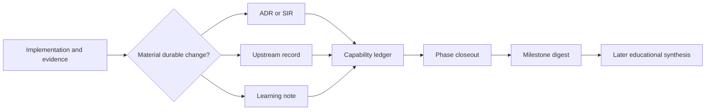

# Decision, nuance and educational-knowledge system

## Purpose

Uzel should leave more than source code and a working package. It should preserve why the
runtime is shaped as it is, what evidence supports each claim, which alternatives failed,
how upstream movement changed the design, and what humans and agents must understand to
work safely.

The process must avoid two failures:

1. **documentation theatre:** large prose plans drift while code becomes the only reliable
   record;
2. **record exhaust:** every minor edit creates another document until nobody can find the
   important decisions.

Use a small set of durable record types only for material changes:

```text
ADR                 durable Uzel product/architecture/security decision
SIR                 exact interpretation of a moving or contradictory external contract
Upstream Record     external issue/comment/PR/security/local-patch lifecycle
Learning Note       reusable nuance, negative result or failure mode
Capability Ledger   current claim and production evidence for one runtime capability
Phase Closeout      bounded reconciliation of one implementation phase
Milestone Digest    reviewed synthesis and education seed for one completed milestone
```

Plans, chat and issue conversation remain temporal evidence. A durable lesson moves to its
owning record before closeout.

## Repository structure

Use established repository conventions when ownership remains singular. Otherwise use an
equivalent structure:

```text
docs/
  decisions/                    # ADR-####-short-name.md
  compat/profiles/              # canonical immutable machine profiles
  compat/generated/             # generated human profile renderings
  specs/interpretations/        # SIR-####-short-name.md
  upstream/records/             # UPR-####-short-name.md
  learnings/                    # LRN-####-short-name.md
  runtime/capabilities/         # capability maturity ledgers
  knowledge/
    terms.toml                  # canonical cross-component terminology
    index.internal.json         # generated, visibility-aware internal index
    index.public.json           # generated, excludes internal/embargoed records
  education/
    milestones/                 # bounded milestone digests
    human/                      # later concept-first learning units
    agents/                     # short invariant/task references
    case-studies/               # evidence-backed system narratives
```

Do not copy living upstream specifications. Link immutable sources and record only Uzel's
selection, interpretation, deviation and evidence.

## Canonical terminology and concept registry

M0 creates `docs/knowledge/terms.toml` from
[the term-registry template](templates/TERM-REGISTRY.toml). This is the bounded canonical
vocabulary for concepts whose meaning crosses components, phases or educational material.
It does not attempt to dictionary every identifier.

Each term has:

```text
stable term_id
preferred label
aliases and deprecated labels
precise definition and non-definition
semantic owner
affected profiles/capabilities
immutable source/evidence links
status and supersession/replacement
last_reviewed and reviewer
```

At minimum, govern local profile, actor, viewed subject, exact build, instance, session,
generation, grant, capability, intent, durable job, publication, relay acceptance,
observed delivery, complete, blocked and unknown. A phase that changes a shared meaning
creates or supersedes a term record; it does not silently edit old learning material or
let separate agents invent aliases. ADRs, SIRs, capability ledgers, closeouts, tests and
education refer to stable term IDs where ambiguity would matter.

## Claim-specific authority and contradiction handling

A single linear hierarchy is unsafe because different claims require different evidence.
Use these authority bundles:

| Claim | Required evidence bundle |
|---|---|
| External protocol meaning | Immutable spec/proposal source + active SIR/profile + contract/interop evidence |
| Library/tool behavior | Immutable source/package integrity + executable behavior and adapter tests |
| Runtime behavior | Exact Uzel source/package + native execution report + capability ledger |
| Durable state meaning | Schema/migration implementation + fixtures + active ADR/profile |
| Product/trust policy | ADR/profile + packaged trusted UX/diagnostics + policy/security tests |
| Operational/release claim | Exact artifact/provenance + measured/rehearsed runbook and support policy |
| Educational statement | Current authority bundle above + reviewed synthesis, status and review date |

When members of a bundle disagree:

1. stop the affected claim or phase;
2. state the contradiction explicitly;
3. create/update a SIR, ADR or defect record under the correct owner;
4. collect the missing evidence;
5. resolve, narrow or retire the claim;
6. update dependent learning/education material.

Do not silently let a test override a protocol claim, a README override shipped bytes, or
new prose rewrite historical decisions.

## Visibility and disclosure

Every durable record has one visibility state:

```text
public
internal
embargoed
```

It also records any disclosure constraint and the condition under which that constraint
changes.

Rules:

- never place secrets, signer material, user/private data or unnecessary exploit detail in
  public learning material;
- an embargoed security record may link to a sanitized public note only after coordinated
  disclosure permits it;
- external reviewer tools do not receive embargoed details without explicit approval;
- generated educational indexes must respect visibility automatically;
- a public record may identify a limitation without publishing a weaponized reproducer.

## Architecture Decision Records

Create an ADR when a change affects:

- semantic ownership;
- trust boundary or authority flow;
- public, wire or durable schema;
- profile/instance/build/session identity;
- signing or irreversible side-effect ordering;
- compatibility/adoption strategy;
- data migration, rollback, backup or restore truth;
- process/OS/network isolation;
- a dependency whose role changes architecture;
- deliberate upstream deviation;
- hard-to-reverse product/runtime policy.

Do not create an ADR for ordinary implementation detail, local naming or reversible
refactoring that preserves behavior.

Use [the ADR template](templates/ADR.md). States are:

```text
proposed
accepted
superseded
rejected
deprecated
```

An accepted ADR is immutable except for metadata and links. A changed decision creates a
new ADR with an explicit supersession relationship.

## Spec Interpretation Records

Create a SIR when:

- two immutable upstream sources disagree;
- a draft leaves an authority/security/persistence ambiguity;
- implementation behavior at the exact pin differs from documentation;
- Uzel supports only a named subset/profile;
- an upstream change would reinterpret stored state or guest authority;
- conformance tooling cannot distinguish materially different behavior;
- an unknown-field/downgrade rule is security-relevant.

Use [the SIR template](templates/SPEC-INTERPRETATION.md). A SIR binds exact source bytes,
observed behavior, chosen interpretation, unsupported behavior, tests, interop evidence,
upstream route and recheck triggers.

## Upstream Interaction Records

Use [the Upstream Record template](templates/UPSTREAM-RECORD.md) for every material:

- existing-thread comment;
- issue or discussion;
- public PR;
- private security report;
- local patch dependent on upstream behavior;
- upstream merge/release/adoption/removal lifecycle.

The record keeps public threads from becoming Uzel's only memory and prevents “merged”
from being confused with “released”, “adopted” or “local patch removed”.

## Learning Notes

A Learning Note captures knowledge more general than one diff but narrower than an ADR.
Create one when, for example:

- replay/conformance failed for a non-obvious reason;
- a draft's words produced a different security model in practice;
- WebKit/Nix/SELinux behavior contradicted browser-only assumptions;
- a state machine required `unknown` instead of a boolean;
- an attempted abstraction was removed because product evidence disproved it;
- a negative result should prevent repeated work;
- maintainer feedback revealed a nuance absent from the README;
- independent interop exposed a hidden assumption;
- agents repeatedly make the same category error.

A Learning Note is not a diary. It contains:

- exact context and evidence;
- fact versus inference;
- the reusable rule/question;
- scope and non-applicability;
- review trigger;
- visibility/disclosure state.

Use [the Learning Note template](templates/LEARNING-NOTE.md).

## Capability ledgers

Every production-relevant runtime capability has one ledger governed by
[the maturity programme](09-PRODUCTION-MATURITY.md) and
[the ledger template](templates/CAPABILITY-LEDGER.md).

The ledger is the shortest reliable answer to:

> What exactly do we support, who owns it, under which profile/hash and trust tier, what
> can fail, how is it bounded, and what evidence proves the current maturity?

It links rather than repeats ADRs, SIRs, tests, incidents, upstream records and package
reports.

## Required issue and PR fields

Every contextual issue records:

```text
Decision impact: none | update | new record
Spec/profile impact: none | assessed | update required
Negotiation/schema impact: none | assessed | update required
Upstream impact: none | monitor | comment | issue | PR | private disclosure
Learning impact: none | candidate note | update required
Education impact: none | agent delta | human delta | case-study input
Visibility impact: public | internal | embargoed | none
```

These flags do not require seven files per PR. `none — <reason>` is valid; omission is not.

Every material PR closeout contains:

```text
Decision delta:
Spec/profile/negotiation delta:
Upstream/local-patch delta:
Learning delta:
Education delta:
Visibility/disclosure delta:
Capability-maturity delta:
```

## Phase closeout

A phase is not complete merely because code and CI are green. Before final review:

1. reconcile plan, issue, source, exact compatibility profile and packaged behavior;
2. update affected capability ledgers;
3. create/supersede required ADRs and SIRs;
4. update upstream records, local patches and immutable source identities;
5. capture reusable negative results and nuances;
6. record all closeout deltas;
7. verify source/profile hashes, links, visibility and disclosure state;
8. scan for contradictions among source, schemas, tests, profiles and docs;
9. remove temporary prose from active agent context after its durable lesson is captured.

Use [the Phase Closeout template](templates/PHASE-CLOSEOUT.md). This is normally a bounded
final commit in the same PR, not a separate documentation programme.



## GSD extraction is intake, not authority

After a phase has execution summaries and `$gsd-verify-work` evidence, run
`$gsd-extract-learnings <phase>` when supported by the phase-pinned GSD version. Preserve
its source-artifact attribution. Treat the generated `.planning/learnings/*-LEARNINGS.md`
as a replaceable intake artifact: it may be incomplete, overgeneralized or overwritten by
a later run.

The phase closeout reviews each extracted item and chooses one disposition:

```text
promote_to_ADR_or_SIR
promote_to_upstream_record
promote_to_learning_note
update_capability_ledger
retain_as_raw_phase_evidence
duplicate
reject_with_reason
embargo
```

Only promoted and reviewed records become durable teaching inputs. A raw extracted lesson
must never silently become an architecture rule or public claim.

## Generated knowledge index

M0 defines deterministic schemas and generators for a repository knowledge index:

```text
docs/knowledge/index.internal.json
docs/knowledge/index.public.json
```

Each entry carries stable ID, type, title, status, visibility, supersession links,
`verified_against`, `last_reviewed`, owners, source/evidence links, canonical term IDs and
affected profile/capability IDs. The internal index includes all records authorized for internal use. The
public generator excludes `internal` and `embargoed` entries and fails on an unresolved or
unknown visibility state.

The index is derived from accepted records; it is not edited as a second authority. CI
checks stable IDs, broken references, supersession cycles, stale review triggers and
visibility leaks. Future educational sites and agent skills consume the index and source
records—not raw `.planning` output, chat transcripts or unreviewed PR prose.

## Milestone learning digest

At the final phase of each product milestone—`2.7`, `3.3`, `4.3`, `5.3`, `6.2` and
`7.9`—produce one reviewed digest using
[the Milestone Learning template](templates/MILESTONE-LEARNING.md).

The digest is bounded synthesis, not polished course production. It must include:

- exact source range and compatibility profile/hash;
- what the milestone actually proved;
- decisions that survived product evidence;
- nuances, failed approaches and negative results;
- relevant ecosystem movement and upstream interactions;
- a human case-study outline;
- an agent-reference delta;
- contradiction and disclosure checks;
- small evidence-backed educational backlog seeds.

A milestone does not close when the digest is missing, contradicts executable evidence, or
publishes embargoed/private material.

## Education pipeline

Capture facts and nuances during implementation; synthesize only after phase/milestone
evidence exists. Do not make every product PR produce polished tutorials.

### Human-facing learning unit

A later human unit should contain:

```text
question or problem
context and mental model
boundary/state diagram
chosen design
alternatives and trade-offs
failure modes and recovery
worked example
what changed upstream
what remains uncertain
source/evidence links
canonical term IDs
executable witness: exact fixture/vector/test/trace/report + command or inspection path
verified_against
last_reviewed
visibility/status
```

It should teach why, not merely enumerate APIs.

### Agent-facing reference

A task-oriented agent reference should contain:

```text
scope and owning component
active profile/hash or profile-selection rule
invariants
allowed authority/dependency edges
forbidden shortcuts
state/error meanings
required preflight
commands/tests/evidence
canonical term IDs
executable witness and expected observable result
common traps
stop/escalation conditions
records to update
verified_against
last_reviewed
visibility/status
```

Agent references must be small enough for task context and link outward. Do not paste the
whole architecture into every `AGENTS.md` or skill.

### Traceability and drift

Every non-elementary educational claim links to an exact executable or inspectable
witness under the declared source/profile—fixture, vector, test, trace or measured
report—and to one or more of:

- immutable source/profile identity;
- executable vector/test;
- current ADR/SIR;
- capability ledger;
- upstream interaction;
- measured/native/package report.

Every educational artifact records:

```text
status: draft | verified | needs_review | historical
verified_against: <source/profile/artifact identities>
last_reviewed: <date>
visibility: public | internal | embargoed
```

An upstream/profile/source change creates a review task. Automation may mark material
`needs_review`; it may not silently rewrite explanatory prose as current fact.

## Educational backlog

Create backlog entries only from accepted records. Likely units include:

- why capability mediation is different from secret injection;
- exact-build identity and immutable compatibility profiles;
- required/optional launch negotiation and fail-closed behavior;
- product intent versus protocol delivery;
- irreversible operations and the `unknown` state;
- signer-produced fields and pre-send validation;
- destination policy and DNS rebinding;
- opaque handles and low-authority media workers;
- composition without transitive authority;
- following draft specs without floating execution;
- local patch, upstream contribution, release, adoption and removal;
- Nix artifact truth versus source replay;
- multi-profile and multi-instance isolation;
- capability-maturity ledgers and production claims.

This backlog is not a promise that all material ships before A5. Its purpose is to prevent
knowledge from being trapped in private chat or temporary plans.

## Quality controls

Durable and educational records must not:

- copy living specifications;
- claim universal conformance from one implementation/profile;
- turn a temporary workaround into a principle;
- hide negative results;
- describe a mitigation without its threat limit;
- report a measurement without environment/revision;
- expose secrets, private data or unresolved vulnerability details;
- accept unreviewed AI-generated explanation as authority;
- maintain duplicated hand-written profile descriptions that can drift.

Milestone and A5 review checks:

- exact sources/profile hashes, canonical term IDs, executable witnesses and review
  dates;
- contradiction with tests, schemas, ADRs or package behavior;
- separation of fact, inference, decision and open question;
- runnable examples or clear illustrative labels;
- visibility and disclosure compliance;
- human readability and agent actionability;
- superseded/deprecated status;
- ownership and review triggers.

## A5 knowledge handoff

The M5 freeze includes:

- active/superseded ADR index;
- canonical compatibility profile bytes/hash and generated rendering;
- SIR index;
- upstream/local-patch registry;
- capability maturity ledgers;
- Learning Note index and dispositioned raw GSD extraction records;
- regenerated internal/public knowledge indexes with visibility-leak checks;
- every milestone learning digest;
- draft exact-candidate case study derived only from these records;
- current human and agent documentation maps;
- visibility/embargo audit result.

A5 Lane 12 audits truthfulness, traceability, drift and disclosure. It does not require a
finished public course/site. It requires a coherent evidence base from which one can be
created without inventing a cleaner story than the system actually earned.
