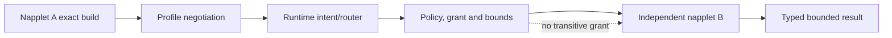

# Production-grade runtime maturity programme

## Independent judgment

M0–M5 should build Uzel toward a production-grade secure composable runtime, but M5 itself
must not be called production. M5 freezes a **production candidate** at capability maturity
L4. A5 then attacks that exact candidate. Production approval is L5 and requires:

- closure and re-audit of A5 blockers;
- a human residual-risk decision;
- one explicit supported compatibility profile and trust tier;
- release, update, incident and supported-version policy;
- exact package/provenance evidence.

This distinction is substantive. A polished product may still have an unproven guest
sandbox, unsafe migration, unbounded queue, first-party-only interoperability, silent
fork, non-reproducible build or misleading conformance claim.

## Scope of the production claim

Before and after A5, claims are limited to the exact declared matrix:

```text
Uzel source and package identity
Uzel Runtime Compatibility Profile ID/hash
Linux distribution/compositor/WebKit/SELinux matrix
packaged daemon and trusted shell
web-projection exact-build napplets
listed capability/domain subsets and limits
listed relay, signer and Blossom peers
listed guest-code trust tier
supported profile/version and migration window
```

Uzel must not imply:

- support for every NAP, NIP, draft or future revision;
- native/WASM projections not evidenced in the package;
- safe execution of arbitrary hostile code merely because it uses a WebView/iframe;
- server-grade multi-user isolation;
- compatibility with mutable branch heads;
- extraction-ready public SDK/API stability.

## Maturity levels

Each core capability has one evidence-backed level:

| Level | Meaning |
|---|---|
| L0 — explored | A mechanism or experiment exists; semantics and ownership may move |
| L1 — bounded | Owner, profile, inputs, outputs, limits and basic failure states are explicit |
| L2 — integrated | Works through the real packaged product journey with one implementation |
| L3 — adversarial | Hostile input, denial, timeout, cancellation, restart and pressure paths are tested |
| L4 — production candidate | Independent interop/version skew, migration, operations, supply-chain and recovery evidence exist; known gaps are owned |
| L5 — production approved | A5/remediation/human decision and supported release/security-response policy are complete |

Phase completion does not automatically promote a capability. Its ledger must cite the new
evidence. M5 requires L4 for every capability used by a required journey; anything lower
is disabled, parked or explicitly excluded from the active profile.

## Capability maturity ledger

Use [the Capability Ledger template](templates/CAPABILITY-LEDGER.md). Each ledger records:

```text
capability_id and owner
supported profile ID/hash and guest trust tier
maturity level and exact evidence revision
user journeys and exclusions
trust/identity/request binding
contract and launch-negotiation behavior
state machine, unknown, cancellation and timeout
resource budgets and overflow policy
persistence, migration and reconciliation
security abuse cases
contract/conformance/fuzz/property evidence
independent interop peers and version-skew fixtures
native/package/platform evidence
operations, diagnostics and incident owner
known gaps, local patches and upstream records
next promotion gate
visibility/disclosure state
```

Core ledgers before M5 include at least:

- source/manifest/exact-build verification;
- compatibility-profile loading and launch negotiation;
- profile/build/session/request binding;
- grants and revocation;
- Nostr query/read mediation;
- destination and resource mediation;
- low-authority raster normalization;
- inter-napplet intents/composition;
- daemon product-service drafts;
- external signer lifecycle;
- canonical-template review and pre-send final-event validation;
- bounded object import/export;
- Blossom authorization/upload/fetch/cache;
- scheduling and reconciliation;
- multi-profile and multi-instance isolation;
- diagnostics and bounded operational control;
- migration, backup, restore and rollback;
- package/update/quarantine/previous-green lifecycle.

## Composability definition

A runtime is not composable because two first-party surfaces can exchange messages. For a
supported profile, composition proves:

1. **Independent exact identity:** each participant is source-verified and bound to the
   active profile/hash, exact build, local profile, session and generation.
2. **Fail-closed negotiation:** required capability/profile mismatch rejects launch before
   guest code; optional absence is explicit and cannot widen authority.
3. **Runtime mediation:** napplets do not call another guest's native object, network,
   signer or storage directly.
4. **No transitive authority:** the receiver receives only its own grants and the bounded
   payload; caller grants are not inherited.
5. **Typed outcomes:** unsupported, denied, timeout, cancelled, stale, crashed, partial and
   failed are distinct.
6. **Cycle/fan-out/work bounds:** recursive, broadcast and nested intents are bounded.
7. **Backpressure and fairness:** global and per-principal work is bounded; a fast
   producer cannot create an unbounded queue, monopolize service or starve a quiet peer.
8. **Lifecycle safety:** close, reload, update and revocation invalidate stale routes and
   callbacks.
9. **Confused-deputy resistance:** trusted review identifies the exact initiating and
   receiving builds for sensitive work.
10. **Independent implementation:** at least one required path includes an independently
    authored/built napplet outside the Uzel repository.
11. **Version/profile skew:** current, previous-window and unsupported participants fail or
    degrade explicitly and non-destructively.
12. **Black-box package path:** the evidence uses the same packaged launch, verification,
    negotiation and routing path as a real external napplet.

Phase 2.7 owns the first clean-room compatibility capstone. Later phases keep it as a
regression suite and add a true independent peer before any L4 ecosystem-composability
promotion.

### Independent napplet evidence criteria

A qualifying independent napplet:

- has a separate repository or independently versioned source boundary;
- is built without Uzel private crates, internal imports, source-tree assumptions or test
  backdoors;
- records exact source/dependency/manifest/artifact provenance;
- is installed and launched through the packaged runtime's normal verification path;
- negotiates required/optional capabilities through the active RCP;
- exercises a real composition journey and adverse outcomes;
- is preferably maintained by an independent party.

A Uzel-authored external-source clean-room fixture is required by M1 and is useful
falsification evidence, but is not independent evidence. Before M5, a separately
authored/commissioned clean-room peer must implement from the public kit and packaged
black-box harness without importing/copying Uzel internals or receiving private tests or
implementation coaching. Since Uzel source is public, record the peer's inputs and call
this procedural independence rather than impossible proof of ignorance. This is required
to promote runtime composability to L4;
`blocked_no_independent_peer` blocks M5 rather than allowing the programme to delete its
core composability thesis. A genuinely community-maintained peer is stronger evidence for
ecosystem adoption and is reported separately. A5 cannot manufacture independence through
extra first-party review.



## Guest-code trust tiers

Uzel distinguishes:

```text
first_party_exact       built/reviewed by the Uzel programme at an exact identity
vetted_external_exact   independently authored exact build reviewed/tested for the RCP
experimental_external   exact build enabled only by explicit experimental policy/warning
unsupported_arbitrary   no production safety/support claim
```

CSP, origin separation, message validation and WebKit sandbox flags are application
containment, not proof against a browser-engine escape or a hostile same-UID process.
Before L5, A5 must either:

- limit the supported release to vetted exact builds and clearly state the boundary; or
- require and verify stronger process/OS/network isolation on the supported Linux matrix.

Uzel must not market arbitrary third-party code as safely sandboxed without such evidence.

## Production engineering dimensions

### 1. Semantic ownership and dependency direction

- One canonical owner for Nostr state, relay routing and signing execution.
- One daemon product-service owner for Uzel workflow intent.
- One runtime owner for guest authority, grants, sessions and composition.
- No shell/UI database bypass.
- No duplicate relay/signing/publication plane.
- Private adapters isolate fast-moving dependencies from Uzel durable contracts.
- A machine-enforced dependency/boundary checker rejects provider-type leakage, runtime-to-
  UI policy imports, shell database access and direct guest authority paths; representative
  forbidden-edge self-tests prove the checker is live.
- Ownership changes require ADR/profile/schema/ledger updates.

### 2. Compatibility and launch integrity

- The canonical RCP is the exact validated UTF-8 TOML bytes embedded in the package,
  hashed with `sha256-exact-utf8-bytes-v1` and checked against a separately bound expected
  digest at daemon startup.
- Launch-transcript hashing uses separately specified canonical CBOR with cross-language
  vectors; profile and transcript hashes cannot be conflated.
- All external sources are immutable identities, not mutable labels.
- Required/optional capability negotiation is fail-closed before guest code.
- The canonical transcript is bound to instance/profile/actor/build/session/generation.
- Profile replacement cannot occur mid-session.
- Unknown or future capability input follows explicit profile behavior.
- Contract/conformance tests reach the packaged path.

### 3. State-machine correctness

Every irreversible or remote operation distinguishes at least:

```text
not_started
in_progress
completed
failed
cancelled
unknown
```

Use precise domain states where required. `unknown` is not silently retried. State
transitions have model/property tests and restart/reconciliation fixtures. Completion is
reported only from evidence appropriate to the side effect.

### 4. Memory, CPU, queues and wakeups

Every externally influenced queue, cache, batch, retry set, subscription, nested
composition and diagnostics buffer has:

- named owner and admission principal (normally build + profile + session + capability);
- hard/adaptive global and per-principal bounds;
- maximum in-flight work, queued items/bytes, retained results and wakeups;
- fair scheduling or another measured bounded anti-starvation policy;
- explicit reject/shed/coalesce/backpressure behavior;
- cancellation/cleanup and crash/restart reconciliation;
- privacy-safe observability;
- noisy/quiet, many-principal and adversarial pressure tests.

A successful soak supports but does not prove boundedness or fairness. Prefer structures
and APIs that make unbounded growth and principal monopoly unavailable.

### 5. Fuzzing and property tests

Before M5 freeze, maintain targeted suites for high-risk parsers and transitions:

- local control/IPC envelopes;
- compatibility profile and negotiation transcript;
- napplet bootstrap/NAP messages;
- manifests, aggregate/path handling and exact-build identity;
- destination/URL/redirect/address policy;
- event-template and signer-result validation;
- object handles/range arithmetic;
- media-worker protocol and image metadata;
- Blossom authorization/response metadata;
- durable jobs and migration state machines;
- composition cycles, fan-out, cancellation and stale generations.

Run bounded cases in normal CI and longer corpora on scheduled/candidate lanes. Minimized
crashes become permanent regression fixtures.

### 6. Sanitizers and dynamic analysis

Use feasible tools for the supported environment:

- ASan/LSan/TSan/UBSan or equivalents where valid;
- Miri or focused undefined-behavior checks for unsafe-sensitive Rust;
- file-descriptor/process/memory leak monitoring;
- browser console, CSP and unhandled-rejection capture;
- dependency/license/advisory scanners;
- SELinux denial review;
- mutation/differential testing where it materially falsifies semantics.

Unavailable tooling is reported with reason and substitute evidence, never as passed.

### 7. Interoperability and version skew

Test:

- current supported RCP;
- previous supported RCP during its migration window;
- unsupported future/unknown fields and capabilities;
- GUI/daemon protocol skew;
- old/new exact napplet builds;
- signer, relay, Blossom and provider peers at exact versions;
- more than one independent peer where available.

Skew failures are explicit and non-destructive. No component opens durable state it cannot
interpret safely.

### 8. Supply chain, reproducibility and release integrity

The M5 candidate includes:

- exact source, lock, toolchain and Nix inputs;
- Nix closure and dependency/source inventory;
- canonical RCP bytes/hash and upstream registry snapshot;
- SBOM in a standard machine-readable format;
- license inventory and policy verdict;
- vulnerability/advisory results with disposition;
- local patch/fork ledger;
- signed checksums/provenance under an owner-approved process;
- source-to-package and package-to-profile mapping;
- previous-green artifact and rollback evidence.

For candidate evidence, perform **two clean exact-input builds** in independent clean
build roots/environments and compare the relevant outputs. Record:

- environment identities;
- derivation and output identities;
- byte-identical results where expected;
- understood nondeterministic fields and normalization, if any;
- unexplained differences.

Any unexplained release-relevant nondeterminism blocks L4. Do not weaken this to “where
infrastructure permits”; inability to run the comparison is an explicit candidate blocker
or supported-claim reduction.

Before L5, define the release/provenance signing-key fingerprint, owner, custody and use
boundary; rotation, revocation and compromise procedures; and how users independently
verify signed checksums/attestations. Private signing material is never present in ordinary
build jobs, caches, logs, reviewer prompts or candidate-next probes. A key compromise has
an executable quarantine/reissue path tied to exact packages and profiles.

Release metadata binds immutable package bytes, RCP bytes/hash, supported platform and
channel. Candidate, canary and stable are separate signed states—not mutable labels.
Runtime or napplet bytes are never silently substituted beneath an active profile. A
post-A5 canary is opt-in, bounded, privacy-aware and reversible; there is no remote
telemetry by default. Health evidence comes from local measurements, synthetic probes or
separately consented redacted reports. Promotion to stable requires explicit health
thresholds, previous-green availability and a second named-human decision. Automatic background checks may discover updates, but installation and any
capability/provenance change remain explicit and reviewable.

No runtime dependency is fetched at first launch except an explicit verified user-content
operation governed by runtime policy.

### 9. Security response and supported versions

Before L5 define:

- private vulnerability route;
- supported package/RCP/platform window and explicit profile-transition/deprecation
  records;
- security update class and response owner;
- compromised build/profile revocation or quarantine;
- signer-client-key generation/import, protected persistence or session-only operation,
  rotation, revocation, deletion, backup/restore truth and compromise recovery;
- advisory and incident communication;
- privacy-bounded diagnostics/forensics;
- end-of-support behavior;
- emergency rollback and schema truth.

This may be small-team operational material, but ownership and safe action must be clear.
The plan includes a tabletop or controlled drill for compromised package/profile,
release-key compromise, urgent quarantine, advisory publication and previous-green
recovery before a stable production claim.

### 10. Data safety

For committed user-owned state:

- atomicity/durability semantics are explicit;
- corruption is detected rather than silently normalized;
- migrations are deterministic, idempotent where appropriate and interruption-tested;
- backup/restore is rehearsed from packaged tools;
- deletion/revocation semantics are explicit;
- rollback claims match schema reality;
- profile/instance separation is verified by filesystem/database inspection.

### 11. UX and accessibility as correctness

Trusted decisions remain visually and semantically separate from guest content. Blocked,
denied, stale, partial, offline, failed and unknown are not collapsed into one generic
error. Required journeys remain keyboard-operable and understandable under screen reader,
scaling, high-contrast and reduced-motion conditions.

### 12. Operations and observability

A production candidate has bounded diagnostics that can answer:

- exact source/package/profile identity;
- active instance/profile/actor/session/build;
- negotiated capabilities and transcript hash;
- grant/revocation state;
- queue/cache/job pressure and failure causes;
- local patch/upstream status;
- migration/backup/rollback health;
- known limitations and supported-version status.

Diagnostics must avoid content/key leakage and distinguish user-safe export from internal
or embargoed evidence.

## Production evidence by milestone

| Milestone | Maturity objective |
|---|---|
| M0 | Establish machine RCP/registry, ledgers, trust/schema/supply-chain baselines and L0/L1 evidence |
| M1 | Raise launch/read/resource/composition foundations to L2/L3 and complete the Uzel-authored clean-room capstone |
| M2 | Raise daemon product-service draft persistence/recovery to L3 |
| M3 | Raise signer/review/publish path to L3 with pre-send validation and signer/relay interop |
| M4 | Raise object/media/Blossom path to L3 with worker isolation and server interop |
| M4.5 | Raise scheduling/reconciliation/composition under background failure to L3 |
| M5 | Close every supported core capability at L4 or remove/disable it from the RCP |
| A5/remediation | Attempt promotion of the exact declared profile to L5 |

## M0 required baselines

M0 establishes:

- canonical exact-byte machine RCP, separately bound digest and generated rendering;
- immutable source identities, upstream registry and candidate-next shadow-probe policy;
- phase-pinned development/orchestration toolchain profile;
- externally consumable compatibility-kit schema and delivery plan;
- fail-closed negotiation schema and test-vector plan;
- capability-ledger index;
- threat model and trust-tier language;
- durable-format/schema registry;
- unsafe-code inventory;
- dependency/source/license/advisory baseline;
- fuzz targets and interop/version-skew backlog;
- private security route;
- canonical terminology registry plus decision/upstream/learning/education structures
  and generated visibility-aware knowledge-index schema;
- global/per-principal admission, fairness and anti-starvation baseline;
- measured CI/native reference environment.

M0 need not close every gap. It must prevent later phases from claiming evidence against
an undefined or mutable profile.

## M5 freeze requirements

Delivery phase 7.9 may freeze the candidate only when:

- all required journey capabilities are L4;
- every enabled capability has owner, profile/hash, negotiation behavior, state model,
  resource bound, restart path, diagnostics and known-gap disposition;
- clean-room compatibility-kit evidence remains green under the packaged path;
- L4 runtime composability has a separately authored/commissioned clean-room peer using
  only the public kit and packaged harness; `blocked_no_independent_peer` blocks freeze;
  community-maintained-peer evidence is labeled separately for ecosystem-adoption claims;
- current/previous/unsupported profile and version-skew fixtures plus executable,
  machine-readable profile-transition/deprecation/migration records are preserved;
- no critical upstream delta is untriaged;
- no local patch lacks an upstream/no-upstream rationale, test and removal trigger;
- fuzz corpora, sanitizer/dynamic reports and minimized regressions are preserved;
- two clean exact-input builds have no unexplained release-relevant difference;
- SBOM, licenses, advisories, provenance and previous-green artifacts are complete;
- architecture-boundary checker/self-tests and release-signing fingerprint/custody/
  rotation/revocation/compromise evidence are complete;
- migration, backup, restore and rollback rehearsals are complete;
- security/incident/supported-version drafts exist;
- an independent critical-boundary security-review scope, evidence bundle, reviewer
  independence declaration and remediation/retest protocol are frozen for A5;
- signed immutable candidate/canary/stable channel policy, no-silent-update invariant,
  opt-in canary health/rollback thresholds and previous-green rehearsal are complete;
- canonical terminology, milestone learning digests, executable teaching witnesses and
  agent records bind to the exact candidate/profile hash;
- visibility/embargo review is complete;
- every known production gap is in the frozen risk register.

M5 output is `candidate ready for A5`, never `production`.

## A5 and production decision

A5 may return only:

```text
fail
remediation_required
pass_for_human_decision
```

`pass_for_human_decision` is not automatic production approval. It permits a named human
to authorize only a bounded release-candidate/canary step. L5 production approval requires:

- all A5 blockers are closed and affected lanes re-audited;
- a named independent security reviewer or review team without implementation ownership
  has completed the critical-boundary review, and every blocking finding has evidence-backed
  remediation and retest;
- the exact supported RCP, trust tier and platform matrix are explicit;
- residual risks are accepted by a named human owner;
- signed immutable candidate/canary/stable metadata, no-silent-update behavior,
  release/update/rollback/incident/support policy and previous-green recovery are ready;
- an opt-in bounded canary has met the predeclared privacy-safe health, correctness and
  rollback thresholds without invalidating the frozen evidence;
- a second named-human decision promotes that exact package/profile from canary to stable;
- final package/profile/provenance evidence is coherent;
- there is no generic conformance, arbitrary-code sandbox or unsupported-platform claim.

A canary finding that changes code, dependencies, schemas, package bytes or the RCP creates
a new candidate and reruns affected A5 lanes. Rollout is not a mechanism for waiving audit
evidence.

Extraction remains a separate later assessment. Production maturity must not be distorted
to make internal modules resemble hypothetical packages.
