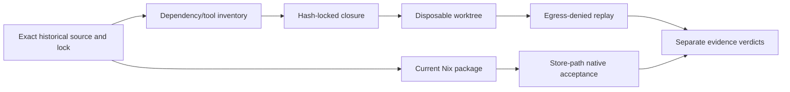
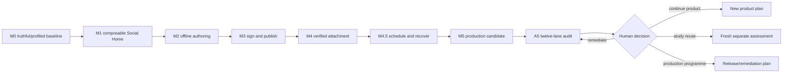

# Uzel product-incubation plan — revision 4

**Status:** re-audited production-candidate execution baseline
**Date:** 10 August 2026
**Active repository:** `jodobear/uzel`
**Project state:** existing brownfield GSD project; Phase 1 plan `01-01` is blocked during pre-flight
**Supersedes:** every earlier two-repository, package-first, revision-1, revision-2 and revision-3 execution plan

## Decision

Develop Uzel as one product-shaped incubation repository through M5. Keep hard internal
security, semantic-ownership, dependency and process boundaries, but do not shape the
current source tree around hypothetical packages. The product must create the evidence
from which later reuse decisions can be made.

The planning-only companion repository has no implementation and does not participate in
this programme. There is no import, dependency, pin, handoff, naming or synchronization
work for it.

The ambition is a production-grade secure composable runtime. The honest milestone claim
is narrower:

- M0–M5 produce a **production candidate** for one declared Linux/web-projection
  compatibility profile;
- A5 attacks that exact candidate through twelve audit lanes;
- production approval requires A5 remediation, a human residual-risk decision and an
  explicit supported-release/security-response policy;
- extraction remains a separate later assessment and cannot be inferred from production
  maturity.

> Build one coherent product while learning. Pin execution, follow the moving ecosystem,
> contribute at the correct upstream seam, and preserve evidence to teach humans and agents later.

## Immediate Phase 1 decision

The blocked `01-01` contains a real contradiction:

```text
exact historical source replay requires repository-locked tools
clean replay checkout has no installed dependencies
old plan prohibits dependency materialization
```

Resolve it with **hermetic exact-source replay**, not artifact-only replay:

1. determine the exact package manager, lockfile, toolchain and origin of Vite and the
   conformance tool from the historical source;
2. realize only the dependency closure fixed by that lockfile or exact content hashes;
3. materialize it in a disposable replay worktree with disposable `HOME`/XDG state;
4. deny external network egress during lifecycle scripts and replay, allowing only
   explicitly declared loopback or Unix-socket fixtures;
5. keep historical source and locks byte-for-byte unchanged;
6. record an honest non-green result when the exact closure/platform cannot be
   reconstructed;
7. independently build and test the current Nix package from store paths.

The isolated commit `b185ad1` is preserved as evidence, not assumed correct. Its final
retain/amend/supersede/discard disposition occurs only after source, parent, diff and tests
are inspected.



## Fast-moving ecosystem decision

Exact pins remain mandatory, but pinning alone is not stewardship. M0 establishes:

- a canonical machine-readable upstream registry;
- an immutable exact-UTF-8 machine-readable Uzel Runtime Compatibility Profile, hashed
  with `sha256-exact-utf8-bytes-v1`, separately bound into the package and rendered for
  humans from those exact bytes;
- a fail-closed required/optional capability negotiation and bound launch transcript;
- a dated spec/library source scan;
- an interop and version-skew matrix;
- local-patch and upstream-interaction ledgers;
- a read-only upstream radar, isolated no-secret candidate-next shadow probe and bounded
  compatibility-campaign process;
- a phase-pinned GSD/Codex/CodeRabbit/toolchain profile;
- an externally consumable compatibility/conformance kit and clean-room black-box fixture;
- decision, spec-interpretation, learning, canonical terminology, generated knowledge-
  index and capability-maturity records.

A current high-risk seam must be resolved before Phase 2: merged NIP-5A currently defines
nsites, while the open NIP-5D work and napplet packages have been changing napplet
manifest kinds, identity and bootstrap semantics. Uzel may implement an exact temporary
profile, but it may not call that profile universal or stable conformance.

Execution is pinned. Upstream movement is observed. Adoption occurs only in a separate,
evidence-led compatibility PR. Public issues/comments/PRs follow the owning repository's
process and are recorded locally through adoption.

See:

- [ecosystem and upstream stewardship](07-ECOSYSTEM-UPSTREAM.md);
- [dated ecosystem baseline](reports/ecosystem-baseline-2026-08-10.md);
- [decision and educational-knowledge system](08-DECISIONS-LEARNING.md);
- [production maturity programme](09-PRODUCTION-MATURITY.md).

## Roadmap

The existing brownfield GSD project remains. Phase 1 is replanned in place. Preserve
integer phases 2–7 as the first bounded increment of their milestone and insert the
listed decimal phases, including the new independent compatibility/composition capstone
at 2.7.

| Product milestone | GSD delivery phases | Product/runtime evidence |
|---|---:|---|
| M0 | 1 | Truthful replay/package baseline, authority/schema map, initial compatibility profile, upstream registry, capability ledgers and measured CI |
| M1 | 2, 2.1–2.7 | Packaged guest boundary, Social Home, mediated resources, people/profile, composition and clean-room compatibility capstone |
| M2 | 3, 3.1–3.3 | Daemon-owned product service, offline authoring, conflict/recovery and migration |
| M3 | 4, 4.1–4.3 | External NIP-46 signer, anti-spoof review and pre-send-verified text publication |
| M4 | 5, 5.1–5.3 | Bounded static-image import, verified Blossom transfer, attachment/export/offline round trip |
| M4.5 | 6, 6.1–6.2 | Scheduling, durable recovery, bounded background work and cross-domain composition |
| M5 | 7, 7.1–7.9 | Multi-profile/instance isolation, build lifecycle, operations, data/platform/performance/supply-chain closure and frozen L4 candidate |
| A5 | Audit, not implementation | Mandatory twelve-lane whole-system audit and human decision |

Expected phase sequence:

```text
1,
2, 2.1, 2.2, 2.3, 2.4, 2.5, 2.6, 2.7,
3, 3.1, 3.2, 3.3,
4, 4.1, 4.2, 4.3,
5, 5.1, 5.2, 5.3,
6, 6.1, 6.2,
7, 7.1, 7.2, 7.3, 7.4, 7.5, 7.6, 7.7, 7.8, 7.9
```

Phase 1 is the incident-recovery exception. After M0, every listed integer or decimal
phase is one bounded delivery increment, one contextual issue/branch/worktree and one
primary PR.



## Production-candidate definition

One exact packaged revision must support and evidence these journeys before A5:

1. install and launch from a Nix result without source checkout or ambient developer
   tools;
2. expose the exact compatibility-profile bytes/hash, immutable source map, source/build
   identity, negotiation evidence and supported trust tier through trusted diagnostics;
3. present a distinctive, accessible Linux shell with honest loading, stale, partial,
   offline, blocked, denied, failed and unknown states;
4. open at least two first-party guests, one Uzel-authored external-source clean-room
   fixture built only from the compatibility kit, and one separately authored/commissioned
   clean-room exact-build napplet through the same verification and profiled launch path;
5. compose napplets through bounded runtime mediation with no transitive grants, cycle or
   fan-out escape, stale callback or confused-deputy path;
6. render cached social state immediately and refresh through one canonical Nostr engine
   using bounded cancellable demand;
7. create, edit and recover drafts fully offline through the daemon product service;
8. connect an external NIP-46 signer without Uzel receiving the signer's `nsec`;
9. review an immutable canonical event template, verify the final signer output and only
   then permit relay submission;
10. select one supported static image through trusted UI, normalize it in a separate
    no-network low-authority worker, represent objects by opaque handles, authorize and
    verify Blossom transfer, export it and reopen it offline;
11. schedule one exact reviewed draft revision under a narrow revocable future-action
    grant and survive refusal, restart, sleep/time changes and ambiguous completion;
12. operate two profiles and two isolated Uzel instances from schemas designed for those
    scopes;
13. inspect builds, grants, jobs, profiles, compatibility, upstream/local-patch state and
    health through bounded trusted diagnostics;
14. upgrade, migrate, back up, restore, quarantine, roll back to previous-green and
    recover interrupted migration honestly;
15. pass native acceptance on the declared Fedora/Wayland/SELinux matrix;
16. meet evidence-based resource budgets and demonstrate structural or tested bounds;
17. carry an SBOM, license/advisory verdict, source/provenance map, two-clean-build
    comparison, architecture-boundary checks, release-signing/rotation/revocation policy,
    fuzz/version-skew corpus, interop matrix and security-response draft;
18. enforce global and per-principal admission, fairness and anti-starvation bounds for
    guest work, composition, subscriptions, jobs, media and diagnostics;
19. exercise the complete NIP-46 client-key lifecycle—generation/import, protected
    persistence or explicit session-only operation, minimal exposure, rotation,
    revocation, deletion, backup/restore truth and compromise recovery;
20. place every enabled core capability at maturity L4 or remove it from the supported
    profile;
21. preserve canonical terminology, phase closeouts, executable learning witnesses and
    milestone learning digests bound to exact source/profile evidence and disclosure
    state;
22. prepare an independently scoped critical-boundary security review package and a
    signed, explicit, no-silent-update candidate/canary/stable release policy with
    previous-green rollback triggers. Actual production approval remains post-A5.

## Non-negotiable architecture

- Keep the separate daemon. Tauri/Svelte presents policy and UX; it is not authority for
  guest identity, grants, canonical Nostr state, signing, object access or durable side
  effects.
- Host a Uzel product service in the daemon through M5. It owns drafts, workspaces,
  schedule intent, attachment choices and product-to-engine references. The shell never
  opens product databases.
- Use exactly one canonical Nostr engine behind a narrow private adapter. Exact-pin it;
  do not expose upstream types as Uzel contracts or create a second relay/signing plane.
- Bind every guest request to instance, local profile, authority mode, actor, exact build,
  session, generation, request and capability. Viewed subjects remain payload data.
- First-party napplets receive no privileged shortcut. Guests receive no raw network,
  signer/pairing keys, host path, native bridge, D-Bus or shell command.
- Treat CSP, origin separation and message validation as application containment, not
  proof against engine escape or hostile same-UID code. Until stronger evidence exists,
  support only declared exact-build trust tiers and do not market arbitrary hostile code
  as safely sandboxed.
- Give every packaged build one immutable compatibility-profile ID. Draft/open-PR
  behavior remains profile-scoped, tested and explicitly non-universal.
- Relay/resource/Blossom destinations pass one trusted endpoint policy. Guests cannot
  supply authority merely by supplying a URL.
- Bind trusted approval to daemon nonces and immutable review models. Validate final
  signer output before any relay write and Blossom authorization before any upload body.
- Decode untrusted raster input in a separate low-authority worker. Do not share object or
  derived-media stores across profiles before A5.
- Persist durable schemas with owner, generation, migration, corruption, backup and
  rollback semantics from their first version.
- Make composition runtime-mediated, bounded and non-transitive. Phase 2.7 first proves
  it with a Uzel-authored clean-room fixture; before the core L4 runtime-composability claim
  can survive M5, a separately authored/commissioned clean-room peer must use only the
  public kit and packaged black-box path. Community-maintained-peer evidence is a stronger,
  separately labeled ecosystem-adoption claim.
- Track each production-relevant capability in a maturity ledger. A green feature test is
  not enough to call a capability production-candidate.
- Exact-pin fast-moving specs/libraries, scan them read-only, and adopt changes only
  through compatibility campaigns. No auto-merge or branch-head production inputs.
- Record material decisions, spec interpretations, upstream interactions and reusable
  learnings. Phase closeout must move durable knowledge out of temporary plans.
- Preserve names at 21 characters or fewer where practical; long names are a design
  smell, not a target for abbreviating away meaning.

## Mandatory stop after M5

Delivery phase 7.9 freezes the exact candidate and produces only:

```text
candidate ready for A5
```

All feature work, dependency churn, release completion and extraction work stop. A5 then
runs twelve lanes:

1. architecture, authority and product fit;
2. correctness and state machines;
3. application/protocol security;
4. Linux/platform hardening;
5. data integrity/migration/backup/recovery;
6. concurrency/resource/performance;
7. Nix/supply-chain/CI integrity;
8. UX/visual/accessibility;
9. operations/observability/supportability;
10. maintainability/code/documentation fit;
11. ecosystem compatibility and upstream stewardship;
12. knowledge integrity and educational readiness.

A5 returns only `fail`, `remediation_required` or `pass_for_human_decision`. It contains
no extraction-readiness lane. `pass_for_human_decision` may authorize only the next
bounded release decision. L5 requires an independent critical-boundary security review,
a named human risk decision, signed immutable release metadata, an opt-in canary stage with no remote telemetry by default, observed rollback thresholds
and a second explicit stable-release decision. Uzel and
napplet updates are never silently substituted underneath an active compatibility
profile.

## Document routing

| Need | Read |
|---|---|
| GSD reorientation | [00-GSD-INGEST.md](00-GSD-INGEST.md) |
| Phase 1 replay incident | [01-BASELINE-REPLAY.md](01-BASELINE-REPLAY.md) |
| Architecture/authority/state | [02-PRODUCT-ARCHITECTURE.md](02-PRODUCT-ARCHITECTURE.md) |
| M0–M5 delivery | [03-ROADMAP.md](03-ROADMAP.md) |
| CI/testing/review | [04-DELIVERY-QUALITY.md](04-DELIVERY-QUALITY.md) |
| Mandatory A5 | [05-POST-M5-AUDIT.md](05-POST-M5-AUDIT.md) |
| Installation/start commands | [06-START-RUNBOOK.md](06-START-RUNBOOK.md) |
| Spec/library/upstream process | [07-ECOSYSTEM-UPSTREAM.md](07-ECOSYSTEM-UPSTREAM.md) |
| Decisions/learnings/education | [08-DECISIONS-LEARNING.md](08-DECISIONS-LEARNING.md) |
| Production maturity | [09-PRODUCTION-MATURITY.md](09-PRODUCTION-MATURITY.md) |
| Re-audit findings | [AUDIT.md](AUDIT.md) |

## Immediate sequence

1. preserve the blocked work and `b185ad1` exactly as the runbook states;
2. verify and install this revision-4 pack in a clean planning branch;
3. reorient the existing GSD project without resuming the blocked plan;
4. replan/review Phase 1 with the replay correction plus ecosystem/profile/knowledge
   baselines;
5. execute and verify Phase 1 only;
6. do not begin Phase 2 until exact-build manifest/identity semantics have an accepted
   compatibility profile and evidence.
