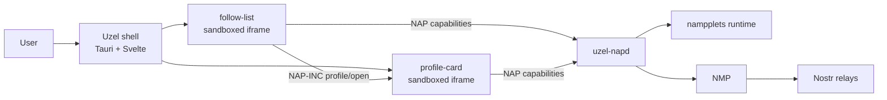

# Uzel single-repository POC

A compact implementation pack for a native Linux napplet-runtime proof of concept in:

```text
jodobear/uzel
```

The POC is a real vertical slice of the intended architecture, temporarily colocated in one repository. It is not a throwaway and it is not the full Uzel platform.

## Demo result

A user starts Uzel, enters a public Nostr key, and sees two separately installed napplets in a clean split layout:

- `follow-list` shows direct follows;
- `profile-card` shows the selected follow's latest-known kind `0`;
- selection crosses NAP-INC as `napplet:profile/open`;
- both napplets use one runtime-owned NMP engine;
- napplets have no raw network, Tauri, key, or host-filesystem authority;
- user mode is clean; developer mode exposes bounded diagnostics.



## Mandatory first step

Implementation does **not** begin from these documents alone. [`work/00-validate.md`](work/00-validate.md) must validate the current upstream commits, Linux build seams, WebKit trust boundary, NMP APIs, and local tools. Any contradicted design is corrected before product code proceeds.

Gate 0 was completed and revalidated on 2026-07-28 with a **no-go for Slice 01**. Linux/runtime/security feasibility and a corrected Napplet 0.29 line are proven. The exact Kehto fix is now a durable fork pin, so Uzel does not need to wait for its upstream merge. The published nampplets candidate remains unratified, its three required reviews are blank, and its Apple catalog changes have not run under Xcode. See [`reports/preflight.md`](reports/preflight.md) and [`compatibility.lock`](compatibility.lock). Do not execute later work files until that acceptance blocker clears or is explicitly accepted and the lock verdict changes.

## Start order

1. Read [`AGENTS.md`](AGENTS.md).
2. Read [`docs/00-scope.md`](docs/00-scope.md).
3. Execute [`work/00-validate.md`](work/00-validate.md).
4. Update [`STATUS.md`](STATUS.md) and the accepted fact records.
5. Execute the remaining work slices in [`docs/04-execution.md`](docs/04-execution.md).
6. Accept the POC using [`docs/05-test-and-demo.md`](docs/05-test-and-demo.md).

## Document map

| Need | Document |
|---|---|
| Scope and acceptance | [`docs/00-scope.md`](docs/00-scope.md) |
| Assumptions and validation gates | [`docs/01-validation.md`](docs/01-validation.md) |
| Architecture and trust boundaries | [`docs/02-architecture.md`](docs/02-architecture.md) |
| Provisional component design | [`docs/03-provisional-design.md`](docs/03-provisional-design.md) |
| Bounded execution slices | [`docs/04-execution.md`](docs/04-execution.md) |
| Tests and demo acceptance | [`docs/05-test-and-demo.md`](docs/05-test-and-demo.md) |
| Post-POC extraction | [`docs/06-extraction.md`](docs/06-extraction.md) |
| Current source baseline | [`docs/07-source-baseline.md`](docs/07-source-baseline.md) |
| Audit and rewrite findings | [`AUDIT.md`](AUDIT.md) |

## Scope rule

Anything not required by the acceptance criteria is deferred. Do not add FIPS, extensions, wallets, media focus, catalogs, native napplets, Android, Plasma widgets, Lua, or host-WM integration to this POC.
