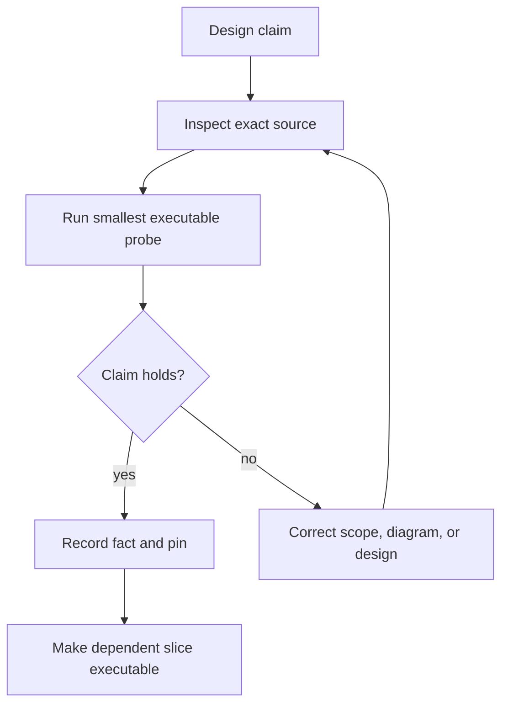

# Assumption validation and decision gates

## Why Gate 0 exists

The architecture is directionally strong, but several implementation details are not yet facts:

- Kehto #204 must be merged and pinned;
- `nampplets` is currently documented with a macOS reference host;
- NAP relay, identity, and storage surfaces are draft;
- exact NMP Rust facade calls must be inspected;
- Tauri/WebKit child-frame and CSP behavior must be proven on Linux;
- installed tooling must be reproducible.

Gate 0 was executed and its blocking compatibility work was revalidated on 2026-07-28. Linux reuse, NMP, frame trust, strict CSP, IPC, and tool claims pass. The corrected 0.29 line also passes locally, but its Kehto source commit is not remotely reachable and the nampplets candidate is unratified. Slice 01 is **not accepted to start**; see [`../reports/preflight.md`](../reports/preflight.md).

## Current observed baseline

At the completed 2026-07-28 validation snapshot:

- Napplet package releases include `@napplet/core@0.29.0`, `@napplet/nap@0.29.0`, and convention/INC behavior used by the current ecosystem.
- Kehto PR #204 is merged at `b85db51db838866de753b275b9d34ec908785bd2`; its original bundles expose the Vite module-preload defect.
- Local candidate `kehto/web@62241de0b4526ba4fdc8a7b3c766c2499d3ae24d` disables module preload. Its exact `chat` and `feed` builds contain no forbidden `fetch` and each passes `@napplet/conformance-cli@0.2.16` with 6 passed, 0 failed, 4 skipped. The candidate cannot yet be fetched from GitHub.
- Reachable candidate `jodobear/nampplets@b1a38f1af9191b6742c0be8ddea04159a2755a71` pins Napplet 0.29/0.27/0.25/0.14 and passes its full Linux suites. It remains unratified, advertises no platform domains, and has blank compatibility, security, and NMP-boundary signoffs.
- NMP documents canonical redb state, provenance-preserving deduplication, freshness, bounded delivery, finite relay fan-out, NIP-65 routing, and NIP-02 following.
- The NAP registry marks shell and INC active while their documents still say draft; relay/identity/storage and NIP-5D remain provisional.

See [`07-source-baseline.md`](07-source-baseline.md), [`../compatibility.lock`](../compatibility.lock), and the fact records for exact sources and probes.

## Gate 0 decision

| Gate | Result | Evidence summary |
|---|---|---|
| V-01 | **fail** | compatible 0.29 artifacts pass locally, but their exact Kehto source commit is not reachable from an upstream or fork remote |
| V-02 | pass | all 16 reusable nampplets crates passed Linux fmt/test/Clippy |
| V-03 | pass | `RuntimeController` already exposes verify/install/launch/mapped-envelope/lifecycle APIs exercised by upstream tests |
| V-04 | pass | locked NMP adapter probe returned profile, follows, evidence, cancellation, and shutdown |
| V-05 | pass | actual Tauri/Wry/WebKitGTK probe kept authenticated IPC in the top frame and source binding held |
| V-06 | pass | hostile frame remains networkless and corrected exact Kehto fixtures contain no module-preload `fetch` and pass released conformance |
| V-07 | pass | bounded same-user AF_UNIX hello/status probe passed under `$XDG_RUNTIME_DIR` |
| V-08 | pass | exact commands and versions are recorded; the original Fallow field and `nix shell` assumption were corrected |

## Gate matrix

| Gate | Claim to prove | Required evidence | Decision if false |
|---|---|---|---|
| V-01 | #204 merged and compatible packages exist | merge commit, package lock, conformance output | stop product work; update pins/plan |
| V-02 | reusable `nampplets` crates compile on Linux | source map and Linux Cargo build | contribute the smallest generic seam upstream; do not clone runtime logic |
| V-03 | exact-build/session APIs can be driven by a daemon | minimal Rust probe | revise daemon adapter; if impossible, document the specific upstream boundary |
| V-04 | NMP exposes required read/freshness/diagnostic APIs | compiling probe with signed fixtures | adapt only through public NMP facade or contribute missing seam |
| V-05 | nested frame cannot access Tauri and source binding is reliable | Linux Tauri/WebKit hostile probe | change host projection before feature work |
| V-06 | self-contained fixture executes with strict CSP and no direct egress | hostile browser suite | correct bundle/host policy; never add broad network permission |
| V-07 | separate shell/daemon IPC is simple enough | one hello/status round trip under `$XDG_RUNTIME_DIR` | reuse an existing local seam if available; avoid public protocol design |
| V-08 | tools are real and pinned | command/version/provenance ledger | fix environment before coding |

## Required outputs

Gate 0 creates inside the implementation repository:

```text
compatibility.lock
reports/preflight.md
reports/nampplets-linux-map.md
reports/nmp-api-map.md
reports/webkit-trust-spike.md
docs/facts/FACT-*.md
```

Use [`../templates/fact.md`](../templates/fact.md).

## Plan correction rule



Do not create a compatibility abstraction merely to protect an incorrect document.

## Per-slice validation

Every work file lists its local assumptions. Before implementation:

1. confirm the upstream/tool pins are unchanged;
2. inspect the concrete API or source path used by the slice;
3. run its smallest falsifying test;
4. record any changed fact;
5. update only the affected design.

## Hard stops

Stop and seek a design decision when:

- Linux reuse would require copying or independently rebuilding `nampplets` semantics;
- a napplet needs raw network or Tauri access;
- a second Nostr event/profile/follow cache is proposed;
- exact-build identity cannot be preserved;
- the POC begins to require extensions, wallet security, media, or WM integration;
- an assumed upstream merge or draft contract differs materially from the pinned implementation.
