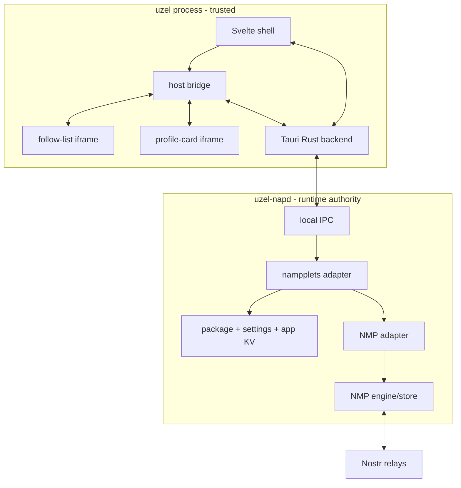
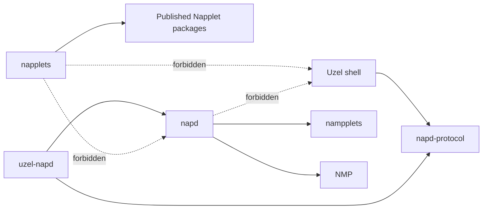
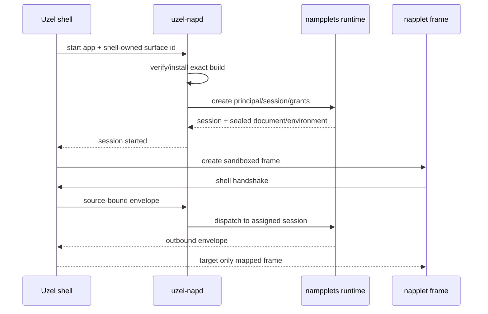
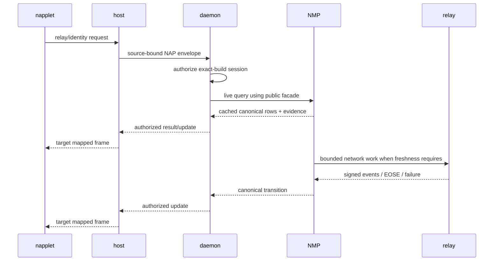
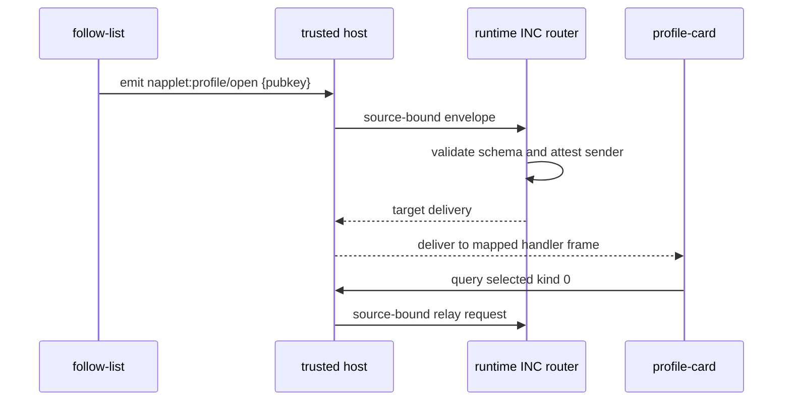

# POC architecture

## Runtime topology



The Svelte shell never talks directly to NMP or runtime storage. The Tauri Rust backend is the trusted daemon client. Napplet frames communicate only with the host bridge using the pinned web projection.

## Trust domains

| Domain | Authority |
|---|---|
| `uzel-napd` | principals, sessions, package verification, KV, NMP, diagnostics |
| Tauri Rust backend | window lifecycle and daemon client |
| Svelte parent | layout, source-bound frame routing, user/dev presentation |
| Napplet iframe | granted NAP capabilities only |
| Nostr relay | untrusted remote signed-event source |
| Bundle | untrusted until publisher/hash verification succeeds |

The POC threat target is malicious napplet JavaScript. It does not claim protection from a compromised kernel or a WebKit engine exploit.

## Repository zones

```text
apps/uzel/              Tauri + Svelte product
apps/uzel-napd/         daemon binary
crates/napd/            reusable runtime, NMP and storage adapters
crates/napd-protocol/   small internal local protocol
napplets/               portable demo/test napplets
contracts/              shared convention schemas
fixtures/               signed manifests, artifacts and Nostr events
```

Keep the POC small: two reusable crates, not a speculative crate hierarchy.



## Session start



No payload field may choose its principal, session, sender, or target frame.

## Shared Nostr flow



NMP owns event truth. SQLite/runtime state may store package, product, and app-KV facts only.

## Composition flow



The sender does not address a session directly. The profile event itself is not copied across INC; the receiver queries canonical data.

## UI boundary

The shell uses one native window and one trusted WebView containing two sandboxed frames. This is the fastest web-projection path. It does not prove independent browser-process isolation or per-surface native resource accounting; those remain later work.
