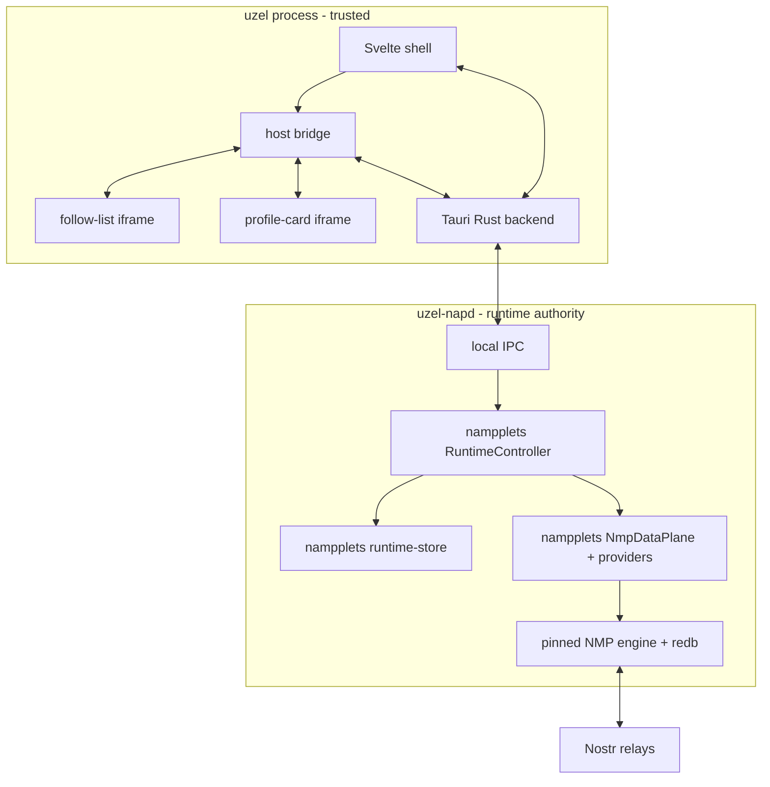
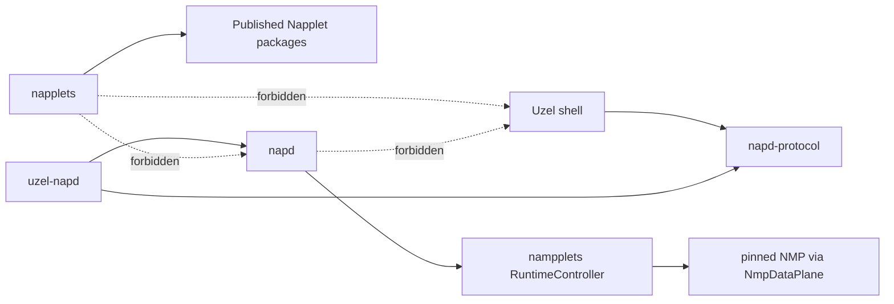
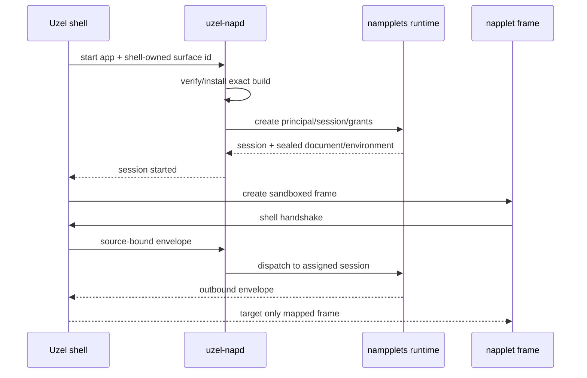
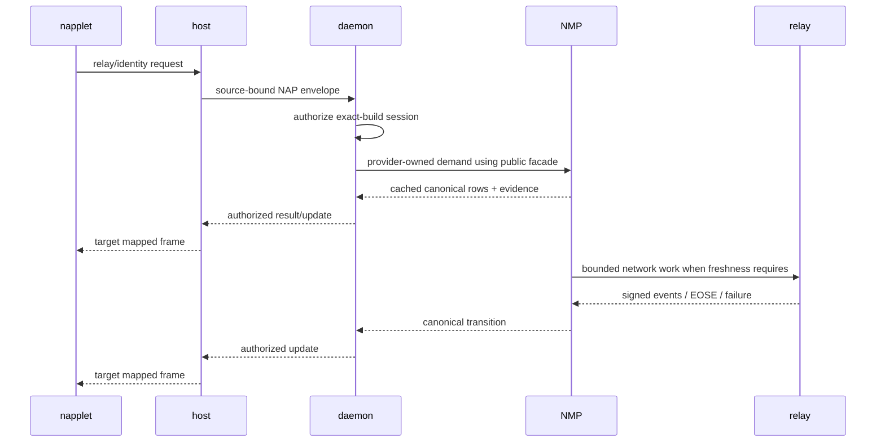
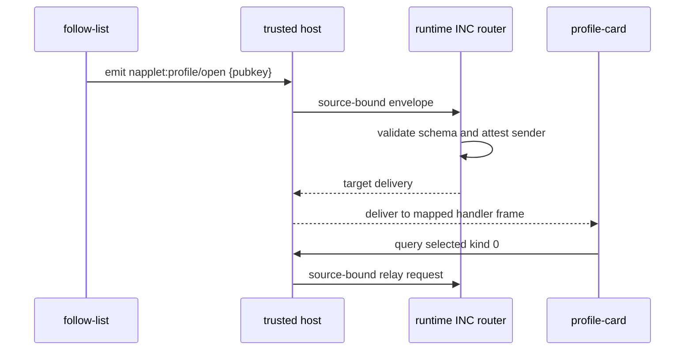

# POC architecture

> Gate 0 validated this topology on Linux. The exact provisional pins and accepted risks are recorded in [`../reports/preflight.md`](../reports/preflight.md). The architecture and Slice 01 are authorized for the Linux-only POC.

## Runtime topology



The Svelte shell never talks directly to NMP or runtime storage. The Tauri Rust backend is a thin trusted daemon client. Napplet frames communicate only with the source-binding host bridge and upstream trusted-shell projection.

## Trust domains

| Domain | Authority |
|---|---|
| `uzel-napd` | process ownership and composition of upstream runtime/NMP authorities |
| nampplets runtime | principals, exact builds, sessions, grants, NAP providers, app KV, bounded diagnostics |
| NMP | Nostr event truth, replaceable selection, follows, relay evidence, freshness, canonical cache |
| Tauri Rust backend | window lifecycle and daemon client |
| Svelte parent | layout, source-bound frame routing, user/dev presentation |
| Napplet iframe | granted NAP capabilities only |
| Nostr relay | untrusted remote signed-event source |
| Bundle | untrusted until publisher/hash verification succeeds |

The POC threat target is malicious napplet JavaScript. It does not claim protection from a compromised kernel or a WebKit engine exploit.

## Repository zones

```text
apps/uzel/              Tauri + Svelte product
apps/uzel-napd/         daemon binary
crates/napd/            thin Uzel daemon composition; no copied runtime/provider/NMP logic
crates/napd-protocol/   small internal local protocol
napplets/               portable demo/test napplets
contracts/              shared convention schemas
fixtures/               signed manifests, artifacts and Nostr events
```

Keep the POC small: two reusable crates, not a speculative crate hierarchy.



## Session start



No payload field may choose its principal, session, sender, or target frame.

## Accepted upstream seam

The daemon drives the existing source pin through:

```text
RuntimeController::open
RuntimeController::verify_artifact
RuntimeController::install
RuntimeController::launch
RuntimeController::mapped_envelope
RuntimeController::read_verified
RuntimeController lifecycle, snapshot, observation, diagnostics, and close methods
```

The controller composes `nmp-native-artifact`, runtime-core/app/store, NAP bridge/providers, and `NmpDataPlane`. `crates/napd` may translate the private AF_UNIX operation enum to these calls; it must not reproduce their semantics. The Linux-only implementation edge is WebKit host creation and source-window mapping.

Slice 04 moved the controller out of Tauri and into `uzel-napd`. The verified
96172-byte document crosses the private socket in ordered 2048-byte base64
chunks; each request and response retains the 4096-byte control-frame ceiling.
The daemon rejects an unknown transfer, a changed transfer ID, an out-of-order
offset, an oversized aggregate, and an invalid completion marker. Tauri
reassembles only bounded bytes, and WebKit never receives an artifact cache
path. The Svelte application has no daemon protocol types.

Slice 05 extends that same controller to at most four simultaneously active
exact fixtures. Each launch burns a new persisted surface generation before
exposure. The private response identifies the target surface explicitly;
Svelte can deliver it only through the upstream multi-surface host, which maps
the original `MessageEvent.source` to that surface. Cross-surface delivery is
permitted only for runtime-authorized `inc.emit`; other replies remain
source-scoped. No envelope payload chooses its destination.

## Shared Nostr flow



NMP owns event truth. nampplets runtime storage owns installed-build, runtime, and app-KV facts. Uzel may store only missing product metadata; it must not add an event/profile/follow cache.

## Composition flow



The sender does not address a session directly. The profile event itself is not copied across INC; the receiver queries canonical data.

## UI boundary

The shell uses one native window and one trusted WebView containing two sandboxed frames. Gate 0 proved that Tauri/Wry bootstrap and the authenticated invoke key remain top-frame-only under WebKitGTK 2.52.5 and that `MessageEvent.source` binding works.

WebKit still exposes its low-level `window.webkit.messageHandlers.ipc` transport to the child. It carries no Tauri command authority without the generated top-frame invoke key; an invalid-key hostile call was rejected. Treat it as attacker-controlled input, keep scripts main-frame-only, preserve size/rate limits, and never use Tauri webview labels as a substitute for inner-frame source binding.

This path does not prove independent browser-process isolation or per-surface native resource accounting; those remain later work.
