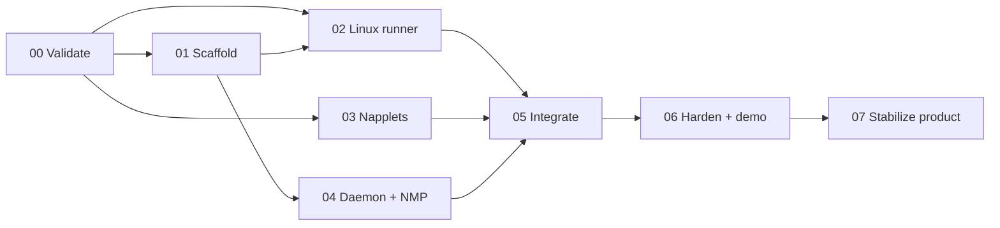

# Execution slices

No orchestration framework is required. Use ordinary Git branches/worktrees, small commits, `STATUS.md`, and the work files below.

## Dependency graph



## Slices

| Slice | Outcome | Work file |
|---|---|---|
| 00 | exact pins, Linux/API/tool probes, corrected design | [`../work/00-validate.md`](../work/00-validate.md) |
| 01 | reproducible Rust/pnpm/Nix/Tauri workspace | [`../work/01-scaffold.md`](../work/01-scaffold.md) |
| 02 | exact-build fixture launches in Linux sandboxed frame | [`../work/02-linux-runner.md`](../work/02-linux-runner.md) |
| 03 | two portable napplets and INC/conformance fixtures | [`../work/03-napplets.md`](../work/03-napplets.md) |
| 04 | daemon, one NMP engine, read identity, minimal persistence | [`../work/04-daemon-nmp.md`](../work/04-daemon-nmp.md) |
| 05 | composed two-pane fixture/live demo | [`../work/05-integrate.md`](../work/05-integrate.md) |
| 06 | user/dev modes, hostile tests, clean demo and audit | [`../work/06-hardening-demo.md`](../work/06-hardening-demo.md) |
| 07 | issue-driven product stabilization with isolated ownership | [`../work/07-stabilize-product.md`](../work/07-stabilize-product.md) |

## Parallel work

Slice 00 has a **Linux-scoped go** verdict as of 2026-07-28:

- scaffold owner establishes the workspace and commands;
- runner owner maps `nampplets` to Linux/Tauri;
- napplet owner builds portable bundles against pinned packages;
- daemon/NMP owner starts only after the workspace and accepted API map exist.

Only one owner edits each canonical contract:

```text
napd-protocol Rust types       daemon/runtime lane
profile-open JSON schema       napplet lane
host bridge/source map         runner lane
NMP adapter                    daemon/NMP lane
```

An integration branch pins or merges completed commits. Agents do not invent local copies of another lane's contract.

After the accepted POC, Work 07 uses GitHub issue #9 as the dependency tracker.
Each child issue remains one isolated branch and PR; read-only source mapping may
run in parallel with a non-overlapping implementation lane.

## Slice entry gate

A slice starts only when:

- its work file's assumptions are checked;
- dependencies are integrated or pinned;
- its owner and non-goals are explicit;
- one observable acceptance scenario exists;
- rollback is clear.

## Handoff

Use [`../templates/handoff.md`](../templates/handoff.md). A handoff contains commits, facts/pins, commands, observable result, adverse tests, limitations, changed contracts, and next integration action.
