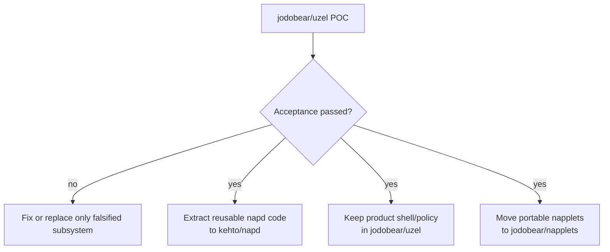

# Post-POC extraction

Do not start fresh after a successful POC. Extract and harden the proven seams.

## Likely `kehto/napd`

- runtime composition over `nampplets`;
- exact-build/session mechanisms;
- local client/protocol if still useful;
- storage and object abstractions that are product-neutral;
- NMP provider adapter;
- deterministic testkit and hostile projection fixtures;
- daemon binary generalized only after a second consumer exists.

Before extraction, remove Uzel defaults, colors, demo IDs, and product composition policy.

## Remains in Uzel

- Tauri + Svelte shell;
- layout and visual product behavior;
- user/developer presentation;
- product configuration and packaging;
- default composition;
- future FIPS, desktop, media and wallet integrations.

## Moves to `jodobear/napplets`

- `follow-list`;
- `profile-card`;
- `profile/open` convention schema;
- portable build/conformance fixtures.

## POC shortcuts that must not silently become platform contracts

- internal protocol version `0`;
- one shell client;
- one public read identity;
- local fixture installation only;
- one trusted WebView with iframes;
- small fixed composition;
- draft relay/identity/storage pins;
- minimal developer diagnostics;
- no OS-level network sandbox if Bubblewrap proof is deferred.

## First hardening follow-ups

1. Design a Linux WebKit subprocess policy that can remove network authority
   from untrusted child content without also severing the trusted Tauri shell's
   loopback daemon and NMP relay traffic. Host Bubblewrap `0.11.0` is available,
   but wrapping the whole application with `--unshare-net` is not that policy.
2. Terminate the deterministic local NMP relay with trusted local TLS before
   advancing from the validated `e539378...` nampplets runtime pin to a successor
   that correctly refuses plaintext operator relays.
3. Separate Nix WebKitGTK libraries and host-linked Cargo targets in the Fedora
   developer command so `pnpm test` cannot request `GLIBC_2.42` from a host
   linker. Keep the complete pinned Debian workspace build as the portable
   linker gate until that composition is corrected.
4. Extract only after a second consumer exists. Preserve the exact hostile
   fixture and sentinel harness as regression evidence across extraction.

## Rewrite criteria

Refactor is expected; a fresh rewrite is justified only for a falsified subsystem, such as:

- generic `nampplets` core cannot be separated from Apple-specific code;
- exact-build/session semantics cannot support a Linux host;
- Tauri/WebKit cannot maintain the required source/trust boundary;
- NMP cannot provide the required data plane through its supported facade.

Even then, preserve unaffected fixtures, napplets, NMP tests, Nix environment, and observed facts.
